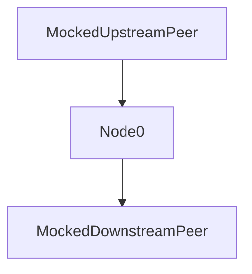

# How to run the Leios October demo

See https://github.com/IntersectMBO/ouroboros-consensus/issues/1701 for context.

## Prepare the shell environment

- If your environment can successfully execute `cabal build exe:cardano-node` from this commit, then it can build this demo's exes.
    ````
    $ git log -1 10.5.1
    commit ca1ec278070baf4481564a6ba7b4a5b9e3d9f366 (tag: 10.5.1, origin/release/10.5.1, nfrisby/leiosdemo2025-anchor)
    Author: Jordan Millar <jordan.millar@iohk.io>
    Date:   Wed Jul 2 08:24:11 2025 -0400
    
        Bump node version to 10.5.1
    ```
- The Python script needs `pandas` and `matplotlib`.
- The bash script needs `ps` (which on a `nix-shell` might require the `procps` package for matching CLIB, eg), and `sqlite`, and so on.
- Set `CONSENSUS_BUILD_DIR` to the absolute path of a directory in which `cabal build exe:immdb-server` will succeed.
- Set `NODE_BUILD_DIR` to the absolute path of a directory in which `cabal build exe:cardano-node` will succeed.
- Set `CONSENSUS_REPO_DIR` to the absolute path of the `ouroboros-consensus` repo.

- Checkout a patched version of the `cardano-node` repository, something like the following, eg.

```
6119c5cff0 - (HEAD -> nfrisby/leiosdemo2025, origin/nfrisby/leiosdemo2025) WIP add Leios demo Consensus s-r-p (25 hours ago) <Nicolas Frisby>
```

- If you're using a `source-repository-package` stanza for the `cabal build exe:cardano-node` command in the `NODE_BUILD_DIR`, confirm that it identifies the `ouroboros-consensus` commit you want to use (eg the one you're reading this file in).

## Build the exes

```
$ (cd $CONSENSUS_BUILD_DIR; cabal build exe:immdb-server exe:leiosdemo202510)
$ IMMDB_SERVER="$(cd $CONSENSUS_BUILD_DIR; cabal list-bin exe:immdb-server)"
$ DEMO_TOOL="$(cd $CONSENSUS_BUILD_DIR; cabal list-bin exe:leiosdemo202510)"
$ (cd $CONSENSUS_BUILD_DIR; cabal build exe:cardano-node)
$ CARDANO_NODE="$(cd $CONSENSUS_BUILD_DIR; cabal list-bin exe:cardano-node)"
```

## Prepare the input data files

```
$ (cd $CONSENSUS_BUILD_DIR; $DEMO_TOOL generate demoUpstream.db "${CONSENSUS_REPO_DIR}/demoManifest.json" demoBaseSchedule.json)
$ cp demoBaseSchedule.json demoSchedule.json
$ # You must now edit demoSchedule.json so that the first number in each array is 182.9
$ echo '[]' >emptySchedule.json
$ # create the following symlinks
$ (cd $CONSENSUS_REPO_DIR; ls -l $(find nix/ -name genesis-*.json))
lrwxrwxrwx 1 nfrisby nifr 30 Oct 24 16:27 nix/leios-mvd/immdb-node/genesis-alonzo.json -> ../genesis/genesis.alonzo.json
lrwxrwxrwx 1 nfrisby nifr 29 Oct 24 16:27 nix/leios-mvd/immdb-node/genesis-byron.json -> ../genesis/genesis.byron.json
lrwxrwxrwx 1 nfrisby nifr 30 Oct 24 16:27 nix/leios-mvd/immdb-node/genesis-conway.json -> ../genesis/genesis.conway.json
lrwxrwxrwx 1 nfrisby nifr 31 Oct 24 16:27 nix/leios-mvd/immdb-node/genesis-shelley.json -> ../genesis/genesis.shelley.json
lrwxrwxrwx 1 nfrisby nifr 30 Oct 24 16:27 nix/leios-mvd/leios-node/genesis-alonzo.json -> ../genesis/genesis.alonzo.json
lrwxrwxrwx 1 nfrisby nifr 29 Oct 24 16:27 nix/leios-mvd/leios-node/genesis-byron.json -> ../genesis/genesis.byron.json
lrwxrwxrwx 1 nfrisby nifr 30 Oct 24 16:27 nix/leios-mvd/leios-node/genesis-conway.json -> ../genesis/genesis.conway.json
lrwxrwxrwx 1 nfrisby nifr 31 Oct 24 16:27 nix/leios-mvd/leios-node/genesis-shelley.json -> ../genesis/genesis.shelley.json
```

## Run the scenario

Run the scenario with `emptySchedule.json`, ie no Leios traffic.

```
$ LEIOS_UPSTREAM_DB_PATH="$(pwd)/demoUpstream.db" LEIOS_SCHEDULE="$(pwd)/emptySchedule.json" SECONDS_UNTIL_REF_SLOT=5 REF_SLOT=182 CLUSTER_RUN_DATA="${CONSENSUS_REPO_DIR}/nix/leios-mvd" CARDANO_NODE=$CARDANO_NODE IMMDB_SERVER=$IMMDB_SERVER ${CONSENSUS_REPO_DIR}/scripts/leios-demo/leios-october-demo.sh
$ # wait about ~20 seconds before stopping the execution by pressing any key
```

Run the scenario with `demoSchedule.json`.

```
$ LEIOS_UPSTREAM_DB_PATH="$(pwd)/demoUpstream.db" LEIOS_SCHEDULE="$(pwd)/demoSchedule.json" SECONDS_UNTIL_REF_SLOT=5 REF_SLOT=182 CLUSTER_RUN_DATA="${CONSENSUS_REPO_DIR}/nix/leios-mvd" CARDANO_NODE=$CARDANO_NODE IMMDB_SERVER=$IMMDB_SERVER ${CONSENSUS_REPO_DIR}/scripts/leios-demo/leios-october-demo.sh
$ # wait about ~20 seconds before stopping the execution by pressing any key
```

## Analysis

Compare and contrast the cell that is in the column for `latency_ms` and the row for the Praos block in slot 183.

**WARNING**.
Each execution consumes about 0.5 gigabytes of disk.
The script announces where (eg `Temporary data stored at: /run/user/1000/leios-october-demo.c5Wmxc`), so you can delete each run's data when necessary.

**INFO**.
If you don't see any data in the 'Extracted and Merged Data Summary' table, then check the log files in the run's temporary directory.
This is where you might see messages about, eg, the missing `genesis-*.json` files, bad syntax in the `demoSchedule.json` file, etc.

# Details about the demo components

## The topology

For this first iteration, the demo topology is a simple linear chain.



**INFO**.
In this iteration of the demo, the mocked downstream peer (see section below) is simply another node, ie Node1.

## The Praos traffic and Leios traffic

In this iteration of the demo, the Praos data and traffic is very simple.

- The Praos data is a simple chain provided by the Performance&Tracing team.
- The mocked upstream peer serves each Praos block when the mocked wall-clock reaches the onset of their slots.
- The Leios data is ten 12.5 megabyte EBs.
  They use the minimal number of txs necessary in order to accumulate 12.5 megabytes in order to minimize the CPU&heap overhead of the patched-in Leios logic, since this iteration of trhe demo is primarily intended to focus on networking.
- The mocked upstream peer serves those EBs just prior to the onset of one of the Praos block's slot, akin to (relatively minor) ATK-LeiosProtocolBurst attack.
  Thus, the patched nodes are under significant Leios load when that Praos block begins diffusing.

## The demo tool

The `cabal run exe:leiosdemo202510 -- generate ...` command generates a SQLite database with the following schema.

```
CREATE TABLE ebPoints (
    ebSlot INTEGER NOT NULL
  ,
    ebHashBytes BLOB NOT NULL
  ,
    ebId INTEGER NOT NULL
  ,
    PRIMARY KEY (ebSlot, ebHashBytes)
  ) WITHOUT ROWID;
CREATE TABLE ebTxs (
    ebId INTEGER NOT NULL   -- foreign key ebPoints.ebId
  ,
    txOffset INTEGER NOT NULL
  ,
    txHashBytes BLOB NOT NULL   -- raw bytes
  ,
    txBytesSize INTEGER NOT NULL
  ,
    txBytes BLOB   -- valid CBOR
  ,
    PRIMARY KEY (ebId, txOffset)
  ) WITHOUT ROWID;
```

The contents of the generated database are determine by the given `manifest.json` file.
For now, see the `demoManifest.json` file for the primary schema: each "`txRecipe`" is simply the byte size of the transaction.

The `generate` subcommand also generates a default `schedule.json`.
Each EB will have two array elements in the schedule.
The first number in an array element is a fractional slot, which determines when the mocked upstream peer will offer the payload.
The rest of the array element is `MsgLeiosBlockOffer` if the EB's byte size is listed or `MsgLeiosBlockTxsOffer` if `null` is listed.

The secondary schema of the manifest allows for EBs to overlap (which isn't necessary for this demo, despite the pathced node fully supporting it).
Overlap is created by an alternative "`txRecipe`", an object `{"share": "XYZ", "startIncl": 90, "stopExcl": 105}` where `"nickname": "XYZ"` was included in a preceding _source_ EB recipe.
The `"startIncl`" and `"stopExcl"` are inclusive and exclusive indices into the source EB (aka a left-closed right-open interval); `"stopExcl"` is optional and defaults to the length of the source EB.
With this `"share"` syntax, it is possible for an EB to include the same tx multiple times.
That would not be a well-formed EB, but the prototype's behavior in response to such an EB is undefined---it's fine for the  prototype to simply  assume all the Leios EBs and txs in their closures are well-formed.
(TODO check for this one, since it's easy to check for---just in the patched node itself, or also in `generate`?)

## The mocked upstream peer

The mocked upstream peer is a patched variant of `immdb-server`.

- It runs incomplete variant of LeiosNotify and LeiosFetch: just EBs and EB closures, nothing else (no EB announcements, no votes, no range requests).
- It serves the EBs present in the given `--leios-db`; it sends Leios notificaitons offering the data according to the given `--leios-schedule`.
  See the demo tool section above for how to generate those files.

## The patched node/node-under-test

The patched node is a patched variant of `cardano-node`.
All of the material changes were made in the `ouroboros-consensus` repo; the `cardano-node` changes are merely for integration.

- It runs the same incomplete variant of LeiosNotify and LeiosFetch as the mocked upstream peer.
- The Leios fetch request logic is a fully fledged first draft, with four primary shortcomings.
    - It only handles EBs and EB closures, not votes and not range requests.
    - It retains a number of heap objects in proportion with the number of txs in EBs it has acquired.
      The real node---and so subsequent iterations of this prototype---must instead keep that data on disk.
      This first draft was intended to do so, but we struggled to invent the fetch logic algorithm with the constraint that some of its state was on-disk; that's currently presumed to be possible, but has been deferred to a iteration of the prototype.
    - It never discards any information.
      The real node---and so subsequent iterations of this prototype---must instead discard EBs and EB closures once their old enough, unless they are needed for the immutable chain.
    - Once it decides to fetch a set of txs from an upstream peer for the sake of some EB closure, it does not necessarily compose those into an optimal set of requests for that peer.
      We had not identified the potential for an optimizing algorithm here until writing this first prototype, so it just does something straight-forward and naive for now (which might be sufficient even for the real-node---we'll have to investigate later).

There are no other changes.
In particular, that means the `ouroboros-network` mux doesn't not deprioritize Leios traffic.
That change is an example of what this first prototype is intended to potentially demonstrate the need for.
There are many such changes, from small to large.
Some examples includes the following.

- The prototype uses SQLite3 with entirely default settings.
  Maybe Write-Ahead Log mode would be much preferable, etc.
- The prototype uses a mutex to completely isolate every SQLite3 invocation---that's probably excessive, but was useful for some debugging during initial development (see the Engineering Notes appendix)
- The prototype chooses several _magic numbers_ for resource utilization limits (eg max-bytes per reqeusted, max outsanding bytes per peer, fetch decision logic rate-limiting, txCache disk-bandwidth rate-limiting, etc).
  These all ultimately need to be tuned for the intended behvaiors on `mainnet`.
- The prototype does not deduplicate the storage of EBs' closures when they share txs.
  This decision makes the LeiosFetch server a trivial single-pass instead of a join.
  However, it "wastes" disk space and disk bandwidth.
  It's left to future work to decide whether that's a worthwhile trade-off.

## The mocked downstream node

For simplicity, this is simply another instance of the patched node.
In the future, it could be comparatively lightweight and moreover could replay an arbitrary schedule of downstream requests, dual to the mocked upstream peer's arbitrary schedule of upstream notifications.

# Appendix: Engineering Notes

This section summaries some lessons learned during the development of this prototype.

- Hypothesis: A SQLite connection will continue to hold SQLite's internal EXCLUSIVE lock _even after the transaction is COMMITed_ when the write transaction involved a prepared statement that was accidentally not finalized.
  That hypothesis was inferred from a painstaking debugging session, but I haven't not yet confirmed it in isolation.
  The bugfix unsuprisingly amounted to using `bracket` for all prepare/finalize pairs and all BEGIN/COMMIT pairs; thankfully our DB patterns seem to accommodate such bracketing.
- The SQLite query plan optimizer might need more information in order to be reliable.
  Therefore at least one join (the one that copies out of `txCache` for the EbTxs identified in an in-memory table) was replaced with application-level iteration.
  It's not yet clear whether a one-time ANALYZE call might suffice, for example.
  Even if it did, it's also not yet clear how much bandwidth usage/latency/jitter/etc might be reduced.
