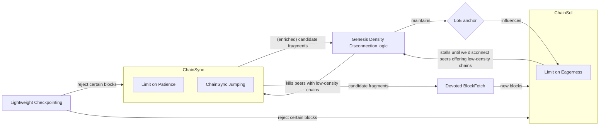
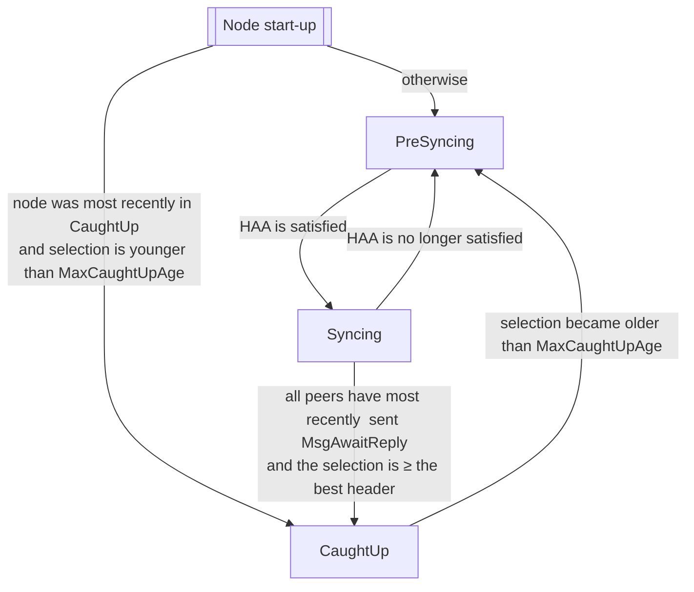

# Cardano Genesis

This document contains the high-level design for adding Ouroboros Genesis to the existing Cardano implementation of Ouroboros Praos.

## Notation

- {X Y Z} indicates the definition of X Y Z, helpful for use with search functionality, such as CTRL-F.

- Occurences of the word _peer_ in this document almost always means upstream peer, one providing blocks to the syncing node.

- {Valency} is the number of upstream peers.

- {Kcp} is the `k` [security parameter](Glossary#security-parameter) parameter of the Common Prefix property of Ouroboros Praos: how many blocks a well-connected honest node might possibly need to roll back in order to adopt the honest network's latest best chain.

- {Δ} is the parameter from Ouroboros Praos's security argument: the maximum delay before a block reaches every well-connected honest node.

- {∩} is the intersection operator: X∩Y is the longest chain that is a prefix of both X and Y.

- {Scg} is the `s` parameter of the [Chain Growth](Glossary#chain-growth-property) property of Ouroboros Praos: the greatest possible number of slots it might take for the honest chain to grow by Kcp.

- {Sgen} is the s parameter of the [Ouroboros Genesis chain selection rule](Glossary#genesis-chain-selection-rule): how many slots after an intersection are considered when comparing two competing chains' densities.
  This document assumes Sgen equals Scg, though other possibilites will be discussed in [Parameter Tuning](#parameter-tuning) below.

## Requirements

Any implementation of Genesis in Cardano must satisfy the following requirements.

### No Praos Disruption

The new behaviors must not alter the functioning of a node that has already completed synchronization with the network—that is, nodes operating under standard Ouroboros Praos behavior.

### Sync Safety

If the syncing node always has at least one peer that is honest, not itself syncing, and connected with reasonable latency and bandwidth, both to the syncing node as well as the honest network, then the syncing node will never select more than `Kcp` blocks of a chain that is not extended by a recent selection of some honest nodes in the network (ie approximately within Δ).

  The antecedent of that implication is the {Honest Availability Assumption} ({HAA}).
  It is beyond the scope of this design to guarantee the HAA.
  Instead, we rely on the Network layer, which ensures—with high probability—that the node is connected to at least one honest peer. The Network layer, in turn, leverages the peers stake to probabilistically fulfill this requirement.

  It is important to note that the Sync Safety requirement directly prevents the [_long-range attack_](Glossary#long-range-attack), which was the original motivation for Ouroboros Genesis.

### Sync Liveness

The upper bound of unnecessary delay incurred during some interval of the sync is proportional to how many of the syncing node's upstream peers in that same interval are adversarial.
  It is beyond the scope of this design to ensure that count of adversarial peers remains below some reasonable bound (eg 50).


### Limited Sync Load

A syncing node should avoid imposing excessive load on the honest network. For example, it should request the same block from multiple peers only as a last resort.

### Disaster Tolerance

With adequate configuration, ideally temporary, the new behaviors should remain functional even in the event of a network-wide disruption.

## Components

This design consists of the following components.

### Lightweight Checkpointing

The {Lightweight Checkpointing} logic allows configuration data (comparable in authority to the genesis block) to mandate that the node reject some chains as invalid by fiat.


### Genesis State Machine

The {Genesis State Machine} ({GSM}) determines the node synchronization status. For this, it transitions between different states: pre-syncing, syncing, and caught-up.
  When the node is caught-up, the GSM disables all components of this design except Lightweight Checkpointing and the GSM itself.


### Limit on Eagerness

The {Limit on Eagerness} ({LoE}) prevents the syncing node from selecting more than `Kcp` blocks beyond the intersection of its peers' latest selections.
  That interesction is called the {LoE anchor}.
  (The implementation maintains an LoE fragment.
  In an unfortunate collision of names, the LoE anchor is the tip of the LoE fragment, _not_ its [`anchor`](https://github.com/IntersectMBO/ouroboros-network/blob/88bf7766ddb70579b730f777e53473dcdc23b6d0/ouroboros-network-api/src/Ouroboros/Network/AnchoredSeq.hs#L94), see here[^loe-anchor-example] for an example.)

### Genesis Density Disconnection

The {Genesis Density Disconnection} logic ({GDD}) disconnects from any advertised peer whose chain has too few blocks to be the honest chain and could prevent the syncing node from finishing.
  There are some absolute limits, such as having no blocks at all within some interval of `Scg` slots.
  The primary rule, though, involves comparisons between peers: Consider peer `A` offering chain `X`. We disconnect from `A` if there is a peer offering a chain `Y` such that: 1) there are no blocks in `Sgen` slots after `X ∩ Y`; 2) `Y` has more than `Kcp` blocks after `X∩Y`.

### Limit on Patience

The {Limit on Patience} ({LoP}) disconnects from any peer that is claiming to have subsequent headers on its selection but not sending them promptly.

### ChainSync Jumping

The {ChainSync Jumping} optimization ({CSJ}) avoids fetching the honest header chain from more than one peer.

### Devoted BlockFetch

The {Devoted BlockFetch} decision logic ({DBF}) of a syncing node prefers to request blocks from only one peer at a time, the first peer it finds that serves the best available header chain and serves the blocks faster than the syncing node can validate them.
  The Honest Availability Assumption ensures that one such peer exists.

### Node Versus Environment Tests

- The {Node Versus Environment} tests scrutinize the behavior of the partially-mocked node when subjected to adversarial inputs.
  These are notably the first Cardano Consensus Layer tests to explicitly simulate non-trivial adversarial behaviors.

### Components Diagram

All components are also depicted in the following diagram, with the exception of the GSM, which simply disables all other Genesis components (except Lightweight Checkpointing).

TODO: edit this diagram, it's barely legible when rendered by Docusaurus. Maybe change it to top-down.



## How the Components Satisfy the Requirements

At a high-level, the [requirements](#requirements) outlined above are satisfied by the [components](#components) just discussed for the following reasons.

### Satisfying Disaster Tolerance

The [Lightweight Checkpointing](#lightweight-checkpointing) logic directly ensures [Disaster Tolerance](#disaster-tolerance); during and/or after the disaster, some decision process (likely off-chain) would certify some additional checkpoints.
  With sufficient checkpoint configuration data, a syncing node will be able to succesfully sync past a disastrously sparse section of the network's historical chain.

Specifically, this allows for the [GDD](genesis-density-disconnection) to favor some alternative chains over the network's densest chain, since a configured checkpoint could prevent the GDD from ever seeing those alternatives.
  As a side benefit, this means the initial Genesis deployment can include checkpoints that cover the Byron era, which has different density characteristics, and some portions of the historical chain that are unusually sparse.
  Without checkpoints, it's theoretically possible that the "missing" blocks all ended up on some unknown adversarial chain that the GDD would actually prefer to today's Cardano network's chain.

### Satisfying No Praos Disruption

The [GSM](#genesis-state-machine) directly ensures [No Praos Disruption](#no-praos-disruption) (unless the node becomes [eclipsed](Glossary#eclipse-attack) or the honest chain actually stops growing for too long).

### Satisfying  Sync Safety

The [LoE](#limit-on-eagerness) directly ensures Sync Safety, because the Honest Availability Assumption ensures that the LoE anchor is a prefix of the latest honest chain.

### Satisfying Sync Liveness

The [GDD](#genesis-density-disconnection) and [LoP](#limit-on-patience) together ensure the LoE anchor will advance --- and with only moderate delay --- which is necessary but not sufficient for Sync Liveness.

  In particular, one honest peer suffices for the GDD to disconnect from every peer that is advertising an alternative chain, based on the core assumption of Ouroboros Genesis that the honest network's historical chain is denser than any alternative.

The advancing LoE anchor and DBF together ensure Sync Liveness.

### Satisfying Limited Sync Load

The CSJ and DBF together ensure Limited Sync Load.

### Satisfying Component Correctness

The [Node Versus Environment Tests](#node-versus-environment-tests)  provide a high degree of assurance that each component is correct.

The descriptions of each component in the remainder of this document will include lower-level reasoning in support of these claims.
A single completely detailed proof would be ideal, but is beyond the project's resources.

## Component-level Designs

Each subsection specifies the high-level design of one component.

### The Lightweight Checkpointing Component

[Link to code](https://github.com/IntersectMBO/ouroboros-consensus/blob/43c1fef4631d7a00879974e785c2291175a5f0dc/ouroboros-consensus/src/ouroboros-consensus/Ouroboros/Consensus/HeaderValidation.hs#L318)

The Lightweight Checkpointing is one of the simplest components.
The node configuration data will include a list of pairs of block number[^checkpoint-block-vs-slot-no] (ie chain length) and hash.

[^checkpoint-block-vs-slot-no]: We decided to use pairs of block numbers and hashes as the resulting semantics are very simple, in particular because that any sufficiently long chain will contain a block with a given block number, in contrast to slot numbers (as slots can be empty). Depending on the exact context, one scheme or the other might be more convenient.

Each pair N and H incurs an additional predicate to that node's header validation: if a header's block number is equal to N, then the header is valid if its hash is H.

If some interval of the desired historical chain is sufficiently sparse that the GDD might not prefer it, then checkpoints can be used to prevent the GDD from being aware of any competing alternative chains.
There are two main options.

- Add a checkpoint in at least each interval in which the desired chain doesn't necessarily have greater GDD density than some potential alternative chain.
  This ensures the node will never see an alternative chain that would cause the GDD to disconnect from peers serving the (by fiat) desired chain.
- Add merely one checkpoint that is after the weak interval.
  This is enough to ensure that a node that was tricked onto an alternative chain will not be able to finish its sync.
  But it's not enough to ensure the node will end up on the same chain as the honest network.

It cannot be emphasized enough that the list of checkpoints in the configuration data must be obtained from/signed by a trusted source.

The Lightweight Checkpointing component is always active, regardless of whether the node is syncing.
This could be changed, but this configuration data already needs such care that it shouldn't matter.
In particular --- except perhaps _during_ a disaster scenario --- no configured checkpoint should ever be recent enough to affect a node that had already synced the desire chain, as required by No Praos Disruption.

This component makes the Sync Safety requirement more flexible/expressive/accomodating, since it introduces the possibility of the community deciding to explicity overrule the GDD comparison for some (eg sparse) interval of the historical chain.
In particular, this flexibility may be required by Disaster Tolerance: both during a disaster and even possibly after it, if the community decides to remain on that chain despite its weak interval.
Ultimately, though, disasters may require more severe remediation, such as temporarily falling back to the Bootstrap Peers mechanism instead of Genesis.

### The Genesis State Machine Component

[Link to code](https://github.com/IntersectMBO/ouroboros-consensus/blob/43c1fef4631d7a00879974e785c2291175a5f0dc/ouroboros-consensus-diffusion/src/ouroboros-consensus-diffusion/Ouroboros/Consensus/Node/GSM.hs)

The Genesis State Machine has three states.

- The {PreSyncing} state artificially sets the LoE anchor to the node's ImmutableDB tip --- the node cannot make any commitments.
- The {Syncing} state enables all of the functionality introduced by this design.
- The {CaughtUp} state disables all of functionality introduced by this design except for Lightweight Checkpointing.
  A node in the CaughtUp state is "just running Praos", and so it no longer needs to _constantly_ ensure the HAA.

The transitions are triggered as follows.

- The nominal path consists of a cycle among the three states.
   - The GSM transitions from PreSyncing to Syncing when the Diffusion Layer indicates the HAA is satisfied.
   - The GSM transitions from Syncing to CaughtUp when every peer simultaneously indicates that is has no subsequent headers to send and the syncing node has selected a chain no worse than any received header.
     This trigger is notably not time based, because an adversary is free to create an alternative chain with a very young tip in order to cause the node to lower its defenses by selecting it.
     This is especially true in the context of an adversarial CSJ Dynamo (see below), which has a temporarily disproportionate influence over the syncing nodes selection.
   - The GSM transitions from CaughtUp to PreSyncing only when the node's selection is older than MaxCaughtUpAge (eg the node was offline for a few hours).
     The MaxCaughtUpAge duration is a parameter of this design; see [Parameter Tuning](#parameter-tuning) below for constraints on it.
     Moreover, this transition is delayed by some small random duration (eg <5 minutes) in order to avoid an undesired simultaneity amongst honest nodes within a struggling honest network.
- But that path is not necessarily guaranteed.
   - The GSM transitions from Syncing to PreSyncing if the Diffusion Layer indicates the HAA is no longer satisfied.

This diagram visualizes that state machine.



The node initializes its GSM in PreSyncing unless it was in the CaughtUp state when the node previously shutdown and the tip of the node's initialized selection is still younger than MaxCaughtUpAge (ie it wouldn't immediately transition to PreSyncing).
The GSM therefore maintains a marker file on disk as a persistent record of whether it is in the CaughtUp state.

The GSM state does not influence whether or not the node attempts to mint blocks.
Superficially, one would expect that a Syncing node needn't bother minting blocks --- and perhaps even shouldn't --- since those misused elections might give the adversary an advantage.
On the other hand, the transition from Syncing to CaughtUp may be preceded by a duration in which the syncing node has the full chain but some peers are preventing it from concluding it has finished syncing.
Wasting an election on a stale chain seems preferable to missing a minting opportunity.

This component directly ensures No Praos Disruption, since the CaughtUp state disables all of the extra features and the Syncing state does not inhibit minting.
The only difference is that the node will defensively transition to PreSyncing if it sees no new blocks for too long, eg if it's eclipsed for a duration of MaxCaughtUpAge and/or if the honest network actually doesn't mint blocks for a duration of MaxCaughtUpAge.

When reasoning about this overall design, a virtual fourth state is often important to consider.
The node is "almost CaughtUp"/"almost done syncing"/etc when it's technically in Syncing but its immutable tip is relatively close to the wall clock.
This is the most difficult state to reason about because the new components are enabled while peers could be justifiably sending MsgAwaitReply and/or MsgRollBack.
These messages are trivial to handle when syncing obviously historical parts of the chain, since they immediately indicate that the peer does not satisfy the HAA.
But when it's almost CaughtUp, the new components must accommodate the potentially non-monotonic/stuttering/non-committal/reneging/etc semantics of these messages --- especially since even honest peers might be sending them.

### The Limit on Eagerness Component

Link to code: [Trimming candidates](https://github.com/IntersectMBO/ouroboros-consensus/blob/43c1fef4631d7a00879974e785c2291175a5f0dc/ouroboros-consensus/src/ouroboros-consensus/Ouroboros/Consensus/Storage/ChainDB/Impl/ChainSel.hs#L691) [Trigger without block](https://github.com/input-output-hk/ouroboros-consensus/blob/43c1fef4631d7a00879974e785c2291175a5f0dc/ouroboros-consensus/src/ouroboros-consensus/Ouroboros/Consensus/Storage/ChainDB/Impl/ChainSel.hs#L320)

The LoE is another of the simplest components.
The LoE prevents the syncing node from selecting a block that is more than Kcp ahead of the LoE anchor, the intersection of all _current_ peers' header chains.
(Recall the exception that PreSyncing instead fixes the LoE anchor to the tip of the ImmutableDB.)

It is possible for the LoE anchor to move backwards, for example if a peer sends a roll back or if the syncing node connects to a new peer on a chain no one else was serving.
This is the only way that the node's selection could be more than Kcp blocks ahead of the LoE.
Because of the HAA, the GDD cannot favor this new chain, and so the GDD/LoP will disconnect from the peer unless it switches to the best chain.
Thus such violations will be ephemeral in the design's assumed environment.

The LoE anchor will always be an extension (possibly non-proper) of the ImmutableDB tip.
Note that the ChainSync client already prohibits peers from rolling back past the ImmutableDB tip.

One subtle consequence of the LoE is a necessary change in the existing Praos implementation.
The chain selection logic ({ChainSel}) is currently only triggered by a block arriving.
However, when the LoE is enabled, ChainSel must also be triggered whenever the LoE advances, even if a block did not arrive.
This may seem unnecessary, based on the idea that a subsequent block arrival should happen within some reasonable time bound.
But that is not necessarily true.
There are edge-case scenarios in which no additional blocks will arrive because none have been requested, which cannot happen until new headers are validated, which cannot happen until the forecast range advances, which cannot until the selection advances, which cannot until the LoE anchor advances.

Moreover, due to the now-spoiled invariant, ChainSel is implemented in the context of "the block that just arrived".
There isn't necessarily such a block when the LoE advances, so the new trigger of ChainSel must emulate that.
Thus, whenever the LoE changes, ChainSel is invoked once per block in the VolatileDB that is an immediate successor of the tip of the ImmutableDB.
(That is equipotent to reprocessing the ImmutableDB tip itself, but only involves mutable blocks.)

This component directly ensures Sync Safety, since the HAA ensures that the LoE anchor is on the honest chain.
It is worth emphasizing that every subsequent component below is designed for the sake of Sync Liveness and Limited Sync Load --- the LoE alone suffices for Sync Safety.

### The Genesis Density Disconnection Component without CSJ

[Link to code](https://github.com/IntersectMBO/ouroboros-consensus/blob/43c1fef4631d7a00879974e785c2291175a5f0dc/ouroboros-consensus/src/ouroboros-consensus/Ouroboros/Consensus/Genesis/Governor.hs#L10)

The GDD must disconnect from any peers serving chains that are preventing the LoE from advancing and also can be inferred to not be the best chain.

The logic compares every ordered pair of peers.
An optimization could avoid symmetric comparisons, but that factor of two doesn't appear to be necessary for the relatively small expected upstream peer counts.

Let {the GDD window} be the Sgen slots after the LoE anchor.
Also, observe that when a peer's latest message was MsgAwaitReply, the syncing node must assume that peer does not have subsequent headers to send.
That might be an incorrect assumption, but only for the short duration until the peer's next ChainSync message arrives.

The GDD will disconnect from a peer P due to comparison to a peer Q if all of the following conjuncts hold simultaneously.

- P and Q disagree on which header directly succeeds the LoE anchor.
  To clarify, this conjunct is satisfied if (but not only if) P's latest message was MsgAwaitReply but Q already sent a header.
  Additionally, this disagreement can be determined even if P's first header after the LoE is not in the syncing node's forecast range: its validity is not yet relevant.

- Q has sent more than Kcp (valid) headers after the LoE anchor.
  This prevents typical Praos short forks from triggering the GDD when the node is almost done syncing.

- Either P's latest message was not MsgAwaitReply or else P does not already have more headers in the GDD window than Q does.

- Either P's latest message was MsgAwaitReply or else no extension of P's chain could have more headers in the GDD window than Q already does.
  The non-existence of any such an extension is conservatively established by there being too few slots in the portion of the GDD window that is after P's header chain.

This component contributes to Sync Liveness.
The LoP component (in the next section) ensures that peers sending an alternative history must soon enough reveal their chain's sparseness so that the GDD will disconnect from them when compared to one of the HAA-satisfying peers.

In the "with CSJ" section below, the GDD is enriched beyond its primary responsibility for the sake of the CSJ design.

To prevent this component from spoiling Sync Liveness, this relatively-expensive calculation is rate-limited with a parameter {GddRateLimit}; see the [Parameter Tuning](#parameter-tuning) section.

### The Limit on Patience Component

Link to code: [Token bucket](https://github.com/IntersectMBO/ouroboros-consensus/blob/43c1fef4631d7a00879974e785c2291175a5f0dc/ouroboros-consensus/src/ouroboros-consensus/Ouroboros/Consensus/Util/LeakyBucket.hs#L30), [ChainSync integration](https://github.com/input-output-hk/ouroboros-consensus/blob/43c1fef4631d7a00879974e785c2291175a5f0dc/ouroboros-consensus/src/ouroboros-consensus/Ouroboros/Consensus/MiniProtocol/ChainSync/Client.hs#L1905)

If a peer claims to have subsequent headers, they must send them promptly.
Otherwise, a disagreement amongst two peers might suffice to prevent the LoE anchor from advancing but not suffice for the GDD to make a decision.

This is in tension with the fact that any honest peer will inevitably exhibit some bursts of latency --- even just garbage collection could cause it, eg, whether that collection be on the local node or on the remote peer.

To accomodate this tension, the LoP is implemented as a token bucket.
The bucket drips unless the peer has most recently sent MsgAwaitReply or their latest header is beyond the syncing node's forecast range.
If the bucket is ever empty, the LoP disconnects from the peer.
A token is added to the bucket whenever the peer sends a valid header that is longer (a la the block number) than any header they had previously sent, but it's discarded if the bucket is already full.

The rate TDRIP at which the bucket drips and its maximum capacity TCAP are design parameters that must be tuned, see [Parameter Tuning](#parameter-tuning) below.

This component contibutes to Sync Liveness because it forces a peer to enable a GDD decision within a duration of at most TDRIP × (TCAP + L), where L is the number of headers that can be in their alternative chain's GDD window before the GDD disconnects them.
Parameter Tuning will ensure this is less than one minute per adversarial peer, for example.

### The ChainSync Jumping Component

[Link to code](https://github.com/IntersectMBO/ouroboros-consensus/blob/43c1fef4631d7a00879974e785c2291175a5f0dc/ouroboros-consensus/src/ouroboros-consensus/Ouroboros/Consensus/MiniProtocol/ChainSync/Client/Jumping.hs#L14)

The ChainSync Jumping optimization is a backwards compatible optimization of the ChainSync mini protocol.
Instead of simply running the normal ChainSync mini protocol with every peer, CSJ runs it with at most two while syncing the historical chain.
This saves significant bandwidth and CPU for both the syncing node and all but one of its honest upstream peers.
By the time the node transitions to the CaughtUp state, all peers will be running full ChainSync --- CSJ inherently ensures that, in addition to the GSM.

The {CSJ governor} is centralized logic that divides peers into the following roles.

- The {Dynamo} is a peer chosen to run full ChainSync.
  It has never sent MsgAwaitReply or MsgRollBack.

- A {Jumper} is a peer that idles until the CSJ governor occasionally sends it a MsgFindIntersect that offers to jump its header chain to the Dynamo's current header chain.

- A Jumper that rejects its offered jump becomes a {PreObjector}.
  It sends subsequent bisecting MsgFindIntersect messages until its intersection with the Dynamo is exactly identified and then idles.
  (A PreObjector is referred to as a "dissenting jumper" in the code.)

- The {Objector} is one of the PreObjectors with the oldest intersection with the Dynamo.
  It also runs full ChainSync, in order to compete with the Dynamo via the GDD.

- A {Disengaged} peer no longer participates in the CSJ optimization; it runs full ChainSync.
  These are peers that have sent MsgAwaitReply or MsgRollBack.

Under some circumstances, the CSJ governor must choose a new Dynamo.
The only constraint on this choosing mechanism is that it should eventually find an HAA-satisfying peer.
For example, a simple round-robin queue or random choice would suffice, excluding Disengaged peers.
This specification suggests using a round-robin queue such that the head of the queue is the Dynamo.
Peers are removed from the queue when they become Disengaged.
Peers are added to the end of the queue when they are first connected to.
(The Devoted BlockFetch component specified below will also introduce an event that causes a peer to be moved to the end of this queue.)
This is named the {Dynamo candidate queue}.

The Dynamo offers a jump whenever its header chain has advanced by {MinJumpSlots} slots since it last offered a jump; the value of the MinJumpSlots design parameter is discussed in the [Parameter Tuning](#parameter-tuning) section.
To offer a jump, the Dynamo makes a copy of its current candidate chain C and (via the CSJ governor) sends a corresponding MsgFindIntersect to every Jumper.
If a Jumper accepts the entire jump, it's header chain is updated to C.
If a Jumper refuses, additional bisecting MsgFindIntersect messages are sent to that peer in order to determine the exact intersection of its selection with C, and the peer becomes a PreObjector.
While there are some PreObjectors, one with the oldest intersection is promoted to be the Objector, which might require demoting the current Objector back to PreObjector.
It is crucial that no PreObjector has an older intersection than the Objector, since otherwise the forecast range might not be able to sufficiently advance for the GDD to resolve the competition between the Dynamo or the Objector.
It is also important that there is only one Objector at a time, since all honest Jumpers would disagree with an alternative chain served by an adversarial Dynamo; multiple honest Objectors would violate the Limited Sync Load requirement.

Whenever a new peer becomes the Dynamo (eg because the GDD killed the previous Dynamo), all others peers (even the Objector) forget their most recent jump offer and are reset to Jumper.
The new Dynamo immediately offers a jump to all Jumpers.

If an Objector or a Dynamo sends MsgAwaitReply or MsgRollBack, then it immediately becomes Disengaged.
In order to prevent adversarial peers from using MsgAwaitReply or MsgRollBack in order to waste the syncing nodes bandwidth and CPU by running full ChainSync for the historical chain, CSJ also enforces a {Limit on the Age of MsgAwaitReply/MsgRollBack}.
This cannot be a perfect mitigation, since it's possible that an honest peer would need to rollback a header that is at most Scg slots old, even though that's very unlikely.
But it's sufficient to simply limit that extra CPU cost to the final Scg window of the sync, instead of potentially paying that cost for the entire age of the chain.
The maximum allowed age of a rolled back header is HistoricityCutoff, which cannot be less than Scg; see the [Parameter Tuning](#parameter-tuning) section below for more details.
Any MsgRollBack that rolls back a header older than HistoricityCutoff (according to the wall clock) and any MsgAwaitReply that is sent when the candidate fragment tip is older than HistoricityCutoff immediately incurs a disconnection from that peer.

The Dynamo, Objector, and every Disengaged peer are continually subject to the standard LoP.
A CSJ Jumper's token bucket does not leak, though it does gain tokens when the Jumper accepts (some of) a jump, since the peer has effectly sent those headers.
When a Jumper refuses a jump, it is only subject to the existing relatively-generous MsgFindIntersect timeout.
This may let an adversarial peer prevent the LoE anchor from advancing for a some minutes, but either the exact intersection is found, this PreObjector is reset to Jumper, or the peer is disengaged for sending a roll back.

This component contributes to Sync Liveness and Limited Sync Load by eliminating redundant ChainSync exchanges.
Under normal circumstances, all honest peers will be serving the singular historical chain.
CSJ eliminates the wasteful remote retrieval and local validation of each honest header by only syncing it once instead of once per peer.

### The Genesis Density Disconnection Component with CSJ

[Link to code](https://github.com/IntersectMBO/ouroboros-consensus/blob/43c1fef4631d7a00879974e785c2291175a5f0dc/ouroboros-consensus/src/ouroboros-consensus/Ouroboros/Consensus/Genesis/Governor.hs#L268)

There are two possible deadlocks introduced by CSJ.
Both can be resolved by implementing additional disconnections according to Genesis density comparisons.

- Without CSJ, the GDD is always comparing each peer to the best header chain a HAA-satisfying peer can provide.
  With CSJ, the HAA-satisfying peers might instead be dormant as PreObjectors, with the Dynamo and Objector both adversarial.

  There's no guarantee in that scenario that the competing header chains of the Dynamo and Objector will (eventually) include more than Kcp headers.
  Since that is one of the plain GDD's required conjuncts, the syncing node would be stuck.
  This state might last a very long time, violating Sync Liveness, since the Dynamo and Objector could each send a header beyond the forecast range in order to also avoid the LoP.

  To prevent this attack, the GDD trigger is relaxed for the sake of CSJ.
  Specifically, Q does not need to have sent more than Kcp (valid) headers after the LoE anchor if P has already sent a header beyond the GDD window.

  It's safe to make the GDD disconnect in more scenarios, as long as it will still never disconnect from an HAA-satisfying peer outside of a disaster scenario.
  In this case, if there has been no disaster and P satisfies the HAA, then Praos Chain Growth ensures P's chain will have more than Kcp headers in the GDD window.
  If this relaxed GDD were to disconnect from P, then Q must have at least as many headers as P, and so the plain GDD's conjunct would also have been satisfied.

- Similarly, if the HAA-satisfying peers are all dormant, then it's possible that the node's selection is simultaneously longer than every peer's header chain and also branches off from some proper prefix of the LoE anchor.
  This is an unusual scenario, but may arise, for example, if the previous Dynamo recently disconnected (which implies it did not satisfy the HAA).
  In this case, the DBF logic would idle, since no peer's header chain is better than the selection --- the node would not select the peers' blocks even if they did somehow arrive, since they're worse than the current selection.
  Moreover, deadlock is possible, since the Dynamo and Objector forecast ranges' do not necessarily include the entire GDD window.
  Thus the GDD is not necessarily able to make a decision between them, just as in the previous deadlock.

  A relatively simple fix is suggested by the observation the GDD only compares peers to peers and not to the node's selection.
  Filling this blindspot suffices to prevent the deadlock.
  The new logic fits nicely in the ChainSync client, instead of in the GDD itself, since it only involves a single peer at a time.

  If a MsgRollForward arrives that is beyond the forecast range (ie Scg slots beyond the intersection with the node's selection) but the predecessor of the new header (ie the tip of its validated header chain) is not preferable to the selection, then disconnect from the peer.
  This is effectively a Genesis density comparison between the peer and the syncing node itself (but not necessarily in the GDD window, which is always anchored in the LoE anchor).
  Even if Sgen were less than Scg, this comparison would still be sufficient and sound, since Sgen = Scg is the most conservative assignment of that Genesis parameter.

  In some sense, this rule is an optimization of the existing ChainSync client logic.
  It fires as soon as it becomes inevitable that the existing logic will subsequently terminate with ForkTooDeep.

The latter addition also prevents another deadlock.
If a peer P sends a header beyond the GDD window without having sent any headers within the GDD window, then it must be disconnected from.
Because Sgen = Scg, such a chain includes a gap at least as large as the forecast range.
No ChainSync client can progress past such a gap.
This has always been true, and it has long been identified as a disaster scenario, since it is a severe violation of Chain Growth (PR https://github.com/IntersectMBO/ouroboros-network/pull/2844 is related future work, but remains Closed).
With CSJ, though, it's now possible that the Dynamo and Objector are stuck on such a gap while some PreObjector would be able to progess if it weren't dormant, just as in the deadlocks discussed above.
Because this trigger does not require a comparison against another peer, not even Lightweight Checkpointing can prevent it.

The following concrete example of the second deadlock arose in our property tests, inspiring the fix specified above.
(It could be minimized further, but this one was actually generated.)

```
    Kcp = 5, Scg = 8, Sgen = 8

    slots:    0  1  2  3  4  5  6  7  8  9 10
    trunk: G──1─────2──3──4─────5──6──7──8───   Honest    1
                    ╰──3───────────4──5──6──7   Adversary 2
                    ╰──3──4────────5─────6──7   Adversary 3
           ╰─────1──2─────3──4────────5─────6   Adversary 1
```

Suppose Adversary 1 is the Dynamo first, serves its chain up to the block 5-8, and then the peer disconnects.
If Adversary 2 becomes the Dynamo and Adversary 3 becomes the Objector (or the other way around), then the (HAA-satisfying) honest peer is dormant as a PreObjector.
In this case, the LoE anchor is the block 2-2, but _not_ the 2-2 that's on the selection.
This is an example of how the selection can be longer than the LoE anchor but not extend it, which is how the second deadlock above arises.
Note again that the forecast range (anchored in G) for the Dynamo and Objector ends in slot 7, which means neither chain can become longer than the selection.
(The block used in this test does not have any tiebreakers, so DBF will not fetch the 5-7 block.
Even supposing tiebreakers, there's no guarantee that it would.)

This component contributes to Sync Liveness by mitigating the discussed deadlocks, ultimately compensating for the fact that the HAA-satisfying peers might be dormant in the PreObjector state.

### The Devoted BlockFetch Component

> Note that in the code, this component is still called *BulkSync BlockFetch* at the moment.

[Link to code](https://github.com/IntersectMBO/ouroboros-network/blob/28b731cde005a1de0b4be0ea0bd16852e827c1bc/ouroboros-network/src/Ouroboros/Network/BlockFetch/Decision/Genesis.hs#L9)

The rationale for Devoted BlockFetch continues the theme from the HAA and CSJ: one peer suffices for actually fetching the chain, once identified the amongst the peers.
For this component, the key insight is that --- so far, at least --- most Cardano blocks can be trasmitted much faster than they can be validated.
Thus, once the syncing node starts requesting blocks from a peer that satisfies the HAA, blocks will tend to arrive faster than the syncing node can process them.
That's a sufficient steady-state because the syncing node doesn't need to receive blocks any faster than that; doing so would just be wasting bandwidth, its own and its peers'.
As a result, under nominal conditions, the syncing node will be able to fetch blocks from just one peer at a time.

While in the Syncing state, the node will only send BlockFetch requests to one peer at a time.
If that peer serves the blocks faster than the node can validate them, then it will continue to request blocks from that peer.
There are two additional concerns.

- The first time the syncing node sends a request to some peer, that peer will of course not be able to instantly respond.
  A naive implementation of the above rule would therefore irrationally penalize that peer for "starving" the node.
  This motivates the {BlockFetchGracePeriod} in the logic below; see [Parameter Tuning](#parameter-tuning) for constraints on its value.

- The syncing BlockFetch logic should, like the normal Praos BlockFetch logic, still only request blocks from a peer that are on that peer's header chain.
  The syncing node's peers may have sent different header chains; they might disagree or merely be prefixes of one another.

In summary: prioritize both fetching blocks from the longest header chain and also fetching blocks from the same peer as long as they're arriving faster than they can be validated.

The following specification of the DBF logic maintains two variables, the set E of blocks that are considered in-flight, and the latest time T at which E was empty.
When the node is initialized, E should be the empty set and T should be the current wall clock.
(The implementation is free to maintain these variables in some other equivalent way.)

Each iteration of the DBF logic executes the following steps.

- If E is non-empty, then all those blocks were requested from a single peer --- that's the DBF invariant motivated above.
  If now > T + BlockFetchGracePeriod and the ChainSel logic has been blocked on an empty work queue at any point since the previous DBF logic iteration, then set E to the empty set.
  (The BlockFetch state must still ultimately track those blocks as in-flight, in order to enforce timeouts, per peer in-flight limits, etc.
  But the DBF logic is no longer influenced by those in-flight requests.)
  Also, if that peer is the Dynamo, signal the CSJ governor to rotate some other peer in as the Dynamo, if another peer is eligible.

- Let the {desired headers} be the headers that are on the most preferable header chain but their blocks haven't already arrived.
  Note that some desired headers might be in E.

- If E is non-empty and that peer's header chain includes the first desired header, choose that same peer again.

- Otherwise, set E to empty and set T to now.
  Also, choose one of the peers whose header chain includes the first desired header.
  The only constraint on this choosing mechanism is that it should eventually find an HAA-satisfying peer.
  For example, a simple round-robin queue (which would first be filtered according to the presence of the first desired header) or random choice would suffice.
  It is suggested to reuse the Dynamo candidate queue, since both mechanisms are intended to find an HAA-satisfying peer.

- Prepare the next request for the chosen peer, using the same logic as in the existing Praos BlockFetch decision logic, except first truncate the chosen peer's header chain by intersecting it with the desired headers.
  Note that this may result in no request being made in this DBF iteration.
  For example, the chosen peer might be in the PeerFetchStatusBusy state.

Some alternatives are worth mentioning.

- BlockFetch does already have a low-level timeout of 60 seconds on its requests.
  That is an insufficient per-request defense against an adversary, though; BlockFetchGracePeriod will be significantly shorter.
  Moreover, BlockFetchGracePeriod does not disconnect from a peer, it merely deprioritizes it for CSJ Dynamo and DBF choices.
  In particular, it's very likely that an honest node will occasionally fail to serve blocks for BlockFetchGracePeriod, so disconnecting would be too aggressive.
  Block costs are more variable than header costs, so a token bucket like in the LoP is less obviously applicable here.

- A possible alternative to the BlockFetchGracePeriod duration would disable the check just for the first in-flight block, but practical networking concerns such as the TCP congestion window make a time-based condition more effective and easier to reason about.

- It would be possible to let a peer finish sending their in-flight blocks even if they aren't serving any of the desired headers.
  This would avoid the risk of subsequently requesting those blocks from someone else.
  However, that risk is unlikely and relatively low severity, so it seems more important to not delay fetching the better chain.

- The logic could require that the chosen peer is serving more than just the first desired header.
  There is a tension here.
  The existing logic maximizes the number of peers considered, for example, which in turn maximizes the chance the same node could be chosen (in particular, even when they're not also the Dynamo), thereby avoiding another opportunity for the adversary to delay for a duration of BlockFetchGracePeriod.
  But it also risks wasting a round-trip to fetch just one block instead of prematurely switching peers in order to fetch potentially many blocks from a newly chosen peer.

- It would be acceptable to not demote the Dynamo if it fails to send blocks fast enough.
  However, as a side effect of CSJ, the Dynamo's header chain will almost always be the longest header chain.
  So it seems beneficial to act upon any indication that the Dynamo does not satisfy HAA.

- The logic cannot be simplified to merely always choose the Dynamo.
  One key reason is because there is not necessarily any Dynamo at all when the node is almost done syncing.
  Similarly, the Dynamo isn't necessarily serving the longest header chain.
  Another is because an adversarial Dynamo could satisfy the GDD and LoP but be extremely slow to serve blocks (although demoting the Dynamo if it's too slow to send blocks might suffice to redress this).

This component contibutes to Sync Liveness for two reasons.

- The node cannot be stuck indefinitely.
  If the unfetched blocks of the longest chain are offered only by adversarial peers, then the node will only request blocks from them.
  The adversary can simply withhold those blocks, and the node will wait for a duration of BlockFetchGracePeriod before it considers requesting from a different peer.
  But it might be in the same state once it does.

  The node can escape this state in a few ways, but the most important is that the longest header chain will soon enough be held by an honest peer.
  When the node is syncing the historical chain: GDD and LoP ensure that the longest header chain of any peer will soon be the (honest) historical chain, and so offered by all honest peers --- CSJ doesn't spoil this because it will eventually offer a jump.
  When the node is almost done syncing: a healthy Praos network will frequently have its longest chain held by honest peers, so HAA ensures some honest peer's header chain will become the new longest chain.

- If all peers have the longest chain, the syncing node might unfortunately choose to request it from an adversarial peer.
  That adversarial peer can withhold blocks for BlockFetchGracePeriod, after which time the node will re-request those blocks from another peer.

  The probability of each chosen peer being adversarial is proportional to the ratio of honest to adversarial peers.
  The HAA merely requires this to be greater than 0; it could be 1 out of 30, for example.
  The lower this ratio, the longer it will take the DBF to find a peer that satisfies the HAA, assuming each adversarial peer is delaying the node for a duration of BlockFetchGracePeriod.
  But once such a peer is found, the node will fetch as many blocks from it as possible.
  (Unfortunately that might not be all blocks, since the Dynamo might eventually be the only one with the longest chain.)

This component also contributes to Limited Sync Load, since it avoids unnecessarily fetching a block from multiple honest peers.

To prevent this component from spoiling Sync Liveness, this relatively-expensive calculation is rate-limited with a parameter {DbfRateLimit}; see the [Parameter Tuning](#parameter-tuning) section.

### The Node Versus Environment Tests Component

We introduce several test modules, which test one or several Genesis components. Refer to the documentation of each function to get a detailed description of each test.

#### [`Test.Consensus.Genesis.LongRangeAttack`](https://github.com/IntersectMBO/ouroboros-consensus/blob/43c1fef4631d7a00879974e785c2291175a5f0dc/ouroboros-consensus-diffusion/test/consensus-test/Test/Consensus/Genesis/Tests/LongRangeAttack.hs)

Checks that the Praos protocol without Genesis is indeed vulnerable to Long Range Attacks.

#### [`Test.Consensus.Genesis.LoE`](https://github.com/IntersectMBO/ouroboros-consensus/blob/43c1fef4631d7a00879974e785c2291175a5f0dc/ouroboros-consensus-diffusion/test/consensus-test/Test/Consensus/Genesis/Tests/LoE.hs)

Tests the LoE module in isolation.

#### [`Test.Consensus.Genesis.LoP`](https://github.com/IntersectMBO/ouroboros-consensus/blob/43c1fef4631d7a00879974e785c2291175a5f0dc/ouroboros-consensus-diffusion/test/consensus-test/Test/Consensus/Genesis/Tests/LoP.hs)

Tests the LoP module in isolation, and its efficiency in stopping a delaying attack.

#### [`Test.Consensus.Genesis.DensityDisconnect`](https://github.com/IntersectMBO/ouroboros-consensus/blob/43c1fef4631d7a00879974e785c2291175a5f0dc/ouroboros-consensus-diffusion/test/consensus-test/Test/Consensus/Genesis/Tests/DensityDisconnect.hs)

Tests the GDD rule in isolation, as well as in conjunction with the LoE.

#### [`Test.Consensus.Genesis.CSJ`](https://github.com/IntersectMBO/ouroboros-consensus/blob/43c1fef4631d7a00879974e785c2291175a5f0dc/ouroboros-consensus-diffusion/test/consensus-test/Test/Consensus/Genesis/Tests/CSJ.hs)

Tests ChainSync Jumping, in conjunction with LoE, LoP, and GDD.

#### [`Test.Consensus.Genesis.Uniform`](https://github.com/IntersectMBO/ouroboros-consensus/blob/43c1fef4631d7a00879974e785c2291175a5f0dc/ouroboros-consensus-diffusion/test/consensus-test/Test/Consensus/Genesis/Tests/Uniform.hs)

Randomly generates various "real life"-ish situations, and checks that the Genesis algorithm yields the correct result, *i.e.* that the tip of the immutable DB ends up within Kcp blocks of the tip of the honest branch.

## Parameter Tuning

The design description introduced the following design parameters.
Some of the requirements, especially Sync Liveness and Limited Sync, ultimately depend on these having well-chosen values.
This section therefore motivates the recommended value of each.

A new piece of jargon improves some of these explanations:
An adversary that is preventing the LoE anchor from advancing is {leashing} the victimized syncing node.

- Sgen = Scg.
  Sgen cannot be greater than Scg, since forecasting wouldn't necessarily allow the headers to be validated before being counted.
  Despite the authors of Ouroboros Genesis expected a smaller value would suffice, the engineers have never considered a value less than Scg.
  If the requirements (eg no unneccesary delays) can be met while minimizing the adversary's chances, then that seems ideal.

- TDRIP = 2 milliseconds and TCAP = 5000 tokens.
  A peer withholding promised headers would therefore be disconnected within at most 10 seconds.
  If the adversary were leashing with a relatively-dense chain, they might be able to extend that to (TCAP + ~4×Kcp)×TDRIP = ~27.28 seconds by earning and spending tokens during the leash.
  This could happen at most once per adversary, which the HAA bounds at Valency - 1.
  In total, that's at most ~15 minutes of total delay tolerated by the LoP while the node is being leashed.

  While the node isn't being leashed, it's making progress.
  Especially with modern Cardano blocks, 2ms is much faster than the typical time to fetch and validate a block.
  Thus an adversary cannot protract the sync at all while satisfying the LoP on average.

  If the LoP is spuriously disconnecting from honest nodes unacceptably often, then TCAP could be increased.
  The duration for which an adversary could potentially leash the syncing node increases somewhat proportionally, but that's a less severe risk than the syncing node eclipsing itself.

- GddRateLimit ~ 1 Hz.
  When the GDD is eventually triggered, the peer is disconnected from, so an extra delay on the order of seconds seems harmless.
  The HistoricityCutoff parameter establishes a reasonable window in which an adversary could attempt to abuse this inattentiveness of the GDD by serving a leashing chain for 999 milliseconds and then serving of non-leashing chain for 1 millisecond, for example, and getting miraculously lucky with the thread scheduling etc.
  However, the LoP ultimately bounds how long that game could persist.

- MaxCaughtUpAge = 20 minutes.
  There is a tension in this value.

  Too low and outages that are inevitable in global public interconnects could cause the entire Cardano network to return to PreSyncing embarassingly often.
  Prediction Network Solutions has advised that tolerating outages up to 20 minutes without cycling suffices for due diligence.

  Too high, on the other hand, and a node might fall out of sync with the honest network without re-enabling the defenses of Ouroboros Genesis.
  It is assumed that a node that missed out on just 20 minutes of honest chain growth is not a significantly higher risk of selecting more than Kcp blocks of an adversarial chain than is a properly caught-up node.
  Because the Cardano chain grows by Kcp blocks in about 12 hours, that's only false if the adversary was already very close to creating a private chain that's longer than the honest chain, ie violating Praos Common Prefix.

  It is worth remarking that this MaxCaughtUpAge mechanism is not intended to detect and/or escape from eclipses.
  The primary anticipated trigger is a user re-opening their laptop lid, for example.

- HistoricityCutoff = 36+1 hours.
  This value must be greater than Scg of the Cardano chain's current era, which is 36 hours, and will remain so for the foreseeable future.
  It seems very unlikely that the community will increase the upper bound on settlement time, but if they did, then HistoricityCutoff would need to increase accordingly.
  The extra hour is to eliminate corner cases/risks/etc --- eg 10 minutes would probably suffice just as well.

  The primary cost of increasing HistoricityCutoff is that an adversarial peer could remove themselves from the CSJ optimization, thereby forcing the victim to sync every header younger that HistoricityCutoff from them as well as from the Dynamo.
  Thus, the potential cost of HistoricityCutoff is proportional to the number of adversarial peers, which is allowed in the definition of Sync Liveness.

- MinJumpSlots = 2×Kcp.
  Similar to Sgen, this parameter must not be greater than the smallest Scg of any era the node will be syncing.
  However, unlike Sgen, Lightweight Checkpointing cannot be used to remove eras from consideration.
  Thus, the recommended value of 2×Kcp arises from the Byron era's Scg, since it's the smallest of any era.

  If it's actually Scg, then just before each jump, DBF will have no choice except the Dynamo, since it'll be the only one serving headers.
  Note that the Dynamo can't validate the header that's Scg after its previous jump until the syncing node actually _selects_ that previous jump point.
  Hence the next jump point won't be in the forecast range until the node has selected (and therefore fetched) the entire header chain of each Jumper.

- BlockFetchGracePeriod = 10 seconds.
  If the node chooses to fetch blocks from an adversarial peer, it could simply refuse to send them.
  In that case, the syncing node would give up on them after BlockFetchGracePeriod, and try a different peer.
  Once DBF finds an HAA-satisfying peer, however, the node will not be delayed again until it's almost caught-up, since that's when the node could learn of a longer chain that the HAA-satisfying peer might not yet have (ie a short fork or new growth).
  Thus the practical worst-case delay via the vector is likely at most several instances of BlockFetchGracePeriod × (Valency - 1), which is almost certainly less than an hour.

  There is a noteworthy corner case.
  The entire DBF design is predicated on the assumption that the syncing node can fetch blocks from an HAA-satisfying peer faster than it can validate them.
  This is a generally reasonable assumption but could be violated by a node that has a terrible network connection and/or extremely strong compute hardware.
  In that case, the node would sync as many blocks from the HAA-satisfying peer as it can in 10 seconds, before being forced to give its adversarial peers an opportunity to abuse BlockFetchGracePeriod.
  It would be possibly starved in 10 second increments until it finds another HAA-satisfying peer, which would then last for another 10 seconds.
  Thus its duty cycle would still be proportional to the ratio of adverarial peers.
  (CSJ would also become unusually inefficient here, since the Dynamo is being rotated so often, many headers will be downloaded multiple times.)
  In practice, this corner case is most likely to manifest as a node with a terrible network connection syncing even more slowly than it already would, which seems like a fair exception to the Sync Liveness requirement.

- DbfRateLimit = 25 Hz.
  The DBF logic is relatively expensive to execute, since its intersecting/comparing/etc full chains from each peer (which typically contain ~4×Kcp = 8640 blocks).
  However, the average block tends to take tens of milliseconds to validate.
  Because BlockFetch requestes are both pipelined and batched, it is unnecessary to analyze them every time a block arrives.
  Thus several iterations per second seems sufficient, and benchmarks have shown it leads to neglible overhead.

  The existing BlockFetch logic already has a rate-limit (100 Hz, set in `Ouroboros.Network.Diffusion.Configuration.defaultBlockFetchConfiguration`), but DBF will set the frequency even lower.
  It's more important for Caught-Up node to request blocks promptly than a syncing node, since its pipeline tends to be empty.

## Compatibility with the HardFork Combinator

The constraint that Sgen <= Scg indicates that the Sgen cannot exceed the smallest Scg of any era on a {HardFork Combinator} ({HFC}) chain.
The only exception to that is if the Lightweight Checkpointing will be used to preclude any alternative chains from some era from even reaching the GDD.

In particular, the first Cardano era, Byron, has much different growth characteristics; it's Scg is 2Kcp as opposed to the Shelley eras' 60Kcp (ie 3Kcp divided by the active slot coefficient of 0.05).
So Lightweight Checkpointing can very usefully prevent Byron from bounding Sgen, since all Cardano eras since Byron have the same Scg.

However, the eras before Babbage also have atypical growth characterstics, due to the use of Transitional Praos.
The 60Kcp is still likely a fair asssessment of Scg for these eras, but it's not as directly interpretable as it is as of Babbage.
So Lightweight Checkpointing would also be helpful to dismiss that complication.

Currently, there are no known plans to alter the Scg or generally Chain Growth in future eras.

Thus this design ignores the past via Lightweight Checkpointing and ignores the future because it's not known to disrupt the design.
If the future does end up changing Scg, for example, that bridge will need to be crossed then.
For example, perhaps the GDD will need to be aware of the HFC's era transitions and some how accomodate GDD windows that involve more than one era.

Other parameters such as MaxCaughtUpAge and HistoricityCutoff have this same caveat as Sgen.

One caveat: MaxCaughtUpAge and HistoricityCutoff are indeed constants in the implementation, but Sgen is actually implemented to vary as the chain transitions eras.
This is technically more complicated than necessary, superseding this specification, due to the planned use of Lightweight Checkpointing to prevent alternate Byron and Transitional Praos histories.
The extra flexibility may prove useful on testnets, eg.

## Deployment Recommendation

No reasonable amount of offline testing could achieve the stress testing that a feature will endure when first released (as _experimental_).
The basic recommendation for deployment is therefore a staged approach, where the default remains the Bootstrap Peers but configuration can opt-in to using Genesis instead.
Staged releases are common practice for new Cardano features, and Genesis is no exception.
There are a bevy of new flags in the node's `config.yaml` file, most notably the `EnableGenesis` Boolean and the `LowLevelGenesisOptions` tree.

Full node wallets such as Daedalus will also need a means to update their Genesis snapshot config files and to opt-in to Genesis as an experimental feature.

The Ledger Peers approach to ensuring the HAA requires a so-called "Genesis snapshot" in order to find HAA-satisfying upstream peers with sufficiently high probability.
Such a snapshot will need to be somehow regularly produced, certified, and distributed.
A stale snapshot is not necessarily useful; the threshold is beyond the scope of the Genesis implementation.

Additionally, the SDET team should be able to catch fundamental regressions via a scenario in which a very slow upstream peer serves a denser chain while a very fast peer serves a less dense alternative chain.
The denser chain needs to have at least k blocks after the intersection, and the syncing node must select the denser chain in order for the test to pass.
The [`immdb-server`](https://github.com/IntersectMBO/ouroboros-consensus/blob/main/ouroboros-consensus-cardano/app/immdb-server.hs) tool will be useful.

The Genesis feature is intended to supercede the Bootstrap Peers method.
However, the fundamentally stronger assumption of Bootstrap Peers may be more useful than Genesis during disaster scenarios and/or attacks, so it seems beneficial to preserve the capability to spin-up Bootstrap Peers on relatively short notice.
Either the logic for using Bootstrap Peers could be retained despite the introduction of the Genesis implementation, guarded behind configuration, or else bespoke Genesis snapshot config file could indirectly force the syncing node to only use Bootstrap Peers without actually being aware of their special status.

## Follow-Up Work

The following additional work on Genesis is suggested, as priorities and resources permit.

- The HAA explicitly excludes disaster scenarios, but it is likely useful to anticipate/explore how the implementation handles disaster scenarios before they happen on mainnet, especially violations of Chain Growth.
- As mentioned above, the engineers have always assumed Sgen = Scg.
  Any such coincidence invites accidental conflations, so it will likely be useful to consider/excercise smaller Sgens, such as Sgen = 0.5×Scg.
  This could result in some specifications and/or implementations being refined to invoke Scg directly instead of indirectly via Sgen, for example.
- The Parameter Tuning section above characterizes the upper bound of unnecessary delay by assuming that disconnected peers are not replaced.
  For example, if a leashing peer were immediately replaced, it could start with a significant number of LoP tokens and pick up where its predecessor left off.
  A reasonable compromise would be for the Diffusion Layer to only replace peers disconnected with prejudice after a moderate delay, eg 15 minutes.
  If the HAA is indeed satisfied, then an extra delay when replacing peers would not introduced any extra delay to the sync.
- Refine some names, such as PreObjectors being called dissenting jumpers in the code, the Devoted BlockFetch implementation not including that name, Disengaged peers incorrectly suggesting they're inactive, etc.
- Tighten the PreObjector MsgFindIntersect timeouts.
  The Network team advises that this is not a high priority vector, but it'd still be preferable to simply eliminate it.
- The LoP and DBF are tuned based on an assumption that modern empty blocks are not particularly concentrated.
  For example, ~4% of the ~650000 most recent blocks were empty as of writing.
  Unless a bulk of those are contiguous, the LoP and DBF buffers will likely absorb one out of, say, 15 blocks being empty.
  It may be worth checking for a string of empty blocks.
  It also may be necessary to consider that the disaster recovery plan could create such a string.
- Potential test improvements:
   - Integrate GSM into the peer simulator and test for consecutive periods of Syncing and CaughtUp states.
     This would require some rethinking on expressivity of the point schedules.
   - Adjust genesis tests to allow for a non-zero GDD rate limit.
   - Implement mutation testing for Genesis implementation (see test plan).
   - Standalone unit/state machine tests for CSJ; test for more CSJ invariants (like [here](https://github.com/IntersectMBO/ouroboros-consensus/blob/b14da83d982224edc1700b0bed31ebd96c9ceaf8/ouroboros-consensus-diffusion/test/consensus-test/Test/Consensus/PeerSimulator/CSJInvariants.hs).
- Define finer grained coverage for Genesis and Praos, make plans to measure it, and then measure it.
- Small optimizations that didn't turn out to be necessary so far:
   - Only compute the LoE anchor amongst the Ledger Peers.
   - Do not trigger chain selection when the LoE anchor moved backwards on a chain.
   - When computing the density upper bound in the GDD, we could use probabilistic argument with a sufficiently low failure probability to bound the number of the remaining slots that could be active to a value lower than the pessimistic current estimate that every slot might be active. However, the LoP guarantees that this is not necessary for liveness.
- Make MinJumpSlots dynamic such that it can vary per era (and in particular be larger in Shelley-based eras).
- Ideally a peer whose candidate fragment branches off before the ImmDB must not satisfy the HAA.
  Therefore, the LoE anchor intersection could exclude that candidate fragment.
  However, we've seen a repro where the honest peer does do that --- we're currently debugging it.
  In the meantime, simply treating such a peer as having the ImmDB tip as their candidate fragment tip is sound; they were ignorable because they're doomed, so we can instead just wait for them to be disconnected.
- Possible improvements to the LoE implementation:
   - Small-ish optimizations:
      - We have a special case to avoid fetching the selection's first header from disk, as it was slightly faster (see [here](https://github.com/IntersectMBO/ouroboros-consensus/pull/1118#discussion_r1613855402)). Determine whether that is still the case, and whether we want to keep it, also from a average-case=worst-case perspective.
      - Perhaps we could maintain a flag that is True only if the LoE has prevented a selection since the last time the LoE advanced; we don't need trigger ChainSel when that flag is False. This would force the adversary to violate Limit on the Age of MsgAwaitReply/MsgRollBack etc in order to let LoE-advancements trigger ChainSel.
Related idea: maybe that flag could just track whether the LoE anchor was an extension of the most recent ChainSel result?
   - Long-term optimization: Use a "chain selection datastructure", ie a data structure maintain a rooted tree that allows efficient inserts, advancing the root and queries of the longest chain (subject to the LoE). Also see section 24.10 in the Consensus report.
- Possible improvements to CSJ:
   - Skip MsgFindIntersect during jumps if the candidate fragment contains the jump point, or if the chain in the immutable db contains the jump point.
     It is unclear how much this would optimize exactly though.
     Most of the time, jumpers jump to points that extend their candidate fragments.
     When a dynamo is elected, they might be asked to jump to a point behind the tip of their candidate fragment.
     This could happen if the dynamo was a jumper that was about to jump but hadn't yet, or the dynamo was an objector.
   - Avoid re-downloading headers when rotating the dynamo.
     In particular, this might be useful to mitigate the impact of long ranges of (almost) empty blocks which might cause the DBF to induce many CSJ rotations.
     This could for example be accomplished by letting the jumpers jump to the tip of the dynamo just before rotation.
- Possible improvements to the GDD:
   - Rerun GDD to disconnect peers earlier if the last run disconnected any peers.

[^loe-anchor-example]:
    For example, consider the following candidate chains, all with anchor `A` and ending in `E`, `F` and `G`, respectively.
    ```
    A---B---C---D---E
            \    \
             \    \-F
              \-G
    ```
    The most recent common point on these fragments is `C`, which we call the LoE anchor.
    However, the LoE fragment (the longest shared common prefix of the candidate chains) is instead anchored in `A` (a recent immutable tip) and has tip `C`.
