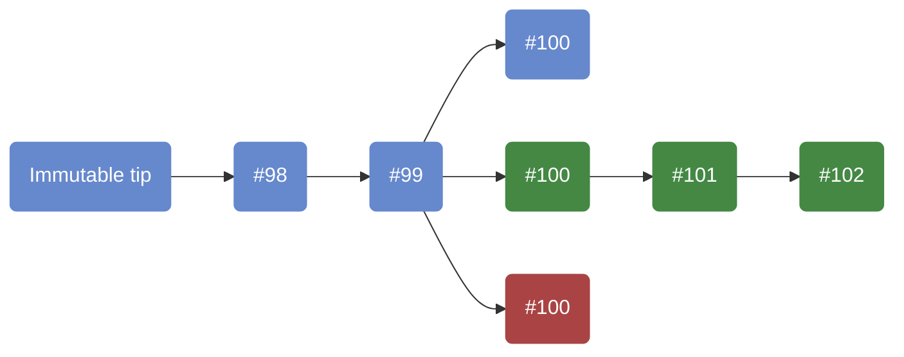

# Consensus Protocol

Part of: [System Overview](index.md)

The consensus protocol's core job is **agreement**: given competing chains, determine which one to adopt.
This requires validating that every block in a chain was produced by a legitimate leader and comparing chains to pick the best one.

Rather than hardcoding this logic for a specific protocol, the system defines an abstraction — the [`ConsensusProtocol`][consensus-protocol] class — that captures what any Ouroboros-family protocol must provide.
This is what allows the same consensus infrastructure to run [PBFT][pbft] (Byron), [TPraos][tpraos] (Shelley through Babbage), and [Praos][praos] (Conway onwards) without changes to the core logic.

## Chain selection

### The problem

The [Ouroboros][ouroboros-papers] protocol papers describe chain selection as a comparison of two entire chains.
In practice, this is not feasible: the Cardano chain contains millions of blocks, and scanning all of them each time a new block arrives is out of the question.

This practical constraint drives the design of chain selection in the consensus layer.
Instead of comparing full chains, the node:
1. Downloads and validates only *headers* first — headers are small and can be checked cheaply.
   This is why blocks are split into a [header and a body](../references/glossary.md#header-and-body): the split exists to make chain selection efficient.
2. Builds candidate [chain fragments](../references/glossary.md#prefixTipEtc-and-fragment-chain-fragment) — connected sequences of validated headers, one per upstream peer, anchored at the intersection with our chain.
3. Compares candidate header fragments by looking at their tips to decide which blocks are worth downloading — for current Ouroboros protocols, the block number and a protocol-specific tiebreaker at the tip carry enough information to decide.[^peras-fragments]
4. Downloads full block bodies (via BlockFetch) for the most promising candidates, and then performs the actual [chain selection](#the-selection-process) — validating blocks via the ledger and adopting the best chain.

[^peras-fragments]: [Peras](../references/glossary.md#peras-weight-boost), an extension of Praos under development, assigns weight to blocks via certificates.
    Its chain selection compares the suffixes of fragments after their intersection point, not just the tips.

### Header validation

Before candidates can be compared, their headers must be validated.
As headers arrive via [ChainSync](data_flow.md#block-flow-ntn-upstream), the node performs three kinds of checks:

- **Envelope checks** ([`validateEnvelope`][validate-envelope]) — block numbers are consecutive, slots are monotonically increasing, and each header's previous hash matches its predecessor.
  These structural checks are independent of the consensus protocol.
- **Protocol-specific checks** ([`updateChainDepState`][validate-header]) — the block's producer was a legitimate leader for its slot.
  For Praos, this means verifying KES and VRF signatures.
  Validating a peer's header and checking local leadership use the same cryptographic mechanism — the difference is the direction: one asks "was *this node* a legitimate leader?", the other asks "am *I* a legitimate leader?" (before forging a block).
- **Time-based checks** ([`realHeaderInFutureCheck`][in-future-check]) — headers with timestamps too far in the future are rejected.
  Near-future headers (within the maximum permissible clock skew) are accepted and stored for later processing.

Only headers that pass all three checks enter a candidate fragment.
This means that by the time we compare tips, every header in the fragment has already been verified.

Note that *block* validity — applying full blocks via the ledger — is a separate step that happens later during the [selection process](#the-selection-process).

See [The `ConsensusProtocol` class](#the-consensusprotocol-class) for how these checks are encoded in the abstraction.

### Comparing candidates

What information from a tip is needed for comparison?
The answer depends on the protocol — for BFT, just the block number suffices; for Praos, a tiebreaker based on the VRF output is also needed.
The consensus layer abstracts this as [`SelectView`][consensus-protocol], which is projected from the header at the tip of each fragment and combines:
1. The **block number** — longer chains are always preferred.
2. A **protocol-specific tiebreaker** — for Praos, this is based on the VRF output, giving a deterministic way to break ties between equal-length chains.

Both candidates fork from block #99.
- **Blue** — our chain, tip at #100.
- **Green** — candidate 1, tip at #102.
  Longer than ours, so it is preferred.
- **Red** — candidate 2, tip at #100.
  Same length as ours — the node sticks with its current chain, since when a candidate is equally preferable, the conservative choice is to not switch.
  This is a property of all Ouroboros protocols.

Candidates that fork deeper than [*k*](#security-parameter-k) blocks from the current tip are rejected outright, without comparison.

### The selection process

Chain selection is triggered when a new block arrives at [ChainDB][chaindb-api] (downloaded via [BlockFetch](data_flow.md#block-flow-ntn-upstream)).
It is implemented as a [single-threaded process][chainsel] inside ChainDB — not in a separate protocol component — because ChainDB knows what candidates exist and when new blocks arrive.

The core of the process is finding the preferred candidate among the [chain fragments](../references/glossary.md#prefixTipEtc-and-fragment-chain-fragment) that extend or fork from the current selection at or after the [immutable tip](../references/glossary.md#immutable-tip).
As part of adopting a candidate, its blocks are validated by applying them via the ledger.
If a block fails validation, it is [recorded as invalid][invalid-block] and the candidate is [truncated][truncate-candidate] to the last valid block.
All remaining candidates containing the invalid block are also truncated, and chain selection restarts with the updated candidate list.
Valid prefixes are preserved because blocks from different peers are mixed in the VolatileDB — an invalid block from one peer might sit on a valid chain from another.
The peer that sent the block triggering chain selection is [punished][punish-peer] if the invalid block is at or before that block in the chain.

ChainDB assumes that no blocks come from the far future — this is enforced earlier by [ChainSync](data_flow.md#block-flow-ntn-upstream), which rejects headers with timestamps too far ahead of the node's wall clock.
One caveat: during initialization, blocks already in the VolatileDB are not checked for future timestamps.

See [Blocks from the future](../references/miscellaneous/handling_blocks_from_the_future.md) for details.

### Outcomes

When chain selection succeeds:
- A volatile fragment is selected as the current chain.
- Blocks at the beginning of the selected fragment may become immutable, moving past the *k* boundary.
- An [extended ledger state](../references/glossary.md#extended-ledger-state) is produced for each block in the selected volatile fragment.
- The new selection is made available for other peers to download via [ChainSync](data_flow.md#block-flow-ntn-upstream).

## Security parameter *k*

The [security parameter *k*][security-param] is the maximum number of blocks the node will ever roll back.
On Cardano, *k* = 2160.
With an [active slot coefficient](../references/glossary.md#active-slot-coefficient-f) of 1/20 and a slot length of one second, a block is expected every 20 seconds on average, so *k* blocks are produced in roughly 12 hours.
Even under adversarial conditions, the [chain growth property](../references/glossary.md#chain-growth-property) guarantees at least *k* blocks within ~36 hours (3*k*/*f* slots).
This is not just a practical limit — it is required by the [Ouroboros][ouroboros-papers] analysis for consensus to be reached.
The consensus layer assumes *k* always applies, even for protocols like BFT and Genesis where the formal requirement is slightly different.

### Architectural consequences

The guarantee that rollbacks are bounded by *k* is exploited throughout the system:

- **Storage split** — [ChainDB](../references/glossary.md#chaindb) divides the chain into an ImmutableDB (blocks beyond *k*) and a VolatileDB (the last *k* blocks).
  Since the vast majority of the chain is immutable, it can be stored in a simple append-only structure where blocks are efficiently looked up by index rather than searched for.
- **Chain selection** rejects candidates that fork deeper than *k* from the current tip, as described [above](#the-selection-process).
- **Historical ledger states** — when switching to a new fork, blocks must be validated against the ledger state at the rollback point.
  With *k*, the node knows it only needs to maintain [*k*+1 historical ledger states][ledger-db-states], enabling efficient rollbacks without having to reconstruct the state by replaying from the beginning of the chain.
- **Peer tracking** — the [ChainSync client][chainsync-client] only tracks candidate fragments that fork within the last *k* blocks.
  Peers whose chains fork deeper are [disconnected][fork-too-deep].
- **Forecast range** — [header validation](#header-validation) needs [ledger views](../references/glossary.md#ledger-view) for future slots; the range over which these can be forecast is bounded by *k*.

### Limitations

Severe network partitions lasting in the order of days can cause chains to diverge beyond *k*.
When this happens, recovery requires manual intervention — this is true for all Ouroboros protocols.

## The `ConsensusProtocol` class

The previous sections described what a consensus protocol must do: compare chains, validate headers (including verifying leadership), and respect the security parameter *k*.
The [`ConsensusProtocol`][consensus-protocol] class encodes all of this in a single abstraction.

### Why a single class

These responsibilities share the same protocol state and configuration, so bundling them in one class is natural.
The class is parameterized by a type-level tag `p` that identifies the protocol — not by a block type.
This keeps the protocol definition independent from any particular ledger or block format.

Each protocol carries static configuration via [`ConsensusConfig p`][consensus-config], a data family.
The rest of the consensus layer treats this configuration as opaque — it just passes it through to where it's needed.
The only thing the system extracts from it directly is *k* (via `protocolSecurityParam`).

### Associated types

Each protocol defines seven associated types.
The contrast between [BFT][bft] and [Praos][praos] illustrates what the abstraction buys — BFT needs almost nothing, while Praos carries real cryptographic content:

| Type | Purpose | BFT | Praos |
|------|---------|-----|-------|
| `ChainDepState` | Protocol state, updated per header, subject to rollback | `()` | `PraosState` (nonces, OCert counters, last slot) |
| `IsLeader` | Proof of leadership | `()` | VRF certificate |
| `CanBeLeader` | Credentials needed to participate | `CoreNodeId` | VRF + KES signing keys |
| `LedgerView` | What the protocol needs from the ledger | `()` | Stake distribution |
| `TiebreakerView` | View for equal-length chain comparison | `NoTiebreaker` | VRF output hash |
| `ValidateView` | View on header for validation | DSIGN fields | KES + VRF fields |
| `ValidationErr` | What can go wrong | Bad signature | KES/VRF/OCert errors |

[`SelectView`][select-view] — introduced in [Comparing candidates](#comparing-candidates) — is built from the block number and the `TiebreakerView`.
Its default is simply `BlockNo`, which suffices for protocols where only chain length matters.

### Methods

The class has five methods, each corresponding to a concept already introduced:

- **`checkIsLeader`** — determines whether the node may produce a block in a given slot.
  Returns a proof of leadership (`IsLeader`) if so, `Nothing` otherwise.
  Uses the same cryptographic rules as [header validation](#header-validation) — applied in the opposite direction.
- **`tickChainDepState`** — advances the protocol state to a given slot (see [Ticked state](#ticked-state) below).
- **`updateChainDepState`** — validates a header and updates the protocol state, or returns a `ValidationErr`.
  This is the protocol-specific check described in [header validation](#header-validation).
- **`reupdateChainDepState`** — re-applies a previously validated header, skipping cryptographic checks.
  Used during chain selection when replaying blocks on a different fork, and during node initialization when replaying blocks from the ImmutableDB.
- **`protocolSecurityParam`** — extracts [*k*](#security-parameter-k) from the protocol configuration.

### Ticked state

Several methods require the protocol state to be *ticked* to a specific slot before use.
[`tickChainDepState`][consensus-protocol] takes a `ChainDepState p` and produces a [`Ticked`][ticked] `(ChainDepState p)` — a type-level distinction that makes it impossible to accidentally use an unticked state where a ticked one is expected.

Both `checkIsLeader` and `updateChainDepState` require a ticked state as input.
Ticking also requires a `LedgerView` (see below), because some time-dependent state transitions need ledger information — for example, Praos rotates its nonces at epoch boundaries using the ledger's epoch structure.

For BFT, ticking is a no-op (`TickedTrivial`) since there is no protocol state.

### LedgerView and forecasting

The [`LedgerView`][consensus-protocol] is a projection of the ledger state that provides what the protocol needs — for Praos, this is the stake distribution used for leader election.

Why does the *ledger* determine which stake distribution to use, rather than the consensus layer?
Because the ledger's reward calculations must use the same distribution.
Placing the sampling decision in the ledger means the consensus algorithm works unchanged even if the sampling rule changes.

The consensus layer accesses the `LedgerView` through [`LedgerSupportsProtocol`][ledger-supports-protocol], which provides:
- `protocolLedgerView` — extract the view from a ticked ledger state.
- [`ledgerViewForecastAt`][ledger-view-forecast] — obtain a `LedgerView` for a future slot from a ledger state at a prior slot, without having seen the intervening blocks.
  This is needed to validate headers on candidate chains that extend beyond the current tip.

Forecasting is distinct from ticking: ticking advances a full ledger state to a slot (expensive, no blocks allowed in between), while forecasting returns only the `LedgerView` (fast, blocks may exist in between).
Cross-era forecasting — forecasting across a hard fork boundary — is more complex and is handled by the Hard Fork Combinator.

### Connecting blocks to protocols

The class above is parameterized by a protocol `p`, not a block type.
Several additional type families and classes provide the glue between blocks and protocols:

- [`BlockProtocol`][block-protocol] — a type family that maps each concrete block type to its consensus protocol.
  For example, `ShelleyBlock` is parameterized by the protocol, so it can be instantiated with either TPraos or Praos.
- [`BlockSupportsProtocol`][block-supports-protocol] — provides projections from a concrete header to the [`SelectView`][select-view] (for [chain comparison](#comparing-candidates)) and `ValidateView` (for [header validation](#header-validation)) that the protocol needs.
- [`LedgerSupportsProtocol`][ledger-supports-protocol] — bridges the ledger and the protocol, providing the `LedgerView` and forecasting.
- [`ValidateEnvelope`][validate-envelope] — defines the [envelope checks](#header-validation) (block number, slot, hash chain).
- [`ProtocolHeaderSupportsProtocol`][protocol-header-supports-protocol] — a Shelley-specific bridge that provides additional projections from protocol headers.

The Cardano chain combines all eras (and their protocols) through the Hard Fork Combinator, which provides composite instances for `ConsensusProtocol` and the classes above.

## Further reading

- [Ouroboros Praos paper][praos-paper] — the formal protocol specification
- [Ouroboros research library][ouroboros-papers] — all Ouroboros family papers
- [Cardano Blueprints](https://cardano-scaling.github.io/cardano-blueprint/) — requirements and specifications
- [The Cardano Consensus and Storage Layer (technical report)](../references/technical_reports.md) — detailed treatment of the consensus layer design
- [Data Flow](data_flow.md) — how blocks and headers flow through the system
- [Node Tasks](node_tasks.md) — practical view of what a running node does

[consensus-protocol]: https://github.com/IntersectMBO/ouroboros-consensus/blob/main/ouroboros-consensus/src/ouroboros-consensus/Ouroboros/Consensus/Protocol/Abstract.hs
[bft]: https://github.com/IntersectMBO/ouroboros-consensus/blob/main/ouroboros-consensus/src/ouroboros-consensus/Ouroboros/Consensus/Protocol/BFT.hs
[praos]: https://github.com/IntersectMBO/ouroboros-consensus/blob/main/ouroboros-consensus-protocol/src/ouroboros-consensus-protocol/Ouroboros/Consensus/Protocol/Praos.hs
[pbft]: https://github.com/IntersectMBO/ouroboros-consensus/blob/main/ouroboros-consensus/src/ouroboros-consensus/Ouroboros/Consensus/Protocol/PBFT.hs
[tpraos]: https://github.com/IntersectMBO/ouroboros-consensus/blob/main/ouroboros-consensus-protocol/src/ouroboros-consensus-protocol/Ouroboros/Consensus/Protocol/TPraos.hs
[ledger-supports-protocol]: https://github.com/IntersectMBO/ouroboros-consensus/blob/main/ouroboros-consensus/src/ouroboros-consensus/Ouroboros/Consensus/Ledger/SupportsProtocol.hs
[security-param]: https://github.com/IntersectMBO/ouroboros-consensus/blob/main/ouroboros-consensus/src/ouroboros-consensus/Ouroboros/Consensus/Config/SecurityParam.hs#L38
[chaindb-api]: https://github.com/IntersectMBO/ouroboros-consensus/blob/main/ouroboros-consensus/src/ouroboros-consensus/Ouroboros/Consensus/Storage/ChainDB/API.hs
[chainsel]: https://github.com/IntersectMBO/ouroboros-consensus/blob/main/ouroboros-consensus/src/ouroboros-consensus/Ouroboros/Consensus/Storage/ChainDB/Impl/ChainSel.hs
[consensus-config]: https://github.com/IntersectMBO/ouroboros-consensus/blob/main/ouroboros-consensus/src/ouroboros-consensus/Ouroboros/Consensus/Protocol/Abstract.hs#L60
[select-view]: https://github.com/IntersectMBO/ouroboros-consensus/blob/main/ouroboros-consensus/src/ouroboros-consensus/Ouroboros/Consensus/Protocol/Abstract.hs#L322
[ticked]: https://github.com/IntersectMBO/ouroboros-consensus/blob/main/ouroboros-consensus/src/ouroboros-consensus/Ouroboros/Consensus/Ticked.hs#L46
[block-protocol]: https://github.com/IntersectMBO/ouroboros-consensus/blob/main/ouroboros-consensus/src/ouroboros-consensus/Ouroboros/Consensus/Block/Abstract.hs#L121
[block-supports-protocol]: https://github.com/IntersectMBO/ouroboros-consensus/blob/main/ouroboros-consensus/src/ouroboros-consensus/Ouroboros/Consensus/Block/SupportsProtocol.hs#L26
[ledger-view-forecast]: https://github.com/IntersectMBO/ouroboros-consensus/blob/main/ouroboros-consensus/src/ouroboros-consensus/Ouroboros/Consensus/Ledger/SupportsProtocol.hs#L71
[protocol-header-supports-protocol]: https://github.com/IntersectMBO/ouroboros-consensus/blob/main/ouroboros-consensus-cardano/src/shelley/Ouroboros/Consensus/Shelley/Protocol/Abstract.hs#L173
[validate-envelope]: https://github.com/IntersectMBO/ouroboros-consensus/blob/main/ouroboros-consensus/src/ouroboros-consensus/Ouroboros/Consensus/HeaderValidation.hs#L357
[validate-header]: https://github.com/IntersectMBO/ouroboros-consensus/blob/main/ouroboros-consensus/src/ouroboros-consensus/Ouroboros/Consensus/HeaderValidation.hs#L503
[in-future-check]: https://github.com/IntersectMBO/ouroboros-consensus/blob/main/ouroboros-consensus/src/ouroboros-consensus/Ouroboros/Consensus/MiniProtocol/ChainSync/Client/InFutureCheck.hs#L134
[invalid-block]: https://github.com/IntersectMBO/ouroboros-consensus/blob/main/ouroboros-consensus/src/ouroboros-consensus/Ouroboros/Consensus/Storage/ChainDB/Impl/ChainSel.hs#L1284
[truncate-candidate]: https://github.com/IntersectMBO/ouroboros-consensus/blob/main/ouroboros-consensus/src/ouroboros-consensus/Ouroboros/Consensus/Storage/ChainDB/Impl/ChainSel.hs#L1132
[punish-peer]: https://github.com/IntersectMBO/ouroboros-consensus/blob/main/ouroboros-consensus/src/ouroboros-consensus/Ouroboros/Consensus/Storage/ChainDB/Impl/ChainSel.hs#L1294
[ledger-db-states]: https://github.com/IntersectMBO/ouroboros-consensus/blob/main/ouroboros-consensus/src/ouroboros-consensus/Ouroboros/Consensus/Storage/LedgerDB/V2.hs#L212
[chainsync-client]: https://github.com/IntersectMBO/ouroboros-consensus/blob/main/ouroboros-consensus/src/ouroboros-consensus/Ouroboros/Consensus/MiniProtocol/ChainSync/Client.hs
[fork-too-deep]: https://github.com/IntersectMBO/ouroboros-consensus/blob/main/ouroboros-consensus/src/ouroboros-consensus/Ouroboros/Consensus/MiniProtocol/ChainSync/Client.hs#L869
[praos-paper]: https://iohk.io/en/research/library/papers/ouroboros-praos-an-adaptively-secure-semi-synchronous-proof-of-stake-protocol/
[ouroboros-papers]: https://iohk.io/en/research/library/
