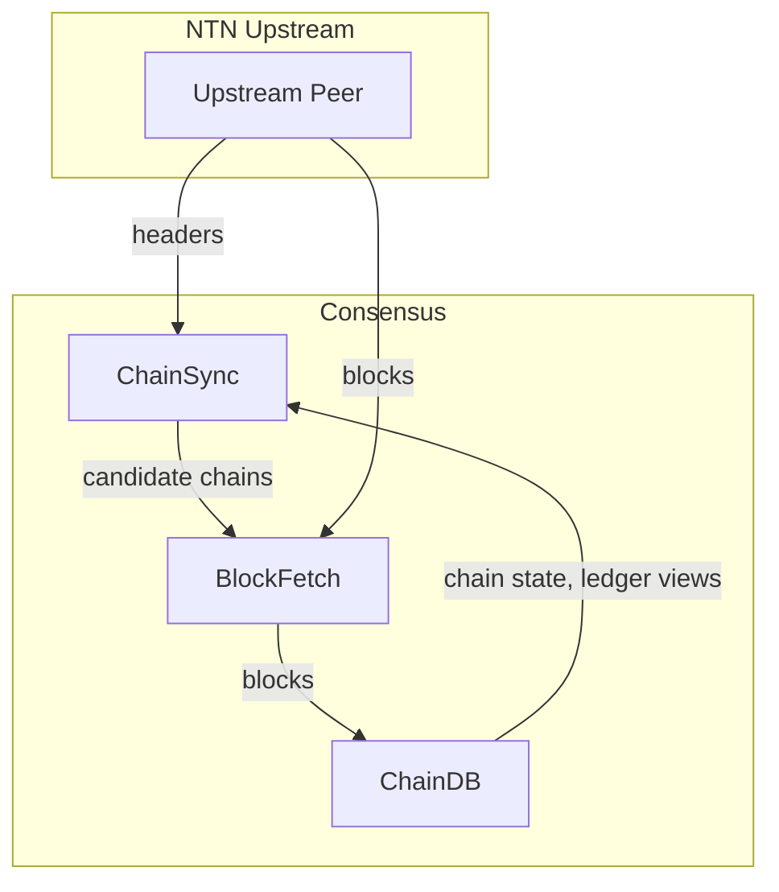
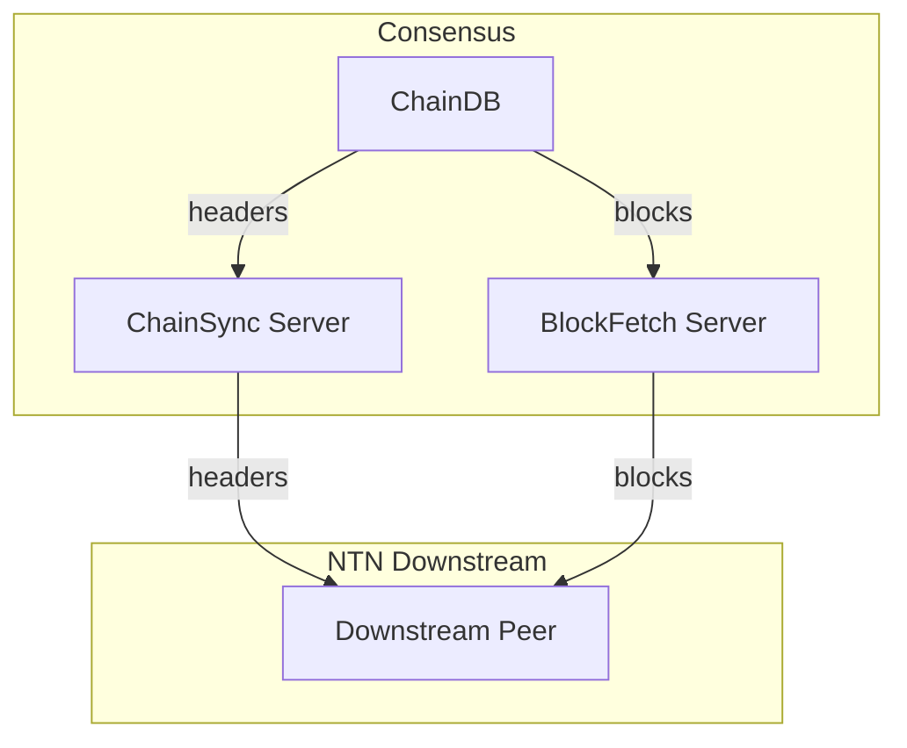
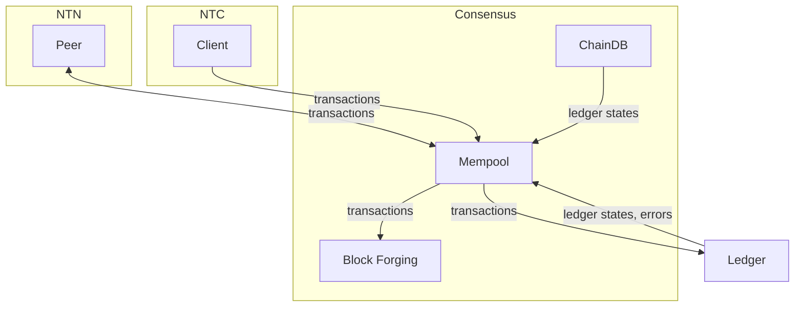
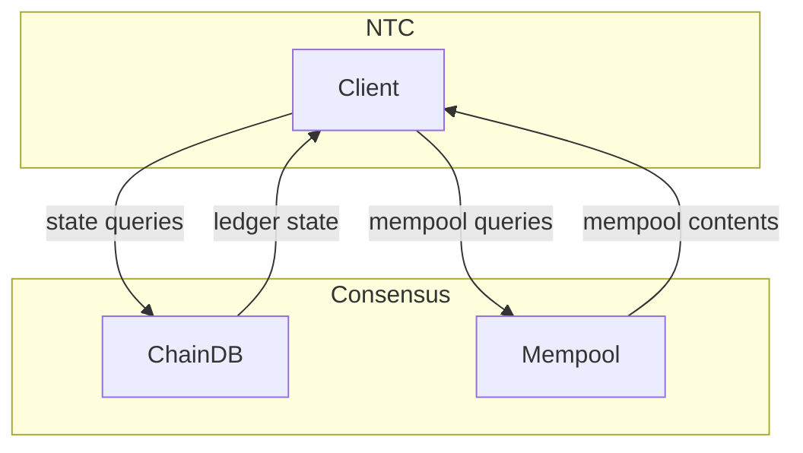
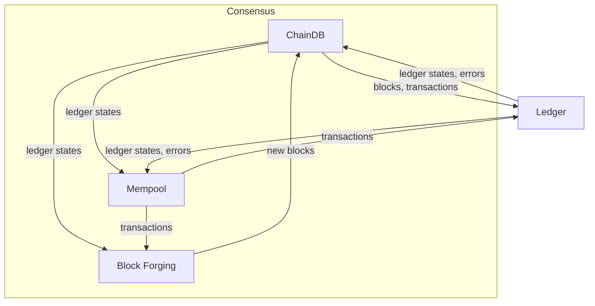

# Components' Data Flow

Part of: [System Overview](index.md)

Understanding how data flows through the consensus layer is key to
understanding the system's architecture — which components own which
responsibilities, and how they coordinate.

## Overview

The consensus layer interacts with the network and the ledger.
It receives blocks and transactions from the network, uses the ledger to validate them, stores the results, and diffuses blocks and transactions back to other nodes.
Local clients (such as wallets and explorers) can also submit transactions and query the current state.

Communication with the network happens through [mini-protocols](../references/glossary.md#mini-protocol), each responsible for a specific kind of data exchange.
Cardano distinguishes two kinds of network connections:
- **[Node-to-Node (NTN)](https://github.com/IntersectMBO/ouroboros-consensus/blob/main/ouroboros-consensus-diffusion/src/ouroboros-consensus-diffusion/Ouroboros/Consensus/Network/NodeToNode.hs)** for communication with other Cardano nodes, which are untrusted, and
- **[Node-to-Client (NTC)](https://github.com/IntersectMBO/ouroboros-consensus/blob/main/ouroboros-consensus-diffusion/src/ouroboros-consensus-diffusion/Ouroboros/Consensus/Network/NodeToClient.hs)** for communication with local clients (wallets, explorers, CLI tools), which are trusted.

This distinction matters because NTN and NTC connections offer different sets of mini-protocols and have different security considerations.
NTN connections are further split into upstream (peers from which we pull data) and downstream (peers to which we serve data).
All NTN mini-protocols are pull-based: data is only sent in response to requests from the other side, providing natural backpressure.

Blocks are split into a [header and a body](../references/glossary.md#header-and-body).
Headers are small and can be validated cheaply, so nodes exchange and validate headers first before downloading full block bodies.
This is reflected in the NTN mini-protocols:
- **[ChainSync](../references/glossary.md#chainsync)** — exchanges block headers between peers
- **[BlockFetch](../references/glossary.md#blockfetch)** — downloads full block bodies
- **TxSubmission** — exchanges transactions between peers

The NTC mini-protocols are:
- **ChainSync** — same protocol as NTN, but exchanges full blocks instead of headers
- **LocalTxSubmission** — clients submit transactions
- **LocalStateQuery** — clients query the current ledger state
- **LocalTxMonitor** — clients monitor the mempool

These protocols are also pull-based, except for LocalTxSubmission where the client pushes transactions directly — this is acceptable because local clients are trusted.

Inside the consensus layer, three main components handle this data:
- **ChainDB** stores the blockchain and performs [chain selection](../references/glossary.md#chain-selection) when new blocks arrive.
- The **[Mempool](../references/glossary.md#mempool)** buffers pending transactions, validating them against the current [ledger state](../references/glossary.md#ledger-state).
- **Block Forging** produces new blocks when the node is a [slot leader](../references/glossary.md#leader-schedule), drawing transactions from the mempool.

Both ChainDB and the Mempool use the **Ledger** layer directly — ChainDB for block validation during chain selection, and the Mempool for transaction validation.

The following sections describe each of these flows in detail.

## Block flow (NTN upstream)

When a node learns about new blocks from upstream peers, the process happens in two stages.

First, the [ChainSync][chainsync-client] mini-protocol requests headers from each upstream peer.
As headers arrive, they are validated using the chain state and [ledger views](../references/glossary.md#ledger-view) obtained from ChainDB.

Valid headers are assembled into candidate chain fragments — one per upstream peer.

Then, the [BlockFetch][blockfetch-client] mini-protocol compares these candidate chains against the node's current chain and decides which blocks to download.
Downloaded blocks are added to [ChainDB][chaindb-api], which triggers [chain selection][chainsel]: if a candidate chain is better than the current one, the node adopts it.

This two-stage design means the node only downloads full blocks for chains that have valid headers, avoiding wasted bandwidth and protecting against resource-draining attacks.

## Block diffusion (NTN downstream)

Downstream peers pull headers and block bodies from the node (their upstream) via the [ChainSync server][chainsync-server] and [BlockFetch server][blockfetch-server].
The node serves them from ChainDB.

As an optimization, when diffusion pipelining is enabled, the ChainSync server can announce a block header before its body has been fully validated.
For details, see [Node Tasks](node_tasks.md).

## Transaction flow

Transactions reach the node's [mempool](../references/glossary.md#mempool) through two paths:
- **NTN TxSubmission** — transactions are exchanged bidirectionally between peers.
  Each NTN connection both sends transactions from the local mempool and receives transactions from the remote peer.
- **NTC [LocalTxSubmission][localtxsubmission-server]** — local clients (such as wallets) submit transactions directly to the node.

In both cases, transactions are added directly to the [mempool][mempool-api].
The mempool validates each transaction against the current [ledger state](../references/glossary.md#ledger-state) and rejects invalid ones.
When the ledger state changes (e.g., after adopting a new chain), the mempool revalidates all buffered transactions.

When the node is a [slot leader](../references/glossary.md#leader-schedule), block forging draws transactions from the mempool to include in a new block.

## Client queries (NTC)

Local clients can query the node's state through two NTC mini-protocols:
- **[LocalStateQuery][localstatequery-server]** — acquires a snapshot of the [ledger state](../references/glossary.md#ledger-state) at a specific point on the chain and runs queries against it.
  The state is obtained from ChainDB.
- **[LocalTxMonitor][localtxmonitor-server]** — monitors the current contents of the [mempool](../references/glossary.md#mempool).

Both are read-only — they do not modify the node's state.

## Internal flows

The consensus layer's internal components also exchange data with each other.

**Chain selection and block validation**:
When blocks arrive at [ChainDB][chaindb-api], they are placed in a queue.
A [background thread][chainsel] dequeues blocks and performs [chain selection](../references/glossary.md#chain-selection) — evaluating whether a candidate chain is better than the current one.
As part of this process, ChainDB applies blocks using the **Ledger** layer, which validates them and produces updated [ledger states](../references/glossary.md#ledger-state).

**Mempool and ledger state**:
The [mempool](../references/glossary.md#mempool) reads the current ledger state from ChainDB.
It uses the **Ledger** layer directly to validate transactions against this state.
When ChainDB's ledger state changes (e.g., after adopting a new chain), the mempool revalidates all its buffered transactions.

**Block forging**:
When the node is a [slot leader](../references/glossary.md#leader-schedule), [block forging][nodekernel] reads the current ledger state from ChainDB and draws transactions from the mempool.
The newly forged block is then added back to ChainDB (using the same queue as when blocks arrive externally), which triggers chain selection.

## See also

For a lower-level view using a different notation, see the [reference data flow diagram](../references/data_flow.md).

<!-- Reference-style links to source modules -->
[chainsync-client]: https://github.com/IntersectMBO/ouroboros-consensus/blob/main/ouroboros-consensus/src/ouroboros-consensus/Ouroboros/Consensus/MiniProtocol/ChainSync/Client.hs
[blockfetch-client]: https://github.com/IntersectMBO/ouroboros-consensus/blob/main/ouroboros-consensus/src/ouroboros-consensus/Ouroboros/Consensus/MiniProtocol/BlockFetch/ClientInterface.hs
[chainsync-server]: https://github.com/IntersectMBO/ouroboros-consensus/blob/main/ouroboros-consensus/src/ouroboros-consensus/Ouroboros/Consensus/MiniProtocol/ChainSync/Server.hs
[blockfetch-server]: https://github.com/IntersectMBO/ouroboros-consensus/blob/main/ouroboros-consensus/src/ouroboros-consensus/Ouroboros/Consensus/MiniProtocol/BlockFetch/Server.hs
[localtxsubmission-server]: https://github.com/IntersectMBO/ouroboros-consensus/blob/main/ouroboros-consensus/src/ouroboros-consensus/Ouroboros/Consensus/MiniProtocol/LocalTxSubmission/Server.hs
[localstatequery-server]: https://github.com/IntersectMBO/ouroboros-consensus/blob/main/ouroboros-consensus/src/ouroboros-consensus/Ouroboros/Consensus/MiniProtocol/LocalStateQuery/Server.hs
[localtxmonitor-server]: https://github.com/IntersectMBO/ouroboros-consensus/blob/main/ouroboros-consensus/src/ouroboros-consensus/Ouroboros/Consensus/MiniProtocol/LocalTxMonitor/Server.hs
[chaindb-api]: https://github.com/IntersectMBO/ouroboros-consensus/blob/main/ouroboros-consensus/src/ouroboros-consensus/Ouroboros/Consensus/Storage/ChainDB/API.hs
[mempool-api]: https://github.com/IntersectMBO/ouroboros-consensus/blob/main/ouroboros-consensus/src/ouroboros-consensus/Ouroboros/Consensus/Mempool/API.hs
[block-forging]: https://github.com/IntersectMBO/ouroboros-consensus/blob/main/ouroboros-consensus/src/ouroboros-consensus/Ouroboros/Consensus/Block/Forging.hs
[chainsel]: https://github.com/IntersectMBO/ouroboros-consensus/blob/main/ouroboros-consensus/src/ouroboros-consensus/Ouroboros/Consensus/Storage/ChainDB/Impl/ChainSel.hs
[nodekernel]: https://github.com/IntersectMBO/ouroboros-consensus/blob/main/ouroboros-consensus-diffusion/src/ouroboros-consensus-diffusion/Ouroboros/Consensus/NodeKernel.hs
