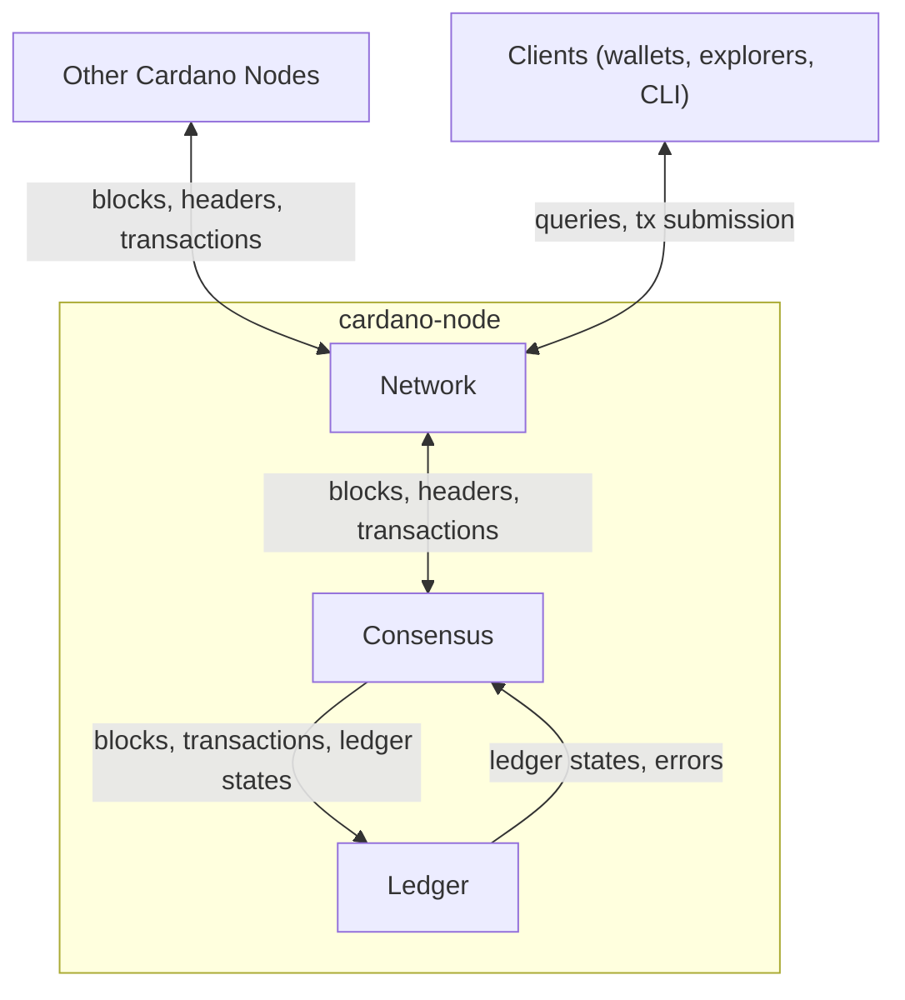

# System Overview

Welcome to the documentation for the [`ouroboros-consensus`](https://github.com/IntersectMBO/ouroboros-consensus) repository, which houses the Haskell implementation of the consensus layer used by the [Cardano node](https://github.com/IntersectMBO/cardano-node).

## What is ouroboros-consensus and why does it exist?

In a blockchain network, nodes must independently agree on which chain of blocks is the current one — this is the consensus problem.
The consensus layer solves this by implementing the [Ouroboros](https://iohk.io/en/research/library/) family of proof-of-stake protocols.

The consensus layer interacts with two other major components:
- the [network layer](https://github.com/input-output-hk/ouroboros-network), which handles peer-to-peer communication, and
- the [ledger layer](https://github.com/IntersectMBO/cardano-ledger), which defines the rules for validating blocks and transactions.

The consensus layer:
- receives blocks and transactions from the network layer,
- determines when the node should produce a new block,
- [uses the ledger layer](../explanations/ledger_interaction.md) to validate blocks and transactions, and
- decides which chain to follow among competing alternatives.

To support these operations, the consensus layer also maintains a storage layer (ChainDB) for efficient access to blockchain data, and a mempool that buffers pending transactions until they can be included in a block.

Cardano has evolved through multiple [ledger eras](../references/glossary.md#ledger-eras) — [Byron](../references/glossary.md#byron-era), [Shelley, Allegra, Mary, Alonzo, Babbage](../references/glossary.md#shelley-based-eras), and Conway — each with its own consensus protocol and ledger rules (see [this table](https://github.com/cardano-foundation/CIPs/blob/master/CIP-0059/feature-table.md) for the transition history).
The consensus layer is designed to support these transitions seamlessly — the same node can validate the entire chain history across all eras.

## Where consensus sits

The following diagram shows the consensus layer in the context of the Cardano node and its external interactions.

The consensus layer does not communicate directly with peers or clients — all external communication goes through the network layer.
The ledger layer provides pure functions for validating blocks and transactions, while the consensus layer is responsible for storing the blockchain and deciding which chain to follow.

## Code organization

A core design principle is the abstraction from specific ledger and protocol implementations.
The polymorphic core (in [`ouroboros-consensus`][oc-src]) defines the consensus logic independently of any particular ledger or protocol, while Cardano-specific instantiations provide the concrete implementations:

- [`byron`][byron-src] — Byron era: PBFT protocol, Byron-specific block/ledger types, EBBs
- [`shelley`][shelley-src] — Shelley-based eras (Shelley through Conway): Praos protocol, shared ledger integration
- [`ouroboros-consensus-cardano`][cardano-src] — the Cardano block type combining all eras, hard fork transitions, and node configuration

[Components' Data Flow](data_flow.md) explains how ChainDB, the mempool, and the mini-protocols interact.

## Further reading

- [Design Goals](design_goals.md) — the design principles behind the system; start here to understand why the system is the way it is
- [Components' Data Flow](data_flow.md) — how ChainDB, the mempool, and the mini-protocols interact
- [Ledger Interaction](ledger_interaction.md) — how the consensus layer interfaces with the ledger and network layers
- [Queries](queries.md) — how consensus exposes information to clients
- [Node Tasks](node_tasks.md) — a practical view of what a running node does

[oc-src]: https://github.com/IntersectMBO/ouroboros-consensus/tree/main/ouroboros-consensus/src/ouroboros-consensus
[byron-src]: https://github.com/IntersectMBO/ouroboros-consensus/tree/main/ouroboros-consensus-cardano/src/byron
[shelley-src]: https://github.com/IntersectMBO/ouroboros-consensus/tree/main/ouroboros-consensus-cardano/src/shelley
[cardano-src]: https://github.com/IntersectMBO/ouroboros-consensus/tree/main/ouroboros-consensus-cardano/src/ouroboros-consensus-cardano
