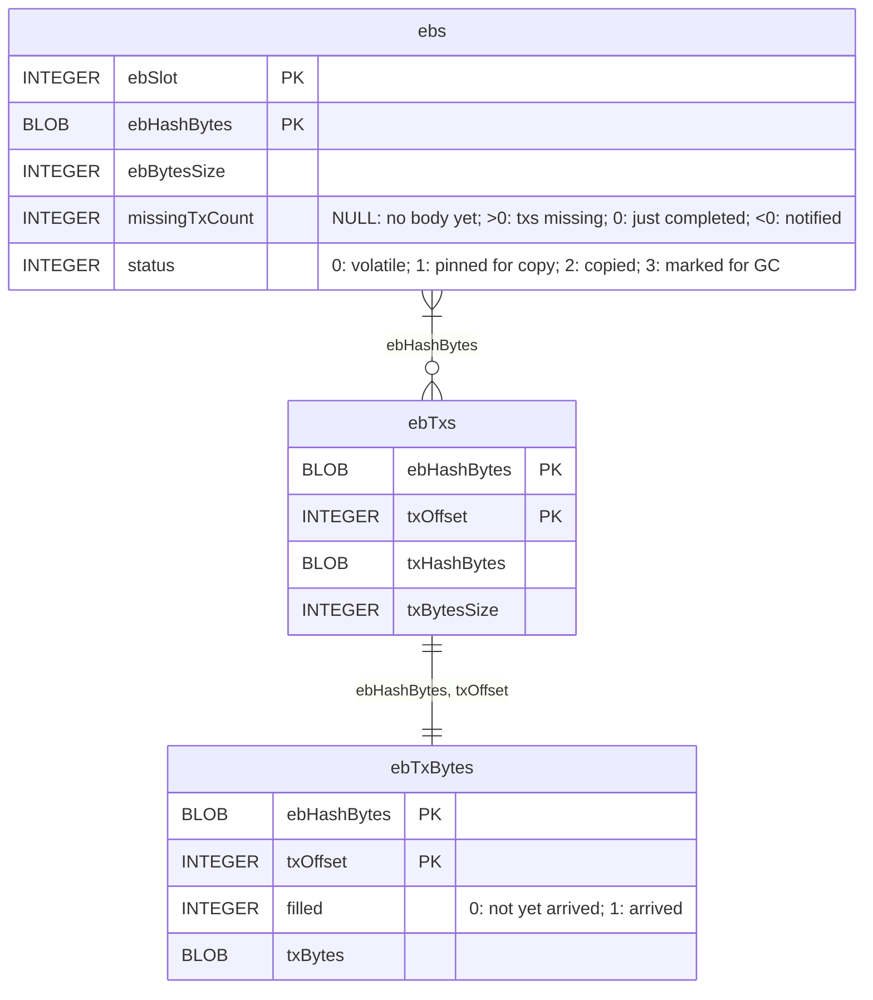
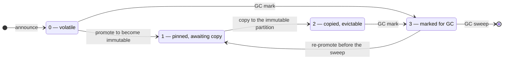
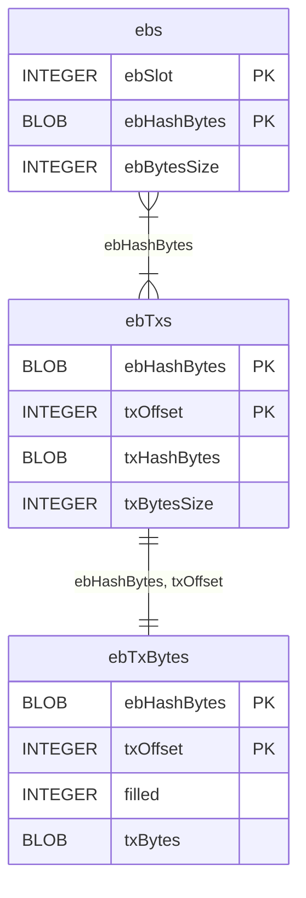

# LeiosDB

LeiosDB stores Leios endorser blocks (EBs) and their transactions.
Its SQLite backend keeps them in two files, called partitions:

- **Volatile partition** stores fresh EB announcements, bodies and transaction that the node downloads or forges.
- **Immutable partition** stores complete EBs (and their closure transactions) that a certificate on the immutable chain refers to.

The EBs and their closures are copied from the volatile to the immutable partition when they become older than [`k`](../references/glossary.md#security-parameter) (the Praos security parameter). See also the [ImmutableDB](../references/glossary.md#chaindb) glossary entry.

## Database schema

- `ebs` has one row for each EB *announcement*. Thus one EB hash can occur at several slots.
- `ebTxs` is the EB body. It has one row for each transaction of the EB, in order. It stores each EB hash only once.
- `ebTxBytes` stores the transaction bytes of the EB body, one row for each `ebTxs` row, with the same key. The EB owns these bytes: a transaction that belongs to two EBs is stored twice.

## Volatile partition

The queries join the tables on the EB hash (`ebHashBytes`) and the transaction offset (`txOffset`).

- When an EB body arrives, rows are inserted in `ebTxs`. In the same transaction, one `ebTxBytes` row is allocated for each of them: a zero-filled blob of the declared size, with `filled = 0`. Then `missingTxCount` is set to the number of unfilled rows.
- When transactions arrive, they overwrite their rows in place and set `filled = 1`. A write is dropped if its row does not exist, is already filled, or has a different size. Then `missingTxCount` is decreased by the number of rows filled, on every announcement of the EB hash.
- The GC sweep phase deletes the `ebTxBytes`, `ebTxs` and `ebs` rows of an EB by its hash: three range deletes.

Indexes:

| Index                           | On                                   | Used for                                                                 |
|---------------------------------|--------------------------------------|--------------------------------------------------------------------------|
| `idx_ebs_ebHashBytes`           | `ebs(ebHashBytes)`                   | Looking up an EB by hash                                                 |
| `idx_ebs_sweepable`             | `ebs(ebSlot) WHERE status IN (0, 2)` | The GC mark scan                                                         |
| `idx_ebs_markedForGc`           | `ebs(ebHashBytes) WHERE status = 3`  | The sweeper picking EBs to evict                                         |
| `idx_ebs_pinned`                | `ebs(ebSlot) WHERE status = 1`       | The copier picking EBs to copy                                           |

### Lifecycle of an EB row

The `status` column records where an `ebs` row is in promotion and garbage collection:

## Immutable partition

The copier copies only complete EBs, and GC never removes EBs from this partition.
Thus every `ebs` row has its full body in `ebTxs`, and every `ebTxs` row has its filled `ebTxBytes` row.
For the same reason, the immutable partition does not have `missingTxCount`, `status`, or any index other than `idx_ebs_ebHashBytes`.
