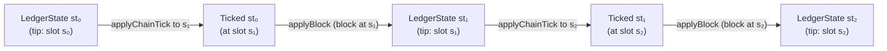

# Ticking

Part of: [System Overview](index.md)

Consensus must answer questions about the ledger at slots where no block exists.
"Would this transaction be valid if included in the next block?"
"Am I allowed to lead this slot?"
"What are the block-production limits right now?"
*Ticking* is the operation that advances a ledger or protocol state in time to answer such questions, without consuming a block.

## Overview

Time in Ouroboros is divided into [slots](../references/glossary.md#slot).
State on a chain — the [ledger state](../references/glossary.md#ledger-state) and the protocol state (`ChainDepState`) — evolves along two independent axes: *blocks arriving* and *time passing*.
Ticking captures the second axis: given a state anchored at some slot and a later target slot, it applies every per-slot rule that fires in between.



A ticked state carries the effects of every per-slot rule between its source slot and the target slot: epoch transitions, rewards pulsing, nonce switching at epoch boundaries, hard-fork activations, and so on.
A block is then applied on top of a ticked state — never directly on an unticked one.
The types enforce this alternation.

## Why ticking is a distinguished operation

If ticking were only ever the first step of applying a block, it would not need its own name — it could just be folded into block application.
The reason it is distinguished is that consensus routinely needs the state at slots where no block exists:

- The [mempool](../references/glossary.md#mempool) validates incoming transactions against the state *as it would be in the next producible slot*, so that transactions it accepts remain valid when a future block is minted.
- The leadership check evaluates at the current wall-clock slot whether this node is elected to mint, regardless of whether a block exists at that slot.
- A block producer needs the ticked state at the slot it is minting for in order to compute block-production limits (size, ExUnits) before any transactions are selected.

Bundling ticking into block application would make all of these impossible.
Separating it also isolates the per-slot rules into one place — the `TICK` transition rule in the ledger — making their behaviour reproducible and independently testable.

## The `Ticked` type wrapper

The interface exposes two ticking operations:

- [`applyChainTickLedgerResult`][apply-chain-tick] on the ledger state.
- [`tickChainDepState`][tick-chain-dep-state] on the protocol state.

Both take an unticked state and produce a [`Ticked`][ticked] version of it:

```haskell
applyChainTickLedgerResult ::
  ComputeLedgerEvents -> LedgerCfg l -> SlotNo -> l EmptyMK ->
  LedgerResult l (Ticked l DiffMK)

tickChainDepState ::
  ConsensusConfig p -> LedgerView p -> SlotNo -> ChainDepState p ->
  Ticked (ChainDepState p)
```

`Ticked` is a [data family][ticked] with one instance per state type.
It encodes a discipline at the type level: applying a block is the *only* operation that turns a `Ticked` state back into an unticked one, and a [`LedgerView`](../references/glossary.md#ledger-view) can only be projected from a `Ticked` state.
This rules out two classes of bug statically — ticking twice without applying a block in between, or applying a block without ticking first.

## Where ticking is used

| Call site                           | From slot             | To slot                      | Why                                                                                   |
|-------------------------------------|-----------------------|------------------------------|---------------------------------------------------------------------------------------|
| Block validation ([ChainDB](../references/glossary.md#chaindb)) | ledger tip | block's slot                 | Advance the state to the block's slot before applying the block body.                 |
| Block forging / leadership check    | ledger tip            | current wall-clock slot      | Check election and compute block-production limits at the slot being minted for.      |
| Mempool validation                  | ledger tip            | ledger tip + 1               | Validate transactions against the state of the next producible block.                 |
| Header validation                   | ledger tip            | header's slot                | Tick the protocol state (`ChainDepState`) to the header's slot before validating it.  |
| Cross-era ticking                   | final slot of era *n* | some slot in era *n+1*       | Activate the hard-fork transition; handled internally by the Hard Fork Combinator.    |

## Ticking vs. forecasting

Ticking and [forecasting](../references/glossary.md#forecasting) both represent the passage of time, but they answer different questions.

- **Ticking** advances the *full* state to a target slot.
  Its precondition is that no block exists between the source slot and the target slot — ticking past a block on the chain is unsound.
- **Forecasting** produces only the slices of the future state that are guaranteed to be stable regardless of intervening blocks — in practice, just the [`LedgerView`](../references/glossary.md#ledger-view) needed to validate future headers.
  It is bounded by the [forecast horizon](../references/glossary.md#forecast-horizon).

The two agree within the forecast horizon:

> `forecastFor (ledgerViewForecastAt cfg st) slot` ≡ `protocolLedgerView cfg (applyChainTick cfg slot st)`

Consensus always guards its ticks behind a successful forecast: the mempool ticks by a single slot (trivially within range); the leadership check aborts if it cannot forecast the `LedgerView`; the ChainSync client forecasts a `LedgerView` before accepting a header; ChainSel only applies blocks whose headers already passed through one of the above.
This is why ticking can be a *total* function while forecasting is partial — every tick the node performs is dominated by a forecast that has already succeeded.

## Invariants and preconditions

- **Monotonicity.** The target slot must be strictly greater than the slot at the ledger tip (with the Byron EBB caveat, which shares its predecessor's slot).
- **Tip invariance.** Ticking does not change the ledger tip; the tip still refers to the most recently applied block:
  `ledgerTipPoint (applyChainTick cfg slot st) == ledgerTipPoint st`.
- **Totality.** `applyChainTickLedgerResult` cannot fail.
  A per-slot rule that could fail would mean a *previous* block set up the ledger so that *any* subsequent block would be invalid as soon as a certain slot was reached — which would break the chain.
- **No reads from the UTxO.** Ticking is not allowed to read from [`LedgerTables`](../references/glossary.md#ledger-state), though it may produce diffs on them (notably at era transitions).
- **No cross-era ticking in a single-era instance.** Ticking across a hard-fork boundary is only defined by the [Hard Fork Combinator](../references/glossary.md#hard-fork-combinator); a single-era ledger state cannot be ticked past its era.

## Further reading

- [References/Miscellaneous/Ticking](../references/miscellaneous/ticking.md) — the archival discussion, with additional detail on cross-era ticking, HFC subtleties, and cost bounds.
- Haddocks: [`Ticked`][ticked], [`applyChainTickLedgerResult`][apply-chain-tick], [`tickChainDepState`][tick-chain-dep-state], [`ledgerViewForecastAt`][ledger-view-forecast], [`Forecast`][forecast].
- [Issue #345](https://github.com/IntersectMBO/ouroboros-consensus/issues/345) — proposal for a cross-era ticking interface.

[ticked]: https://github.com/IntersectMBO/ouroboros-consensus/blob/main/ouroboros-consensus/src/ouroboros-consensus/Ouroboros/Consensus/Ticked.hs
[apply-chain-tick]: https://github.com/IntersectMBO/ouroboros-consensus/blob/main/ouroboros-consensus/src/ouroboros-consensus/Ouroboros/Consensus/Ledger/Basics.hs
[tick-chain-dep-state]: https://github.com/IntersectMBO/ouroboros-consensus/blob/main/ouroboros-consensus/src/ouroboros-consensus/Ouroboros/Consensus/Protocol/Abstract.hs
[ledger-view-forecast]: https://github.com/IntersectMBO/ouroboros-consensus/blob/main/ouroboros-consensus/src/ouroboros-consensus/Ouroboros/Consensus/Ledger/SupportsProtocol.hs
[forecast]: https://github.com/IntersectMBO/ouroboros-consensus/blob/main/ouroboros-consensus/src/ouroboros-consensus/Ouroboros/Consensus/Forecast.hs
