# Bootstrap peers

## Introduction

We are currently implementing a small refinement to the syncing node.
The Genesis release will supersede this, but this can be released sooner.

## Desired High-Level Behavior

**Desideratum 1.**
The following state machine depicts the desired behavior of the node.

```mermaid
graph
    subgraph OnlyBootstrap
        direction TB
        PreSyncing[PreSyncing]
        Syncing[Syncing]
        PreSyncing -- "Honest Availability Assumption\nis satisfied" --> Syncing
        Syncing -- "Honest Availability Assumption\nis no longer satisfied" --> PreSyncing
    end

    CaughtUp[CaughtUp]
    Syncing -- "no peers claim to have\nsubsequent headers,\nand its selection is ≥\nthe best header" --> CaughtUp
    CaughtUp -- "vol tip became older than X" ----> PreSyncing

    StartUp[[Node start-up]]
    StartUp -- "node was most recently in CaughtUp\nand vol tip is younger than X" --> CaughtUp
    StartUp -- "otherwise" --> PreSyncing
```



- `OnlyBootstrap` - All upstream peers must be trusted.

   In the context of bootstrap peers, as all peers are trusted, the _Honest Availability Assumption_ is satisfied in the following cases:

    - The node is configured to connect to bootstrap peers, and it has established a connection to a bootstrap peer.

    - The node is not configured to connect to bootstrap peers. This is the case for eg block producers and hidden relays. They will only be connected to trusted local root peers (eg the relays for a block-producing node).

- `CaughtUp` state - The peers are chosen according to the P2P design, including the _ledger peers_ etc.

**Desideratum 2.**
In particular, the transitions should happen promptly.

- `CaughtUp -> PreSyncing` should be prompt in order to minimize the duration that the node is exposed to untrusted peers (aka non-bootstrap peers) while its stale volatile tip is making it vulnerable.
  Delays here would directly threaten the security of the node.

- `Syncing -> CaughtUp` should be prompt so that the centralized, relatively-few bootstrap peers are relieved of load as soon as possible.
  Delays here would not directly threaten the security of the node.
  However, wasting the centralized resources would threaten the ability of nodes to join the net, ie the availability of the whole net.
  Determining the exact load constraints for the bootstrap peers is not yet finalized.

- `PreSyncing -> Syncing` should be prompt to allow the node to conclude that is is caught up as a follow-up.

- `Syncing -> PreSyncing` should be prompt to prevent the node from concluding that it is caught up while it is not actually connected to a bootstrap peers.

**Desideratum 3.**
The node should not return to `OnlyBootstrap` every time it restarts/briefly loses network/etc.
Such unnecessary connections would also put unnecessary load on the centralized, relatively-few bootstrap peers.
This is the point of the "Node start-up" pseudo state in the diagram above.

## Information Exchange Requirements

- When in `OnlyBootstrap`, the Diffusion Layer needs to know the addresses of the bootstrap peers.
  This data will likely come from configuration files, and so doesn't require communication between the Diffusion Layer and the Consensus Layer.

- When in `CaughtUp`, the Diffusion Layer needs to know the addresses and weights of the registered stake pool relays---aka the stake distribution among the ledger peers.
  This information is in the ledger state, and so the Consensus Layer will need to provide it to the Diffusion Layer continually.

- For the sake of efficient reuse, the Diffusion Layer must manage the disconnections from all peers upon the `CaughtUp -> OnlyBootstrap` transition.
  It would be wasteful for the Consensus Layer to achieve this less carefully, eg by simply killing those threads.

  Therefore, the Consensus Layer needs to promptly notify the Diffusion Layer when the node should make the `CaughtUp -> OnlyBootstrap` transition.
  Ideally, this happens immediately, so the implementation will likely involve an `STM` `TVar`.

  As the volatile tip age approaches X, the Consensus Layer could forewarn the Diffusion Layer, eg "it seems like the transition back to OnlyBootstrap will be necessary soon; please prepare", if that would be helpful.

- For similar reasons, the Diffusion Layer should also manage the disconections from all (bootstrap) peers upon the `OnlyBootstrap -> CaughtUp` transition.

## Anticipated Interface

See [IntersectMBO/ouroboros-network#4555](https://github.com/IntersectMBO/ouroboros-network/pull/4555) and [IntersectMBO/ouroboros-network#4846](https://github.com/IntersectMBO/ouroboros-network/pull/4846) for the definition/implementation of this interface on the Network side.

- The Diffusion Layer should monitor a `TVar State` (maybe via a `STM State` action).
  The Consensus Layer will update that state promptly.
  The Diffusion Layer should react promptly.
  ```haskell
  data LedgerStateJudgement = YoungEnough | TooOld
  lpGetLedgerStateJudgement :: STM m LedgerStateJudgement
  ```
  Here, `YoungEnough` signals that the ledger state's distribution among stake relays is sufficiently close to that of the actual real world.
  For now, we conservatively return `YoungEnough` only when the node concludes it has fully caught-up, and `TooOld` otherwise.

- The Diffusion Layer will inform the Consensus Layer whether the Honest Availability Assumption is satisfied.
  ```haskell
  data OutboundConnectionsState = TrustedStateWithExternalPeers | UntrustedState
  daUpdateOutboundConnectionsState :: OutboundConnectionsState -> STM m ()
  ```

- Whenever necessary, the Diffusion Layer can ask the Consensus Layer for the ledger peer information, eg
  ```haskell
  lpGetLedgerPeers :: STM m [(PoolStake, NonEmpty RelayAccessPoint)]
  ```
  Note that this is completely independent of `lpGetLedgerStateJudgement`; we anticipate that it will be called conditional on `lpGetLedgerStateJudgement == YoungEnough`.

 - Additionally, the Consensus Layer will provide the Diffusion Layer with the slot number of the latest tip, to allow the Diffusion Layer to support the related `UseLedgerAfter` feature without the Consensus Layer having to be aware of it. Concretely:
   ```haskell
   lpGetLatestSlot :: STM m SlotNo
   ```
