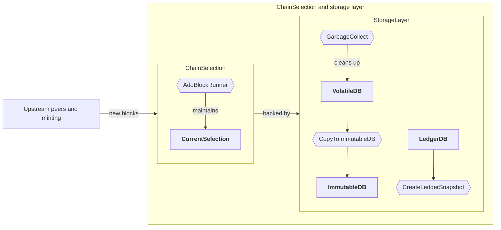
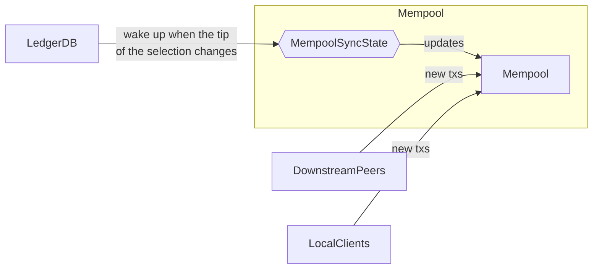
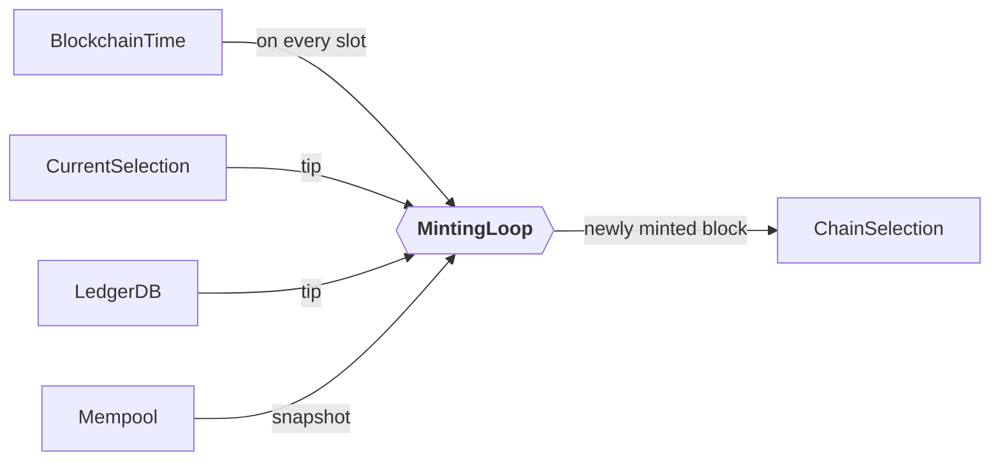
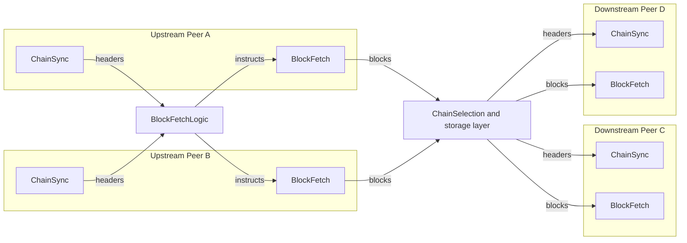
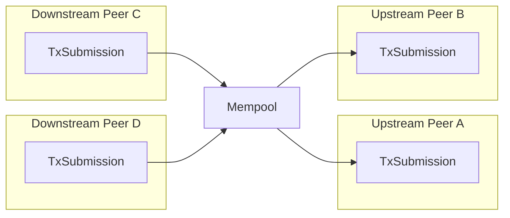
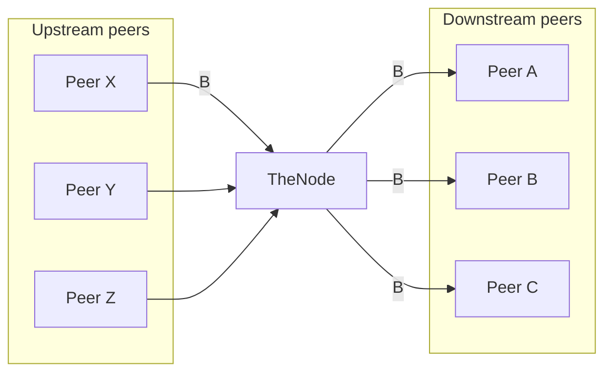

# Overview of the tasks of a caught-up node

<!-- xrefcheck: ignore link -->
This document gives an overview of the tasks of a [caught-up](./Glossary.md#honest-caught-up-parties) node, both as a relay and as a block producer.

## In a single node

We refer to the [component diagram](./ComponentDiagram.md) for a very high-level overview of the data flow in a node.
Another good diagram is [Figure 1.1. in the Shelley networking spec](https://ouroboros-network.cardano.intersectmbo.org/pdfs/network-spec/network-spec.pdf).

Also see the [Glossary](./Glossary.md) for jargon explanations.

### Chain selection and storage layer

As a basis for all other operations, the node needs to maintain a *current selection*, ie the best valid chain it has seen so far.

The selection is made up of an immutable and a volatile part:

 - The immutable part of the selection consists of blocks that are no longer subject to rollback.
   This is the case when a block has been confirmed by at least $k$ (the *security parameter*, $k=2160$ on mainnet) blocks, as guaranteed by *common prefix* property of Ouroboros Praos.
   Immutable blocks stored in the ImmutableDB.

 - The volatile part of the selection are the newest $k$ blocks.
   They are stored in the VolatileDB, together with other blocks that could be on a fork we might switch to in the future.

<!-- xrefcheck: ignore link -->
Additionally, the LedgerDB contains the ledger state corresponding to all [points](./Glossary.md#point) on the volatile part of the chain as well as the tip of the immutable chain, in order to validate new blocks and potential forks.

The flow of information is depicted in the following diagram.
Rectangular boxes stand for logical components, and hexagons correspond to Haskell RTS threads.

 - **AddBlockRunner**:
   Sequentially process incoming blocks (from upstream peers, or minted by this node if it is a block producer).
   A new block is first stored in the VolatileDB, and might become part of the selection (only if it is valid):

    - Common case: The block fits on top of the current selection.
    - The block is part of a fork that is preferrable to the current selection.
      Usually, this is the case when the block has the same predecessor as the tip block of the selection, and a better tiebreaker.
 - **CreateLedgerSnapshot**:
   From time to time (by default, every 72 min on mainnet for a caught-up node), the node writes the ledger state at the tip of the ImmutableDB to disk.
   This is a rather expensive operation as the ledger state is quite large.[^snapshots-slow]
 - **CopyToImmutableDB**:
   Once a block on the selection is confirmed by sufficiently many blocks, it becomes immutable and is copied from the VolatileDB to the ImmutableDB.
   This is a very cheap operation.
 - **GarbageCollect**:
   Blocks that are either immutable or can no longer be part of a fork we might switch to are occasionally deleted from the VolatileDB.
   This is a very cheap operation.

### The Mempool

The mempool maintains a bounded sequence of transactions that are valid when applied to the ledger state corresponding to the tip of the current selection.
When the node is a block producer, this is the source of the contents of its minted blocks.

 - **Adding new transactions.**
   New transactions can be added via downstream peers (another node) or local clients (like `cardano-cli`).
   The transaction is only added to the mempool if it is fully valid, and otherwise discarded.[^tx-validity]

   Adding a transaction requires the acquisition of a lock, so no transactions are validated in parallel.

   No work is shared between validating blocks and transactions at the moment; so it is expected that a transaction is fully validated both when it is added to the mempool and when it is later validated as part of a block.

 - **MempoolSyncState**:
   This thread wakes up every time when the tip of the selection changes.
   Then, the transactions of the mempool are revalidated against the new ledger state; discarding all transactions that are now invalid.

   Crucially, transactions are only *re*validated, which is much faster than full validation as eg signature checks and script evaluations can be safely skipped.
   Usually, transactions become invalid as they are now part of a block on our selection, and hence consume already-spent outputs.

### Minting[^minting] blocks

When the node is a block producer, it will wake up on every slot to check whether it is elected to mint.
In that case, it will decide which block to extend[^mint-block-context], fetch a corresponding *mempool snapshot* (a sequence of valid transactions) and create a block using the largest prefix that fits into a block (depending on the current protocol parameters).

The resulting block is then submitted to chain selection, and not treated specially compared to external blocks (out of robustness considerations).

### Upstream and downstream peers

The node maintains network connections to other peers as well as local clients.
The connection manager is maintained by the Network team, and described in ["The Shelley Networking Protocol", Chapter 4](https://ouroboros-network.cardano.intersectmbo.org/pdfs/network-spec/network-spec.pdf#chapter.4).
The details are out of scope for this document.

For every (active/hot) peer, we run several [*mini protocols*](https://ouroboros-network.cardano.intersectmbo.org/pdfs/network-spec/network-spec.pdf#chapter.3).
A mini protocol specifies the allowed communication between a initiator/client and a responder/server via a state machine.
In the context of a mini protocol, we say that a peer is an *upstream peer* when that peer acts as the server/responder.
(Note that we might also separately run the mini protocol in the other direction with that peer at the same time.)

In brief (see the linked network specification for more details):

 - **ChainSync**:
   In the context of a caught-up node, the ChainSync mini protocol allows the client to subscribe to updates of the selection of the upstream peer.
   Such an update might either be a new header[^ChainSync-N2C] (`MsgRollForward`), or a rollback to a point in the past (`MsgRollBackward`).

   The node validates all headers (in particular, this encompasses the validation of the stake-based *election proof*) and maintains a *candidate header chain* for that peer (the result of the messages received so far), which is used to decide which blocks to download.

 - **BlockFetch**:
   The client can request arbitrary blocks from the server (potentially in batches).

 - **TxSubmission**
   The server can request transactions from the client.

   Generally, blocks flow from upstream to downstream peers, while transactions flow from downstream to upstream peers (in order to allow nodes without any downstream peers to still submit transactions to the network).

#### Diffusion of headers and blocks

Here, BlockFetchLogic is a centralized component that decides whether and in which order to download certain blocks based on the candidate header chains.

#### Diffusion of transactions

## Relaying a new block

As a concrete example, we will consider how the node relays a new block B from its upstream peers (which includes a "peer X" that will give us B first) to its downstream peers.

We assume that no other blocks arrive in the meantime, and that B extends the node's selection.
We also provide rough numbers on the time budget (ignoring garbage collection time here) of the steps for illustration.

 1. In the ChainSync mini protocol thread for peer X, we receive a `MsgRollForward` with the header of B.
    We validate the header and add it to the candidate header chain for peer X.

    Time budget: average ~1ms, upper bound ~2ms.

 2. The BlockFetchLogic wakes up due to a change to a candidate chain, and notices the new header.
    As the header extends our selection, the BlockFetchLogic tells the BlockFetch client for peer X to download the full block B.

    Time budget: essentially instant.

 3. The BlockFetch client for peer X downloads the full block B and submits it to chain selection.

    Time budget: depends on the bandwidth and latency between the node and peer X, as well as on the block size (at most 88 KiB at the moment). Usually, it should be (significantly) less than one second.

 4. Before chain selection starts, B is written to disk.

    This is very cheap (no `fsync`).

 5. The node checks whether B is eligible for *block diffusion pipelining*, an optimization which allows to already announce a block to downstream peers before its body has been validated.
    In scenarios like this one, this is usually the case.

 6. Because of block diffusion pipelining for B, the ChainSync servers to our downstream peers send a `MsgRollForward` containing the header of B.

    Soon after, the downstream peers will request the corresponding block body of B via BlockFetch if they do not have it.

 7. In parallel, chain selection for B continues by validating B.

    Time budget: average ~30ms, upper bound ~500ms (based on empirical data).
    Depends on chain load, as well as on the on-chain parameters controlling the size of a block (block size, Plutus execution units, reference scripts size).
    
    There are also known pathologies in the ledger at certain points in the epoch (just at the beginning, and at 40% into the epoch) where blocks can take significantly longer to validate (multiple seconds).
    This is suboptimal and should eventually be fixed, but sufficiently rare to not cause problems at the moment.

 8. The node updates its selection to include B at the tip.

Changing the selection triggers various other tasks[^on-selection-change] in the node:

 - The mempool is revalidated against the new ledger state that arose by applying block B.
   In particular, this will remove all transactions from the mempool that are contained in B.
   This is fairly cheap as it doesn't have to perform eg any cryptographic checks or signature evaluations.

 - The block that is now confirmed by $k=2160$ blocks is copied to the ImmutableDB, and will eventually (roughly after one minute) be deleted from the VolatileDB.

[^snapshots-slow]: Also see https://github.com/IntersectMBO/ouroboros-consensus/issues/868 for more context for potential upcoming improvements. UTxO HD will also help with this problem.

[^tx-validity]: One case that requires a bit of care are transactions with invalid scripts. When such a transaction is received from another node, we still include it in the mempool in order to collect the collateral. In contrast, we do not do this for local clients, as they are trusted.

[^minting]: "Minting" is a synonym for "forging" in this context. It is sometimes preferred as "forging" could also be (mis)understood to mean "counterfeiting".

[^mint-block-context]: This will almost always be the tip of the current selection except for certain edge cases that can arise eg in multi-leader slots.

[^ChainSync-N2C]: Note that the ChainSync mini protocol can also be initiated by local clients (instead of remote nodes). In that case, `MsgRollForward` contains entire blocks instead of just headers.

[^on-selection-change]: Not exhaustive, e.g. the (computationally inexpensive) Bootstrap/Genesis State Machine is missing.
