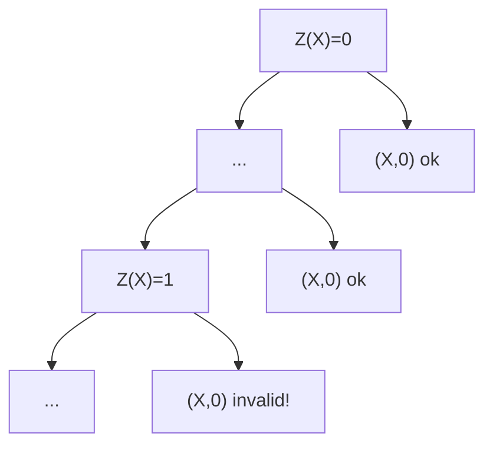
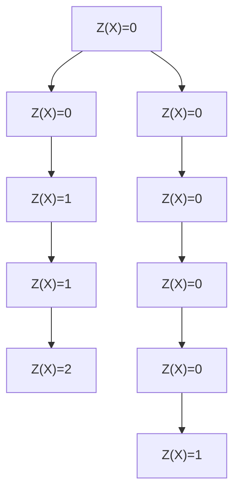

## Introduction 

This document explains and motivates operational certificate issue numbers (aka opcert issue numbers), their relationship with header validity, block tiebreakers, and short forks.

## Syntax

- {FooBar} is the definition of FooBar, useful for navigation via CTRL+F.
- X, Y, and Z are variable names whose scope does not extend beyond this document.

## Definition

In the most granular sense, a party producing Cardano blocks is identified by a pair X and Y.

- {X} is a {ColdKey}; the ledger state includes the public half via the stake pool's registration.
- {Y} is an {OperationalCertificateIssueNumber}; the Cardano header includes one, signed by X.
  (The initialism {OCIN} abbreviates OperationalCertificateIssueNumber in this document but is not broadly used outside of it.)

An {OperationalCertificate} (aka opcert) grants a {HotKey} the right to issue blocks on behalf of some X.
An OperationalCertificate is present in each Cardano header and contains the OCIN Y.
The ColdKey-HotKey indirection enables the stake pool operator (aka {SPO}) to store their ColdKey offline, so that it's plausible ColdKeys will never be acquired by the adversary excepty through physical access or coercion (eg burglary/bribery).

## Consequences and Motivation

The benefit of identities including an OCIN Y rather than merely being determined by a ColdKey X is that an SPO can increment their OCIN whenever they suspect the adversary could have acquired their current HotKey (eg they discover evidence of unauthorized software running on their block-producing node).
This response will be effective because the header validity and tiebreaker rules involve the OCIN.

- The protocol state maintains a mapping from X to Z, the OCIN of the youngest header issued by X on this chain.
  The protocol rules allow exactly two identities to issue a header extending some chain when X is elected, either Y=Z or Y=Z+1.
- The Cardano tiebreaker rules favor the greater OCIN when comparing two headers from X in the same slot.
  Without this preference in the tiebreaker, whether X is able to increment their OCIN on the honest chain is merely a network race between the adversary's header/block and the SPO's header/block.
  Conservatively, the adversary is assumed to have better network connectivity, and so theoretically could prevent an honest party from incrementing the OCIN until the leaked HotKey expires up to 90 days later (see next section).

The fact that Z is not allowed to decrease along a chain prevents the adversary that acquired a HotKey with precedence Y from extending alternative chains whenever X is elected unless that chain branches off from the honest chain _before_ X incremented their OCIN to Y+1 on the honest chain---see the visualization below.
An SPO is thereby able to effectively revoke the rights from a HotKey that the adversary might have acquired, thereby re-establishing control of their blocks' predecessor and payload on the honest chain.

The fact that Z can only increase along a chain by at most one per header bounds the rate at which X can increment their Z as a chain grows.
If that rate weren't bounded, an adversary X could generate infinite identities Y whenever they wanted, and the Cardano tiebreaker would favor each new one.

## Advantage over Mere ColdKey-HotKey Indirection

Completely orthogonally to OCINs, each HotKey is confined to one interval of slots, the {KesPeriod}, which is ~90 days on Cardano.
This achieves _forward-security_ ([Wikipedia](https://en.wikipedia.org/wiki/Forward_secrecy)) with respect to long-term time scales without requiring SPOs to access their ColdKey unbearably often (recall that it's physically offline).

If Cardano did not involve OCINs, then an adversary would benefit from an acquired HotKey until its KesPeriod expired, which could be up to 90 days.
On the other hand, an SPO---especially one with a lot of delegated stake---can increment the OCIN much sooner than 90 days after an attack (assuming they notice it).

When issuing a new HotKey merely because the current one expired, an SPO does not need to increment their OCIN.
Generally, there's no downside if they do so, other than increasing the likelihood of some awkward situations described in the next section---even then it's a risk that arises only once per 90 days per stake pool.

*Remark*.
[The current Cardano documentation](https://developers.cardano.org/docs/operate-a-stake-pool/cardano-key-pairs/#stake-pool-cold-keys) disagrees, stating it's crucial to increment when rotating.
Moreover, the relevant CLI tool always increments ([here](https://github.com/IntersectMBO/cardano-api/blob/4a6ce60b0028e3062d666980574aebf6acfee9b3/cardano-api/src/Cardano/Api/Certificate/Internal/OperationalCertificate.hs#L134) and [here](https://github.com/IntersectMBO/cardano-cli/blob/2124f5ab210ef57a6ed25c8cd383b36f927b6415/cardano-cli/src/Cardano/CLI/EraIndependent/Node/Run.hs#L292-L304)).
We suspect either a past miscommunication or else those authors considered the nuance to not be worth the risk, favoring the conservative/robust approach of always incrementing.

## Interaction with Short Forks

Different forks might disagree on some ColdKeys's Z.
In the most common circumstance, this makes no difference to the SPO.
If X issues a header with an incremented Y+1 that doesn't end up on the honest chain (ie is orphaned), they'll simply issue their next header with the same Y+1 on the winning fork.

On the other hand, if unusual circumstances cause a party X to increment its OCIN multiple times within the same stability window (12 to 36 hr on Cardano, shorter when Peras succeeds), then it's possible that a short fork might discard N>1 of those increments.
In that case, X's next header on the winning fork cannot be its greatest ever OCIN (ie Z on the losing short fork), but rather N-1 less than that.
Thus there will be an extended interval during which the adversary can abuse X's elections, if X actually did need to increment their OCIN N times.

The unusual scenario might be visualized as follows, where the chain on the left is the losing fork and the chain on the right is the winning fork.
The unfortunate property here is that X has issued a header with Y=1 _after_ having issued a header with Y=2.
If X had good reason to increment Y to 2, then that means X does not necessarily control the payload of their first subsequent block on the winning fork: the adversary can also issue a block with Y=1 and the header validity rules prevent X from skipping ahead from Z=0 to Y=2 on this chain.

