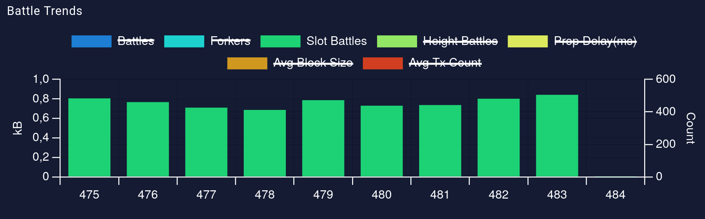

# Preflight guide

> "What I Wish I Knew When Working In Consensus"

This document lists possible steps in getting familiar with the core of the Cardano universe with a focus on topics that are important for the daily life of a Consensus developer.

Every step has a clear **goal** as well as optional ideas for other activities.

This document contains various footnotes with additional information that can be safely skipped on a first pass.

If you have ideas for further steps, first check [this epic][preflight epic] to compare it with existing ideas, and then create a PR!

## Setting up a local node

The [cardano-node][] (usually just called "node") is the most important consumer[^other-consensus-consumers] of the Consensus and Storage layer maintained by the Consensus team.
It is *the* way to get a full copy of "the" blockchain for any given network[^cardano-node-purpose], in particular and most importantly, for **mainnet**. This process is called "syncing".

Having a local copy of the node is not absolutely essential for your daily work, but it can be useful in several cases:

 - Assessing a change for correctness and performance problems by using the entire multi-year history of Cardano as a test case.
 - Quickly gathering empirical statistics of quantities of interest, like minimum/average/maximum size/validation time/frequency of blocks.
 - Directly accessing any on-chain data, like the current protocol version, stake distribution or UTxO size.

### Disclaimer

 - The node is currently relatively resource-intensive[^resource-relative], see the minimum system requirements on the [node release page][].
    - It uses a lot of memory, and the memory requirements are growing as the chain evolves[^utxo-hd].
    - It inherently requires a lot of disk space (as of January 2024, 150GB).
    - During syncing, it is quite CPU-intensive (albeit mostly only on a single core).
      Once syncing is done, it is very light on CPU usage.
 - You do not need to run the node at all times.
   The stored blockchain can also be consumed by other developer tools that are independent of the node.
 - Syncing can take multiple days (full sync in December 2023 on a decently powerful server: 2 days).
   Unless your network connection is very slow compared to your CPU, the bottleneck is likely your CPU.
 - It is safe to cleanly interrupt syncing, eg via <kbd>Ctrl</kbd> + <kbd>C</kbd>.
   The node is able to gracefully resume on restart.

### Running the node

First, get a [cardano-node][] binary, see the README, eg via Nix, binary from the releases or compiling locally, depending on preferences and context.

A basic invocation looks like this:

```shell
./result/bin/cardano-node \
    run \
    --config /path/to/mainnet-config.yaml \
    --database-path /path/to/db-mainnet \
    --topology /path/to/mainnet-topology.json \
    --host-addr 0.0.0.0 --port 3001 \
    --socket-path /path/to/node.socket
```

 - `--config`: Get the default Cardano mainnet configuration file [here][cardano mainnet conf].
    - The logging system supports human-readable or JSON output (look for `ScText`/`ScJson`).
      `ScJson` sometimes contains more information, and it can be handy for automatic processing via eg `jq`.
    - Note that Genesis files are still mutable as long as their corresponding era is still in development (like Conway as of early 2024), so your configuration file might need changes once you update your node.
 - `--topology`: This file defines how/when the node will connect to other nodes.
   Get the default [here][cardano mainnet topo].

   While syncing, it makes sense to set the valency, ie the number of nodes sampled from the given DNS name to connect to, to `1` for better performance.[^genesis-syncing]

Make sure to store the log output somewhere.

### Syncing to mainnet

Now you are ready to start syncing to mainnet!

During this long process, you can stare at the log output, and eg look for lines containing `Chain extended` or `AddedToCurrentChain`, which (at least) mention the slot number of the most recently added block.
Bonus points for a plot of your sync progress over time!

### Syncing faster 🚀

As seen above, syncing is relatively slow, and you might be in a situation where you haven't caught up to mainnet in maybe a couple of months, but don't want to wait several hours.
Here are two options:

 - If do not mind a little extra clutter, it's possible to sync to mainnet in about two hours by using the [Mithril client][].
   See [here][Mithril instructions] for instructions.
 - Maybe someone you know has a very recent local copy of the mainnet ChainDB.
   If you are sure you *really* trust them, ask them to send you their ChainDB (or at least the missing parts) via eg [Magic Wormhole][].

## Understanding ledger snapshots and using db-analyser

You need a local ChainDB for this step, see the previous step.

[db-analyser][] is a tool maintained by the Consensus team to gather information and investigate problems (especially performance-related) by analyzing a local ChainDB, providing a variety of analysis passes.

### Ledger snapshots

A *ledger snapshot* is the CBOR serialization of the (extended[^extended-ledger-state]) *ledger state*, which represents the summary of all blocks up to a specific point[^glossary], the tip point or point of the last applied block, that is necessary to judge the validity of any block extending the last applied block.
Here, "validity" refers most prominently to the ledger rules ("Does this person actually have enough money to make that payment?") of the [Cardano ledger].
On disk, the file name of a ledger snapshot usually contains the slot number of its tip point.

### Running db-analyser passes

Most [db-analyser][] passes need a ledger snapshot for the specified starting slot.
Read the [db-analyser][] documentation up to the [the corresponding example][db-analyser snapshot] to create a ledger snapshot for slot `4492800`[^first-shelley-slot].

Starting from there (using `--analyse-from 4492800`), try the following two db-analyser passes:

 - `--show-slot-block-no --num-blocks-to-process 100`:
   You will see that many slots do not contain a block; our Consensus protocols involve a _leader schedule_[^glossary] that determines which slots are allowed to contain blocks.
   On average, there will be a block every $1/f$ slots, where $f$ is the _active slot coefficient_[^glossary].
   On mainnet, we have $f=1/20$.
 - `--benchmark-ledger-ops --num-blocks-to-process 1000`:
   Look for the `mut_headerApply` and `mut_blockApply` columns, which are the bulk of the time that is spent when validating headers and blocks, respectively; in order to get a rough sense for these durations, as they are relevant in lots of situations.

Feel free to run other passes that sound interesting to you.

### Reusing ledger snapshots

The node regularly creates ledger snapshots while running.
You can reuse these snapshots in db-analyser, and vice versa.

> ‼️ Note that the format of ledger snapshots can change with every new ledger release, so in order for this to work, make sure that your db-analyser and your node use the same ledger version.
> Some ways to achieve this:
>  - Click on the [release page][node release page] corresponding to your node, expand the "Individual packages' changelogs" section, and then check out the corresponding `ouroboros-consensus-cardano` release tag in the Consensus repo.
>  - If you used Nix to get the `cardano-node` binary, you can use `nix build .#db-analyser` to get a compatible db-analyser, assuming you are in the root of the `cardano-node` repo.
>
> You might also run into this when you update the node to a newer version.
> The node will automatically detect this situation, and create a new ledger state starting from Genesis.[^apply-vs-reapply]

Use a ledger snapshot of your local node (make sure to add the `_db-analyser` suffix[^snapshot-suffix]) to run the two db-analyser passes again, but now starting at the slot of your ledger snapshot.

 - The pattern of filled/unfilled slots will look very different to what you saw at the beginning of Shelley above.
   This is due to the usage of _transitional Praos_ (TPraos) at the beginning of Shelley, where the leader schedule gradually transitioned from being fully centralized to fully decentralized.
   It has been fully decentralized for several years now.
 - Comparing the benchmarking results for block validation times, you should see that validating a typical block takes much longer today.
   This is mainly due to larger allowed block sizes and this size being actually used, as well as more complex ledger rules (most prominently, Plutus smart contracts).

## Dynamics of the leader schedule

This section focuses on high-level statistical properties of the *leader schedule*[^glossary].
The definitions and most of the basic properties come from the [Ouroboros Praos paper][], eg section 3.3 and 4.4.

### Active slots

In our context, time is discretized into slots of a specific slot length.
(For Praos on Cardano mainnet, a slot lasts for one second.)
Every slot has a specific number of *leaders*, ie stake pools that are allowed to mint a block in this slot.
The elections for different slots are independent of each other; leading in one slot does not make it more/less likely to lead in another.

 - Most slots are *inactive*, ie there are no leaders for these slots.[^praos-origin]
 - Some slots are *active*. The probability of a slot to be active is determined by the *active slot coefficient* $f$. On Cardano mainnet, $f = 1/20$.
    - Most active slots are *single leader slots*.
    - Some active slots are *multi leader slots*. As the slot numbers on a chain have to strictly increase, at most one of the blocks minted by the elected stake pools will end up on the honest chain eventually.[^ssle]

The leader schedule of Cardano is *private* due to the usage of *verifiable random functions* (VRFs):
Nodes only know their own leader schedule for one epoch[^glossary] in advance, and nobody can know whether some pool is elected in a slot until they reveal this themselves by minting a block in that slot.
The advantage of this approach is that eg targeted DoS attacks against slot leaders are impossible.
However, it also means that it is generally impossible to retroactively distinguish inactive slots from active slots where nobody minted a block for some reason.

Let us apply some common probability distributions to this scenario.

 - The number of active slots out of a number of slots $n$ follows a binomial distribution $\mathop{\mathrm{B}}(n,f)$.
   This number is often of interest as it bounds by how many blocks any chain can grow in that period.

   For example, consider the number of active slots on Cardano mainnet within 12h (43200 slots), with the probability mass function also depicted below.
   The mean is $43200 \cdot f = 43200 / 20 = 2160$, note that this is the *security parameter*[^glossary] $k$ that comes up in many places.
   Importantly, the number of active slots is rather strongly concentrated around the mean, which justifies common statements like "Usually, there are $k$ active slots within 12h.".

 - The number of slots until a slot is active (including that slot) follows a geometric distribution $\mathop{\mathrm{Geo}}(f)$.

   For Cardano mainnet, the probability mass function is again depicted below.
   The mean here is $1/f = 20$ slots, the median however is only $14$ slots, ie in ~50% of all cases, it takes at most 14 slots until a slot is active.
   On the other hand, there is a non-negligible ~0.2% chance that it takes more than 120 slots (2 minutes) until there is an active slot.
   Concretely, this means that an interval of 2 minutes without any blocks on Cardano mainnet does not mean that anything went wrong; the randomness of the leader schedule means that intervals of inactive slots of this or even somewhat larger duration are bound to happen from time to time.

   As a generalization, the number of slots until a given number (potentially larger than one) of slots have been active follows a negative binomial distribution.


> A useful library for various calculations in this areas is [scipy.stats][] (in particular available in sagemath).
> For example, we can calculate the probability that at most 2000 slots are active within 12h
> ```python
> from scipy import stats
> stats.binom(43200,1/20).cdf(2000)
> ```
> which yields 0.0185%, or the probability that it takes more than one minute until a slot is active
> ```python
> stats.geom(1/20).sf(60)
> ```
> which yields 4.6%.
> Calculate some other probabilities that seem interesting to you, maybe inspired by some of the empirical data gathered via db-analyser.

### Multi leader slots

The probability that a pool with relative stake $\sigma$ is elected in any specific slot is given by $\phi_f(\sigma) = \phi(\sigma) = 1-{(1-f)}^\sigma$.
We have $\phi(\sigma) \ge f\sigma$, ie a pool with stake $\sigma$ will be elected in an active slot with probability somewhat higher than $\sigma$.
For small $\sigma$, $\phi(\sigma) \approx f\sigma$ is a fine approximation.

The motivation for choosing $\phi$ like this is the *independent aggregation* property
```math
\phi\left(\sum_{\sigma\in S} \sigma\right) = 1-\prod_{\sigma\in S}(1-\phi(\sigma))
```
for any set $S$ of relative stake quantities.
Intuitively, this means that for a party with $\sum_{\sigma\in S} \sigma$ total relative stake, no matter how they distribute their stake across different pools, they always have the same probability to be elected with at least one pool in any given slot.

Unless there is just a single pool with all of the stake (which is heavily disincentivized by the Cardano reward structure), there is a chance that an active slot will in fact have *multiple* slot leaders.
The exact probabilities depend on the stake distribution.
In general, the more equally the stake is distributed across many pools, the more likely are slots with more slot leaders.
In the extreme case, which one can think of as the stake $\sigma$ being distributed evenly across infinitely many pools, the number of slot leaders $L$ of a single slot is given by a Poisson distribution $\mathop{\mathrm{Pois}}(-\sigma\log(1-f))$.

For example, consider $\sigma = 1$:


We see that having three or more leaders per slot quickly becomes very (exponentially) unlikely.

In particular, we can calculate the probability that a slot is an active multi leader slot
```math
\mathop{\mathrm{Pr}}(L \ge 2)
  = 1-\mathop{\mathrm{Pr}}(L = 0)-\mathop{\mathrm{Pr}}(L=1)
  = f + \sigma \cdot {(1-f)}^\sigma \cdot \log(1-f)
```
via the definition of the Poisson distribution and $L \sim \mathop{\mathrm{Pois}}(-\sigma\log(1-f))$.
For $f=1/20$ and $\sigma =1$, we get $\mathop{\mathrm{Pr}}(L \ge 2) = 0.00127$, ie 0.127% of all slots are multi leader slots in the worst case.
In that case, we would expect to see $10k/f \cdot 0.00127 \approx 549$ multi leader slots per epoch.

On the community-maintained [pooltool.io](https://pooltool.io/networkhealth), we can observe the number of "slot battles" per epoch, ie the number of times the nodes reporting to pooltool.io observed two blocks in the same slot.



As the stake on mainnet is "only" distributed across a few thousand pools (and not completely evenly), we are not in the extreme case modeled by the Poisson described above.
And indeed, we usually see even less than 500 slot battles per epoch.

### Grinding

The discussion above completely ignored *grinding*.
In the context of the leader schedule, this refers to an adversarial influence on the nonce that is used as a seed for all of the VRF computations for slot election within a specific epoch.
The exact mechanism is out-of-scope for this section, but it should be said that such an attack requires both a considerable amount of stake and computational resources, and it allows an adversary to choose the best out of multiple epoch nonces.
An extremely conservative upper bound for how many nonces an attacker can choose from is $10^{20}$ (based on the computational resources required to even compute all of these nonces).
The mainnet parameters of Cardano (in particular the security parameter) were chosen with resistance against grinding in mind.

Concretely, an attacker with $\alpha$ stake that can choose out of $N$ epoch nonces can ensure that it leads any specific slot with probability $1-{(1-\phi(\alpha))}^N$, which is a huge advantage compared to $\phi(\alpha)$.
For example, an attacker with $N=10^{20}$ with even a very small amount of stake has a chance of close to 100% to cause themselves to be elected in any single specific slot.

Usually, an attacker wants to maximize their total number of active slots within a larger number of slots, like in an entire epoch.
For this, the impact of grinding is smaller (but still large), as every epoch nonce affects the entire leader schedule of the epoch, and the attacker can not choose different epoch nonces for different slots.
Calculations in this area make use of the [largest order statistic][order statistic].
Here, we plot the cumulative distribution function of the number of active slots without and with different levels of grinding.


Grinding does *not* impact the number of elections by any honest party, as an attacker can't observe what the leader schedule of honest nodes would be for different nonces (privacy of the leader schedule).

Finally, we shall note that there are various ideas of how to eliminate grinding, for example by making the epoch nonce "difficult" to calculate[^nonce-difficult] or by replacing the current source of the nonce with a special protocol[^nonce-protocol].

<!-- Footnotes -->

[^other-consensus-consumers]: Other important consumers include:

    - [cardano-cli][], a CLI tool allowing to query various information about the current state of a running node, as well as submitting transactions.
    - Indexers like [cardano-db-sync][] or [kupo][] store certain historical information (like old transactions) in an easily queryable format (in contrast to the node, which, by design, does not store information in ways that are unnecessary for its core responsibilities).
    - Other services or tools that need to communicate with nodes, like [hydra][] or [ogmios][].

[^cardano-node-purpose]: Note however that this is not its only purpose; it is also required to actively participate in the ongoing evolution of any Cardano-based blockchain.

[^utxo-hd]: The main reason for this is that the ledger state, ie the aggregated information necessary to validate blocks, is currently fully stored in memory.
The Consensus team is currently working on *UTxO HD*, a solution to move the ledger state to disk.

[^resource-relative]: Cardano is not a huge outlier in either direction, there are many examples for blockchains that are either much less resource-intensive (due to very low activity or new age, or due to very fancy cryptography, like Mina) or much more resource-intensive (due to very old age and large accumulated history, like Bitcoin, or a hyperfocus on performance, like [Solana](https://docs.solana.com/running-validator/validator-reqs#hardware-recommendations)).

[^genesis-syncing]: As of early 2024, syncing is a fully trusted process; if any node you are syncing from is adversarial, you might end up on an adversarial chain.
There is an ongoing effort to implement *Ouroboros Genesis* in order to reduce this strong trust assumption; in particular, it will involve reaching out to lots of nodes while syncing.

[^glossary]: See the [Glossary][].

[^extended-ledger-state]: A ledger snapshot also contains the _header state_ in addition to the ledger state.
As a rough idea, this is the state maintained by Consensus protocol (in our case: Praos), and much more lightweight than the ledger state both in size and in time it takes to update.
An "extended" ledger state is a ledger state plus the header state, but people sometimes/often drop the "extended" prefix, especially for ledger snapshots, as there are no "unextended" ledger snapshots.

[^first-shelley-slot]: This is the first "Shelley" slot, see [here](https://github.com/cardano-foundation/CIPs/blob/master/CIP-0059/feature-table.md).
All previous slots were "Byron" slots, which is a legacy era that is largely irrelevant for our work, except in the very annoying case where it isn't.

[^apply-vs-reapply]: It will be much faster than syncing from scratch, as the blocks are only _reapplied_ instead of _applied_.
This means that certain checks (in particular, evaluating smart contracts) are skipped, which is sound as we know that the blocks were already applied/validated fully previously.

[^snapshot-suffix]: db-analyser only ever reads/writes snapshots with a `_db-analyser` suffix in the file name, eg `4492800_db-analyser`.
The node itself will create snapshots without a suffix (eg `4492800`), but can also read snapshots with any suffix.
Crucially, the node won't ever *delete* snapshots with a suffix, as opposed to unsuffixed ones, which are periodically garbage-collected, as well as deleted if the node can't decode them.

[^praos-origin]: The fact that most slots are empty (such that there often are periods of "silence" in the network) motivated the name "Praos", meaning "mellow", or "gentle".

[^ssle]: With more sophisticated cryptography, one can avoid multi leader slots and the wasted work they cause, see ["Single Secret Leader election" by Boneh et al](https://eprint.iacr.org/2020/025).

[^nonce-difficult]: The core idea is for example described in the abstract of [the paper introducing *Verifiable Delay Functions* (VDF) by Boneh et al](https://eprint.iacr.org/2018/601.pdf).

[^nonce-protocol]: See [the paper "Efficient Random Beacons with Adaptive Security
for Ungrindable Blockchains" by Kiayias et al](https://eprint.iacr.org/2021/1698.pdf).

[cardano-node]: https://github.com/IntersectMBO/cardano-node
[cardano-cli]: https://github.com/IntersectMBO/cardano-cli
[cardano-db-sync]: https://github.com/IntersectMBO/cardano-db-sync
[kupo]: https://github.com/cardanosolutions/kupo
[hydra]: https://github.com/input-output-hk/hydra
[ogmios]: https://github.com/CardanoSolutions/ogmios
[node release page]: https://github.com/IntersectMBO/cardano-node/releases
[cardano mainnet conf]: https://github.com/IntersectMBO/cardano-node/blob/master/configuration/cardano/mainnet-config.yaml
[cardano mainnet topo]: https://github.com/IntersectMBO/cardano-node/blob/master/configuration/cardano/mainnet-topology.json
[Mithril client]: https://mithril.network/doc
[Mithril instructions]: https://mithril.network/doc/manual/getting-started/bootstrap-cardano-node
[Magic Wormhole]: https://github.com/magic-wormhole/magic-wormhole
[db-analyser]: https://github.com/IntersectMBO/ouroboros-consensus/blob/main/ouroboros-consensus-cardano/README.md#db-analyser
[Cardano ledger]: https://github.com/IntersectMBO/cardano-ledger
[Glossary]: https://ouroboros-consensus.cardano.intersectmbo.org/docs/for-developers/Glossary
[db-analyser snapshot]: https://github.com/IntersectMBO/ouroboros-consensus/blob/main/ouroboros-consensus-cardano/README.md#saving-a-snapshot
[preflight epic]: https://github.com/IntersectMBO/ouroboros-consensus/issues/887
[Ouroboros Praos paper]: https://iohk.io/en/research/library/papers/ouroboros-praos-an-adaptively-secure-semi-synchronous-proof-of-stake-protocol/
[scipy.stats]: https://docs.scipy.org/doc/scipy/reference/stats.html
[order statistic]: https://en.wikipedia.org/wiki/Order_statistic
