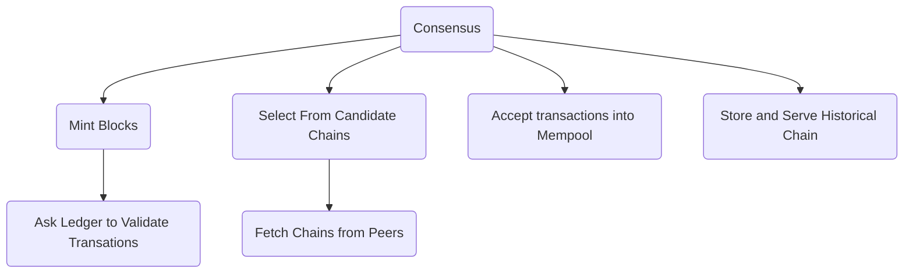

In this document, we describe the necessary components comprising the Consensus layer of a Cardano blockchain node. The main goal of this report is to provide guidance to software engineers that intend to implement the Consensus layer of a Cardano node from scratch.

This document is a work in progress. We strive to provide a set of requirements for and responsibilities of the Consensus layer that is agnostic of a particular implementation. However, we still very much are informed by the Haskell implementation in [ouroboros-consensus](https://github.com/IntersectMBO/ouroboros-consensus) as it is the only one.

# What does Consensus and Storage need to do: responsibilities and requirements

## Responsibilities of the Consensus Layer



The Consensus layer is responsible to choose among the different chains that might co-exist on the network. The candidate chains may arise both from honest and adversarial participation. The Consensus Layer must implement the consensus protocol or the current Cardano era to know what is the right candidate chain to choose. To replicate the blockchain across all Cardano nodes, the Consensus layer must distribute the selected chain to its peers.

The Consensus layer is also responsible for producing new blocks according to the current consensus protocol. For the new blocks to include meaningful data, Consensus has to receive and maintain a list of submitted transactions that are not in the chain yet.

The following table outlines the informal components of the Haskell reference implementation and their responsibilities:

| Component                                      | Responsibility                                                                      |
|:-----------------------------------------------|:------------------------------------------------------------------------------------|
| Forging Loop (aka The Mint)                    | Extend the Cardano chain by minting new blocks                                      |
| `Mempool`                                      | Maintain a list of valid transactions to include in new blocks                      |
| `ChainSync` and `BlockFetch` clients           | Gather candidate chains from peers                                                  |
| `ChainSync` and `BlockFetch` servers           | Provide peers with access to `ChainDB` (see Storage Layer)                          |
| `ChainSel`                                     | Among all forks that can be fetched from peers, must identify the best chain.       |
| N2N `TxSubmission`, N2C `TxSubmission` servers | Accept transactions from peers and store them into `Mempool` for further processing |


## Responsibilities of the Storage Layer

The Consensus layer needs to keep track of a significant amount of data to maintain the Cardano network. Some of this data is "hot" and relates to the candidate chains and other data is cold and relates to the historical chain.

```mermaid
flowchart TD
    A("Storage") -- Sequential Access --> B("Immutable Chain")
    A("Storage") -- Random Access --> C("Volatile Chain")
    A("Storage") -- Random Access --> D("Recent Leder States")

    subgraph noteB ["Hot - Efficient Rollback"]
        C
        D

    subgraph noteB ["Cold - Efficient Storage"]
        B

    end

```

In order to switch to an alternative chain, Consensus needs to evaluate the validity of such a chain. In order to evaluate the validity of a block, we need to have a Ledger state at the predecessor block. As applying blocks is not an inversible operation, this is usually solved by maintaining the last `k` ledger states in memory.

In the Haskell reference implementation, the Storage layer is implemented by the `ChainDB` components, which comprises the `ImmutableDB`, `VolatileDB` and `LedgerDB` subcomponents:

| Component   | Responsibility                                                                                            |
|:------------|:----------------------------------------------------------------------------------------------------------|
| ImmutableDB | Store definitive blocks on disk and provide iterator access to them for new syncing peers.                |
| VolatileDB  | Store non-definitive blocks on disk, providing random access to peers,                                    |
|             | efficiently switch to a different suffix of the chain if needed                                           |
| LedgerDB    | Maintaining the last `k` (2160 on Cardano mainnet) ledger states in memory to facilitate chain selection. |

**TODO**: refile requirements on access patterns for Immutable and Volatile databases. Read/write access? When do we need random access and where we do not? What does it mean specifically to efficiently switch chains?

## Requirements and Constraints for the Consensus and Storage Layers

For stable and secure operation of the Cardano blockchain network, the node implementation must adhere to requirements somewhat comparable to a hard real time system, i.e. if a node misses the deadline for its interaction in the protocol, the result of its work becomes useless to the network as a whole.

In this section, we informally outline the requirements for Consensus layer of the node.

Blocks can be theoretically forged every slot (e.g. every second on Cardano mainnet), so the Consensus layer must be
extremely fast in producing the blocks once it knows it has to do so.

As the Ouroboros family of protocols allows short-lived forks, for example due to slot battles in Praos, the Consensus layer has to be able to efficiently switch between these forks. This requires a mechanism for a fast rollback which is handled by the Storage Layer (see below).

In terms of security, Consensus must not expose meaningful advantages for adversaries that could trigger a worst-case situation in which the amount of computation to be performed would block the node.
This is generally achieved by trying to respect the following principle:

- The cost of the worst case should be no greater than the cost of the average
  case.

We don't want to optimize for the average case because it exposes the node to DoS attacks.

## Requirements imposed onto the Networking/Diffusion layer

To maximize the probability of the block being included in the definitive chain,
the Consensus layer has to strive to mint new blocks on top of the best block
that exists in the network. Therefore it necessitates of a fast diffusion layer
for blocks to arrive on time to the next block minters.

Transmit chains as fast as possible so that blocks arrive to the next forger in time.

## Requirements imposed onto the Ledger layer

**TODO**

# Single-era Consensus Layer

In this section, we give a more detailed description of what _how_ the components of the reference Haskell implementation of the Consensus layer implement the requirements discussed in the previous section.

## ChainSync client

Each ChainSync client maintains an upstream peer's candidate chain.

The protocol state is also independently maintained alongside each candidate chain by ChainSync.

### Details

It disconnects if the peer violates the mini protocol, if the peer sends an invalid header, or if switching to their chain would require rolling back more than `k` blocks of the local selection.

It's able to validate headers past the intersection with the local selection because the parts of the ledger state necessary to validate a header were completely determined some positive number of slots ago on that header's chain; see _forecasting_ within the ledger rules and _snapshots_ within the ledger state.

The `ChainSync` protocol stalls while the candidate chain is past the forecast range of the local selection.
The forecast range must be great enough for the peer to rescue the local node from the worse-case scenario.
The Praos paper bounds this to needing at most `k`+1 headers from the peer, which that paper also bounds to requiring at most the stability window slots of forecast range.
The Genesis paper is also satisfied by a forecast range of the stability window.
(The ChainSync server is much simpler than the client; see _followers_ below.)

## ChainSync server

ChainSync server provides an iterator into the ChainDB for downstream peers to be able to download headers and blocks.

#### Details

Moreover — because the node must serve the whole chain and not only the historical chain — each ChainSync server actually uses a _follower_ abstraction, which is implemented via iterators and additionally supports the fact that ChainSel might have to rollback a follower if it's already within `k` of the local selection's tip, i.e. if it is streaming the volatile part of the chain.
(Even the pipelining signaling from ChainSel to ChainSync clients is implemented via a follower, one that follows the so-called _tentative chain_ instead of just the actual local selection.)

## BlockFetch client and client coordinator

The client-side of the BlockFetch mini-protocol comprises the client itself and the centralised logic that coordinates multiple clients.
Based on the set of all candidate chains and the local selection, the centralized BlockFetch logic (one instance, no matter how many peers) decides which of the candidate chains to fetch and which particular blocks to fetch from which peers.
It instructs the corresponding BlockFetch clients (one per upstream peer) to fetch those blocks and add them to the ChainDB.
The client disconnects if the peer violates the mini protocol or if it sends a block that doesn't match (eg different hash) the requested portion of the snapshot of its candidate chain that lead to that request.

## BlockFetch server

The BlockFetch server uses a mere iterator instead of a follower because each fetch request is so specific; their only corner case involves garbage collection discarding a block while a corresponding fetch request is being served.

## ChainSel

The ChainDB's ChainSel logic persists each fetched block to the ChainDB and then uses that block to improve the local selection if possible.
(No other component persists blocks or mutates the selection, only ChainSel.)
Improving the selection requires validation of the fetched block (and maybe more, if blocks arrived out of order).
If the fetched block is invalid, ChainSel disconnects from the upstream peer who sent it, unless that block may have been pipelined; see the specific pipelining rules.
In turn, if a fetched block should be pipelined, ChainSel signals the ChainSync servers to send that header just before it starts validating that block.
If it turns out to be invalid, ChainSel promptly signals the ChainSync servers to send the corresponding MsgRollBack.

The combined ledger and protocol state is maintained alongside the local selection by ChainSel, so that blocks can be validated.

## ChainDB

A Praos node must not introduce unnecessary delays between receiving a block and forwarding it along.
It is therefore an important observation that the ChainDB does not require the Durability property of ACID: upstream peers will always be available to replace any blocks a node loses.

## LedgerDB

In both ChainSel and ChainSync, rollbacks require maintenance of/access to the past `k`+1 states, not only the tip's state — access to any such state must be fast enough to avoid disrupting the semantics of the worst-case delay parameter Delta assumed in the Praos paper's security argument.

In addition to validation in ChainSel and ChainSync, these ledger states are how the node handles a fixed set of queries used by wallets, CLI tools, etc via the LocalStateQuery mini protocol.

## Mempool & TxSubmission

The Mempool maintains a sequence of transactions that could inhabit a hypothetical block that is valid and extends the current local selection.
The Mempool is bounded via a multi-dimensional notion of size such that it never contains more transactions than could fit in N blocks.
Peers synchronize their Mempools via the TxSubmission protocol.
This mini protocol leverages the fact that the Mempool is a sequence as opposed to an unordered set; a simple integer suffices as the iterator state for the TxSub client.
(Recall that transactions flow from client to server, since the orientation is determined by the flow of blocks and pending transactions naturally flow opposite of blocks.)

## The Mint aka Block Forge

Whenever the wall clock enters a new slot, the node checks whether its configured minting credentials (if any) were elected by the protocol state and forecasted ledger state to lead this slot.
If so, it mints a block that extends its local selection (or its immediate predecessor if the tip somehow already occupies this slot or greater) and contains the longest prefix of the Mempool's transactions that can fit.
That block is then sent to ChainSel, as if it had been fetched, to make sure other nodes will be able to adopt it. The only reason why a block could be rejected at this point is if there was a mismatch between the block application and Mempool transaction validation logic.

When (if) the node selects that block, the Mempool will react as it does for any change in the local selection: it discards any transactions that are no longer valid in the updated hypothetical block the Mempool continuously represents.
Because every Ouroboros transaction _consumes_ at least one UTxO, the transactions in a newly minted and selected block will definitely be discarded.

## Some Important Optimizations

Both both blocks and transactions can be applied much more quickly if they are known to have been previously validated.
For blocks, the outcome will be exact same, since they can only validly extend a single chain.
A transaction, though, might be validated against a different chain/ledger state than the first time, so many checks still need to happen.
But many "static" checks don't need to be repeated, since they'd fail regardless of the ledger state.

Despite block reapplication being much faster than initial validation, the node should not need to reapply their entire historical chain whenever it is restarted.
The node instead occasionally persists its oldest ledger state in the `LedgerDB` (i.e. the `k+1`st state, the immutable tip of the chain).
On startup, the node only needs to deserialize that snapshotted ledger state and then replay the best chain amongs the persisted blocks it has that extends this ledger state in order to re-establish its `k`+1 ledger states in the `LedgerDB` (and `k` volatile blocks in its selected chain).

# Multi-era Considerations

In Cardano, an _era_ is an informal concept that unites a set of Cardano features, such as ledger rules or consensus protocols. See [Cardano Features](https://github.com/cardano-foundation/CIPs/blob/master/CIP-0059/feature-table.md) for the current list of eras.

In Cardano, the on-chain governance ultimately decides when to adopt backwards-incompatible changes, by incrementing the major component of the protocol version. The first such _era transition_ switched to the Praos protocol.

In this section, we discuss the challenges imposed by the need to support multiple Cardano eras. We start with the possible approaches to handle era changes. We then outline the different aspects that need to considered when implementing a multi-era node. Then we transition to discussing possible approaches to supporting a multiple-era blockchain network in the node software. Finally, we discuss the Hard Fork Combinator --- the approach implemented in the Haskell reference implementation.

## Approaches to handle protocol changes

With the blockchain network evolving, the block format and ledger rules are bound to change. In Cardano, every significant change starts a new "era". There are several ways to deal with multiple eras in the node software, associated here with some of the DnD alignments:

* Chaotic Evil: the node software only ever implements one era. When the protocol needs to be updated, all participants must update the software or risk being ejected from the network. Most importantly, the decision to transition to the new era needs to happen off-chain.
Pros: the simplest possible node software.
Cons: on-chain governance of the hard-fork is impossible, as the software has no way of knowing where the era boundary is and does not even have such a concept. Additionally, special care is needed to process history blocks: chain replay is likely to be handled by special code, separate from the active era's logic.

* Chaotic Good: the node software supports the current era and the next era. Once the next era is adopted, a grace period is allowed for the participants to upgrade. The decision to upgrade may happen on chain.
Pros: allows for on-chain governance of the hard fork.
Cons: supporting two eras is more difficult than one: higher chances of bugs that will cause the network to fork in an unintended way. Like in the previous case, special care is needed to process historic blocks.

* True Neutral: software is structured in such a way that is supports all eras.
Pros: enables massive code reuse and forces the code to be structured in the way that allows for abstract manipulation of blocks of different eras. The on-chain governance of hard-forks is reflected in the code, and ideally in the types as well, making it more likely that unintended scenarios are either impossible or easily discover able through type checking and testing.

Cons: abstraction is a double-edged sword and may be difficult to encode in some programming languages. Engineers require extended onboarding to be productive.

We argue that Cardano has been the True Neutral so far, which allowed to maintain the stability of the network while allowing it to change and evolve.

## Responsibilities of a multi-era node


| Responsibility           | Timing                                             | Description                                                                                          |
|:-------------------------|:---------------------------------------------------|:-----------------------------------------------------------------------------------------------------|
| Process historical chain | slot number of the era boundaries known statically | switch and translate between the statically known historical sequence of revisions of block formats, |
|                          |                                                    | ledger rules and protocols                                                                           |
| Transition to a new era  | slot number of the era boundary unknown            | during the era transition:                                                                           |
|                          |                                                    | * switch the consensus protocol, block format, ledger rules                                          |
|                          |                                                    | * translate transactions received from prevoios-era peers                                            |
|                          |                                                    | into the format of the current era for them included in a new block                                  |

## Replaying history of multiple eras

Cardano has the peculiarity of being a multi-era network, in which at given
points in the chain, new backwards-incompatible features were added to the
ledger. Consensus, as it needs to be able to replay the whole chain, needs to
implement some mechanism to switch the logic used for each of the eras, in
particular the Ledger layer exposes different implementations for each one of
the ledger eras.

## The Hard Fork Combinator: a uniform way to support multiple eras}

*Hard Fork Combinator (HFC)* is a mechanism that handles era transitions, including changes to ledger rules, block formats and even consensus protocols. It automates translations between different eras and provides a minimal interface for defining specific translations that obey rigorous laws. The HFC was primarily introduced to handle the fundamental complexity that arises when the translation between wall clocks and slot onsets depends on the ledger state (since on-chain governance determines when the era transition happens).

The HFC also handles the comparatively simple bookkeeping of the protocol, ledger and codecs changing on the era boundary --- i.e. a variety of blocks, transactions, etc. co-existing on the same chain in a pre-specified sequence but not according to a pre-specified schedule.

Lastly, the HFC handles the fact that ticking and forecasting can cross era boundaries, which requires translation of ledger states, protocol states, and pending transactions from one era to the next.

The HFC cannot automatically infer the implementation of these necessities, but it automates as much as possible against a minimal interface that requires the definition of the specific translations.

The HFC lifts types parameterised by eras into sum types which can be manipulated in an abstract way. As so, for example, it lifts the `LedgerState` of an era (for example, `ShellyLedgerState`) into a `HardForkLedgerState` which is a sum type of `LedgerState`s of all Cardano eras. Such sum types fulfil the same interfaces as the single-era types. The consensus layer is designed around such interfaces, allowing the same code to run a multi-era network without modifications. These sum types are paired with the functions and mechanisms that make possible to transition to a different constructor in the type (translating between eras) or combine properties of those different summands (the forecasting window over an era transition is a combination of the forecasting window of the old era and the new era). This uniform interface for handling single-era states and mixed-era states is the essence of the Hard Fork Combinator.
