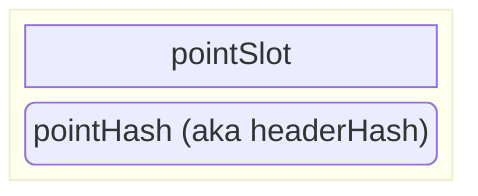
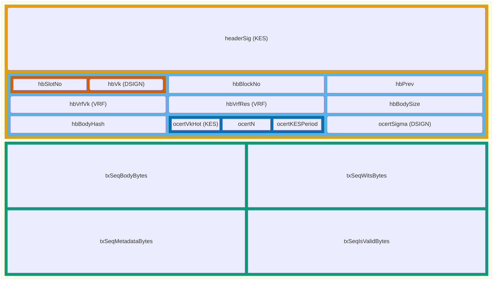
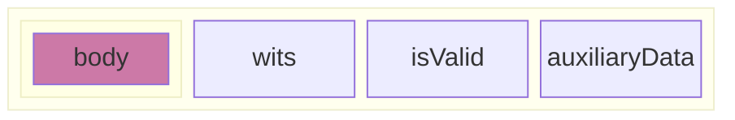
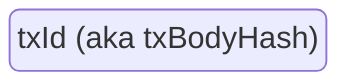

# Block Diagrams of Data

Many parts of the Consensus and Storage Layers' design primarily focus on points, blocks headers, and full blocks.
This document visualizes their contents, as of the Conway ledger era, from the perspective of the Consensus protocol.

The names of the individual fields were copied directly from the corresponding Haskell code; they are merely mnemonics within this diagram/document, not necessarily recognized more broadly.
Moreover, the order of the fields does not necessarily match their order within the valid CBOR encodings; see the corresponding CDDL specs for such details.

# Block Diagram of a Point

A point `(s, h)` names a (supposed) block whose `hbSlotNo` is `s` and whose serialized block header has hash `h`.

The `pointHash` field has the color #E69F00 because it's a hash of the (serialization of the) fields inside that background color in the block diagram of a full block below.
The same semantics of text color matching some background color is used within that diagram as well.

# Block Diagram of a Full Block

Some remarks.

- The relative sizes of the rectangles in this diagram are meaningless.
  We couldn't figure out a reasonable way to better control them within the Mermaid syntax.

- The `hbPrev` field has the same #E69F00 color as `pointHash`, but note that it is the hash of the header of the this block's predecessor.

# Block Diagram of a Transaction

There is very rich structure within the transactions themselves, but the majority of the Consensus and Storage Layer does not concern itself with that structure.
The `txSeq*` items are shown within the full block are just for orientation, since the alternative would be to simply write `body`, which is much less perspicious.

An individual transaction, outside of a block, has the same four parts (due to [segregated witnesses](https://github.com/IntersectMBO/cardano-ledger/blob/81637a1c2250225fef47399dd56f80d87384df32/libs/cardano-ledger-core/src/Cardano/Ledger/Core.hs#L562-L579)).

The transaction ID is the hash of just one of those parts of a single transaction, its body.

The `hbBodyHash` field, in contrast, hashes over all four parts of all transactions in the block body.
