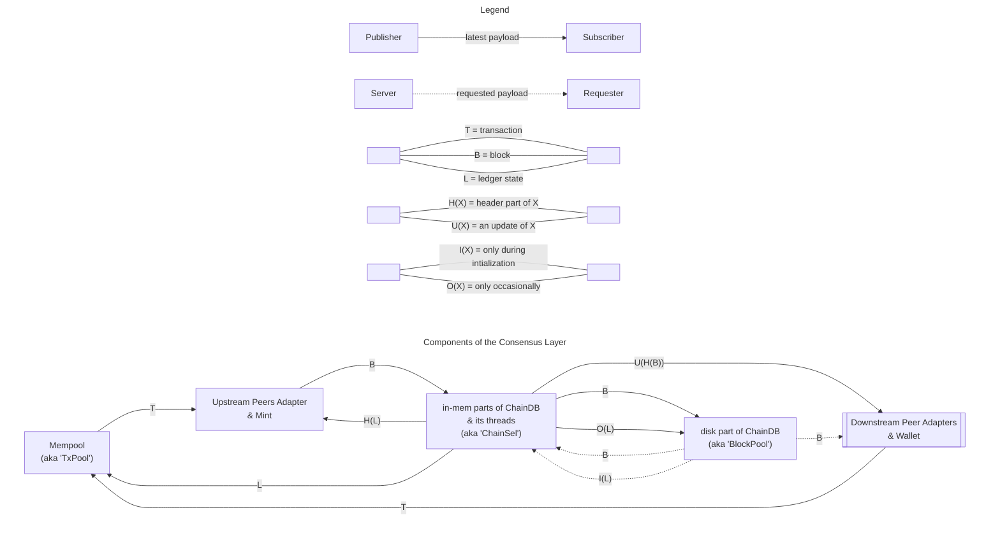
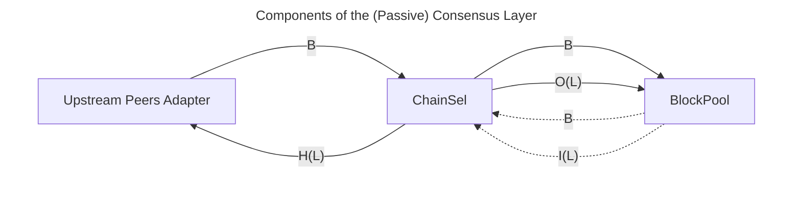

# Components' Data Flow
This is a very high-level diagram that indicates how the core data flow within the conceptual components of a single node's Consensus Layer.

The current implementation architecture is not an exact concretization of the conceptual components in this diagram.

- The BlockPool component in this diagram is to blocks on disk as the TxPool component (aka Mempool) is to transactions in memory.
  It corresponds to the on-disk parts of the ChainDB, ie the VolDB, the ImmDB, and the disk part of the LedgerDB.
- The ChainSel component in this diagram corresponds to the non-BlockPool parts of the ChainDB, ie the background threads and the in-memory part of the LedgerDB.

The other parts of the diagram more closely match the implementation.

- The TxPool is one-to-one with the actual Mempool.
- The Upstream Peers Adapter component in this diagram represents all mini protocol components for upstream peers (from which this node receives blocks) and the centralized BlockFetch decision logic.
  For the purpose of this diagram, the Mint component behaves like a special, simple, trusted upstream peer.
- The Downstream Peer Adapters component in this diagram represents all mini protocol components for downstream peers (to which this node sends blocks).
  For the purpose of this diagram, the Wallet peer (or any other _local client_) behaves like a special, simple, trusted downstream peer.

Remarks.

- H(L) must contain at least enough of an L to validate headers (ie H(B)).
  U(H(B)) corresponds to the `ChainUpdate` data type (ie roll forward or roll backward).

- This diagram distinguishes ChainSel and BlockPool in order to explicitly enumerate the three sources of blocks: Upstream Peers, the Mint, and from disk during node initialization.

- The difference in the plurals of Upstream Peers Adapter and Downstream Peer Adapters is not a typo.
  The logic managing each downstream peer is independent of the other downstream peers, whereas the logic managing upstream peers involves some centralized logic (eg the BlockFetch decision logic).
  The double-box node shape is the closest Mermaid equivalent to the more standard stack boxes.

- The peers are divided into "upstream" and "downstream" based on which direction blocks flow, but transactions flow in the opposite direction.

- Q: Since the upstream peers pass the blocks to ChainSel, why does ChainSel ever need to read from BlockPool?
  A: Two reasons. It may receive the blocks out of order. It reads them during initialization.

TODO.
Ideally the diagram is a cross with BlockPool, ChainSel, and TxPool all on the top-to-bottom line and Upstream Peers Adapter, ChainSel, and Downstream Peer Adapters on the left-to-right line.
But I can't figure out how to force Mermaid to choose that layout; [nor has anyone else](https://github.com/mermaid-js/mermaid/issues/270).
If we rework in eg `tikz`, we should do the cross.

The diagram is much simpler for a node that has no downstream peers, no wallet, and doesn't forge blocks; ie its sole purpose is to follow the chain and store it on the local disk.

