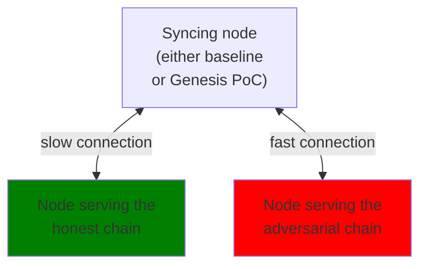

# Long-Range Attack demo

A *long-range* attack consists of an adversary creating a long chain that forks off far in the past from "the" honest chain, and presenting it to a newly syncing node with the goal of preventing it from ever fully catching up with the honest chain.

The current Cardano Node implementation is vulnerable against such attacks (even very trivial ones), and hence, it is required that all upstream peers are trusted during syncing.
A primary goal of the ongoing effort to implement Ouroboros Genesis is to remove this assumption, and instead only require that *at least one* upstream peer is serving the honest chain.

In this demo, we showcase how an existing proof-of-concept implementation of Genesis can already resist long-range attacks in a local testnet.

### Quickstart

We provide an out-of-the-box showcase that starts a tmux window or instance and runs all of the involved components in different windows, using Nix:

```shell
nix run .#genesis-poc
```

The focused window will listen for key presses that start a Genesis-enabled node (`g`) or a conventional one (`n`).

### Building the node

#### Without Nix

Checkout both this branch of `ouroboros-consensus`, as well as `cardano-node` at commit `8063de9354de737788e038a56946c74d5227b05d`.

In `cardano-node`, first build a baseline node executable via `cabal build exe:cardano-node`, which we will call `cardano-node-baseline`, as well as `cardano-cli` (for inspection purposes).
Then, insert
```cabal
packages:
  /path/to/ouroboros-consensus/ouroboros-consensus
  /path/to/ouroboros-consensus/ouroboros-consensus-diffusion
  /path/to/ouroboros-consensus/ouroboros-consensus-protocol
  /path/to/ouroboros-consensus/ouroboros-consensus-cardano
```
into `cabal.project.local` in `cardano-node`, and run `cabal build exe:cardano-node` again.
We will refer to the final binary as `cardano-node-genesis-poc`.

#### With Nix

```console
nix build .#long-range-attack.cardano-cli -o result-cardano-cli
nix build .#long-range-attack.baseline    -o result-baseline
nix build .#long-range-attack.genesis-poc -o result-genesis-poc
```

### Overview of the testnet setup

Our simulated local testnet consists of two nodes serving two different chains, the honest one and the adversarial one.

 - Slot duration = 1s
 - Security parameter k = 10 blocks
 - Block number of tip of the **honest** chain: 385
 - Block number of tip of the **adversarial** chain: 237
 - Intersection of the honest and adversarial chain: slot 100, block 98
 - The honest chain is (much) **denser** than the adversarial chain after the intersection.
   This is the property that the Genesis design and implementation are crucially relying on to decide which chain to pick.

For the demo, we let a node with only these two nodes in the topology file start to sync from scratch.
In order to make this demo deterministic, we assume that the connection to the honest node is slower than the one to the adversarial node.

Concretely, we use [toxiproxy], a standard tool to simulate network conditions, to set the latency of the connection to 20ms for the honest node, but to only 10ms for the adversarial node.

### Spinning up the testnet

Extract the necessary files via
```console
tar xJf testnet.tar.xz
```
Then, in separate terminals, run
```console
./testnet/start-honest.sh    cardano-node-baseline
./testnet/start-adversary.sh cardano-node-baseline
toxiproxy-server
./testnet/toxiproxy.sh
```
Here, replace `cardano-node-baseline` with the path to the Cardano node binary.

### Letting different nodes sync

To let a node sync to the testnet, run
```console
./testnet/start-syncing.sh cardano-node-xxx
```
After an initial burst of log output of at most a few second, the node will have fully selected either the honest or the adversarial chain.
You can check this by running
```console
./testnet/query-syncing.sh cardano-cli
```
which will report either tip as listed above.

In particular:

 - `cardano-node-baseline` will always end up on the adversarial chain, and has no chance to ever adopt the honest chain (without manual intervention).
 - `cardano-node-genesis-poc` will always end up on the honest chain automatically.

:tada: :tada: :tada:

[toxiproxy]: https://github.com/shopify/toxiproxy
