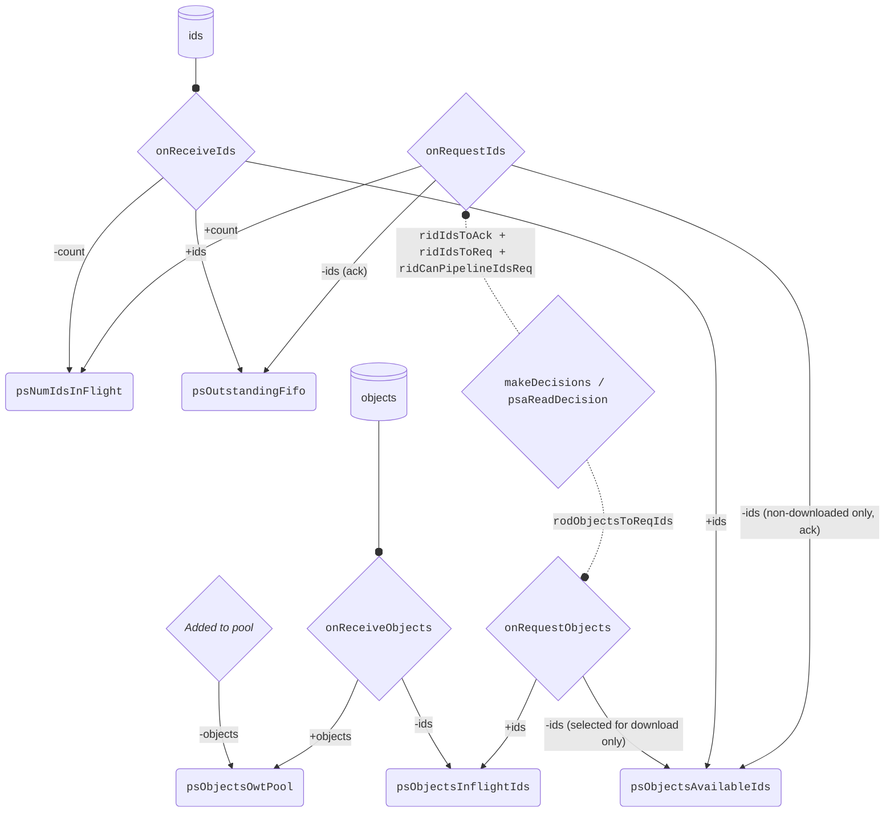

# Object Diffusion Inbound Mini-Protocol V2

This document describes the inner workings of the inbound side of the `ObjectDiffusion` mini-protocol. A broad description of the whole protocol can be found in section 2.5 of [this document](https://tweag.github.io/cardano-peras/peras-design.pdf).

- [Object Diffusion Inbound Mini-Protocol V2](#object-diffusion-inbound-mini-protocol-v2)
  - [General architecture](#general-architecture)
  - [Inbound peer loop](#inbound-peer-loop)
  - [Peer state description and lifecycle](#peer-state-description-and-lifecycle)
  - [Acknowledgement behavior](#acknowledgement-behavior)
  - [Download attribution process in `makeDecisions`](#download-attribution-process-in-makedecisions)
  - [On peer disconnection](#on-peer-disconnection)
  - [Differences with TxSubmission V2 inbound mini-protocol](#differences-with-txsubmission-v2-inbound-mini-protocol)

## General architecture

In `ObjectDiffusion` V2 (only the inbound side changes compared to V1), each connection to an outbound peer is no longer considered in isolation. Instead, there is a global state `peerStates :: Map peerAddr (PeerState objectId object)` made individual `PeerState`s (defined in `Types.hs`) that each track the state of a given connection. Further on, we denote _an instance of the inbound protocol connected to a specific outbound peer_ simply as _an inbound peer_.

A `PeerState` holds the state of the interaction with the distant outbound peer, which is described in more details in [this section](#fields-of-peerstate-and-their-lifecycle).

The global state is read periodically from a dedicated _decision_ thread (defined in `Registry.hs` and `Decision.hs`), and for each inbound peer computes a `PeerDecision` (defined in `Types.hs`) that indicates what the inbound peer should do next. The decision is made of two parts, `ReqIdsDecision` and `ReqObjectsDecision`.

The `ReqIdsDecision` gives the necessary information for the inbound peer to request new IDs from the outbound peer, and is made of the following fields:

- `ridIdsToReq`: number of new IDs to request from the outbound peer
- `ridIdsToAck`: number of IDs that the peer should ack in its next request for IDs. Note that if `ridIdsToReq` is zero, then no request for IDs will be sent, and thus no acknowledgment will happen despite `ridIdsToAck` being non-zero (we might change the decision process in the future to get rid of this non-intuitive case).
- `ridCanPipelineIdsReq`: a flag indicating whether the peer can pipeline its requests for IDs (instead of making a blocking call).

The `ReqObjectsDecision` gives the necessary information for the inbound peer to request new objects from the outbound peer, and is made of the following field:

- `rodObjectsToReqIds`: the set of IDs of the objects that the inbound peer should request from the outbound peer.

An inbound peer (defined in `V2.hs`) has no direct access to the state, neither in write nor read fashion. It only has access to a monadic API `PeerStateAPI` defined in `Registry.hs`. This API has 2 decisions-related callbacks, and 4 state-mutating callbacks. It should follow the decision and call the state-mutating callbacks accordingly to keep the global state consistent with the actions taken.

**Decision-related callbacks:**

- `psaReadDecision` that allows the inbound peer to read the current `PeerDecision` made for itself by the last round of the decision logic. This will block if a new decision is not yet available for this peer.
- `psaOnDecisionCompleted` that allows the inbound peer to signal that it has executed the last decision it read, and that the decision logic should now compute a new decision for this peer

For that, we wrap the `PeerDecision` in a `PeerDecisioStatus` type that has three variants: `DecisionUnread`, `DecisionBeingActedUpon` and `DecisionCompleted`. Only `DecisionUnread` and `DecisionBeingActedUpon` have a payload of type `PeerDecision`.

When the status for a peer is of variant `DecisionBeingActedUpon`, the global-state decision logic will not update the decision for this peer (it is locked, or "busy").

**State-mutating callbacks:**

These are the callbacks that the inbound peer must call when it takes the corresponding actions that has been dictated by the decision it read. These callbacks will update the corresponding peer state in the global state. For reference, the fields of this state are documented in [this section](#fields-of-decisionpeerstate-and-their-lifecycle).

- `psaOnRequestIds` (corresponding to `onRequestIds` from `State.hs`) that must be called when emitting a request for a non-zero amount of new IDs (that will also acks previously received IDs that we no longer care about). Under the hood, `onRequestIds` will increase the `psNumIdsInFlight` count by the requested number of IDs, and remove the acked IDs from `psOutstandingFifo` and `psObjectsAvailableIds`.
- `psaOnReceiveIds` (corresponding to `onReceiveIds` from `State.hs`) that must be called after receiving new IDs from the outbound peer. Under the hood, `onReceiveIds` will decrease the `psNumIdsInFlight` count by **the number of IDs that were requested in the request corresponding to this reply** (it might be more than the number of received IDs), and add the received IDs to `psOutstandingFifo` and `psObjectsAvailableIds`.
- `psaOnRequestObjects` (corresponding to `onRequestObjects` from `State.hs`) that must be called when emitting a request for a non-zero amount of new objects. Under the hood, `onRequestObjects` will remove the requested IDs from `psObjectsAvailableIds` and add them to `psObjectsInflightIds`.
- `psaOnReceiveObjects` (corresponding to `onReceiveObjects` from `State.hs`) that must be called when receiving objects from the outbound peer. Under the hood, `onReceiveObjects` will remove the received IDs from `psObjectsInflightIds`, and add the received objects to `dpsOwtPool`, and call the `submitObjectsToPool` subroutine that will actually insert the objects into the object pool when the lock can be acquired (at which point the objects are removed from `dpsOwtPool`)

NOTE: Protocol error-handling (e.g. making sure the outbound peer has sent the correct information) is done by the callback themselves, so the inbound peer doesn't have to check anything before calling these state-mutating callbacks. Preconditions that should hold, but don't due to implementation errors, are tested with `assert` throughout the code. This ensures a modicum of correctness as long as the code is sufficiently tested.

## Inbound peer loop

The inbound peer performs a loop where each iteration starts with (blocking on) reading a new decision, and ends with signaling that the decision has been executed. It should not return to the start of the loop too early, i.e., before it has taken all the actions dictated by the decision, as the decision logic considers that once a decision has been read, it is effectively "busy in" and will be performed. So in each iteration, the inbound peer should do the following steps in order:

1. Read the current decision via `psaReadDecision`
2. Then try to read any available reply from the outbound peer if there have been pipelined requests in previous rounds. It should process the reply accordingly, and call either `psaOnReceiveIds` or `psaOnReceiveObjects` as needed
3. Then request objects (if any) as per `rodObjectsToReqIds`, and call `psaOnRequestObjects` accordingly
4. Then request IDs (if any) as per `ridIdsToReq` (acking `ridIdsToAck` as a side-effect), and call `psaOnRequestIds` accordingly
5. Call `psaOnDecisionExecuted` to signal that a new decision should be made for this peer

In the implementation, steps 2, 3, 4 are performed by the `goCollect`, `goReqIds` and `goReqObjects` functions in `V2.hs` that each call the next one in sequence as needed.

NOTE: The decision logic doesn't assume that we will first request objects, then only (request and) acknowledge IDs. Consequently, the decision logic won't ever ask to request objects whose IDs would be acknowledged in that same round.

## Peer state description and lifecycle

The following diagram indicates when and by whom fields of the `PeerState` of an inbound peer are modified.

Fields of `PeerState` are represented as rounded rectangles, while callbacks/functions are represented as diamond shapes. The entry point of the diagram is the `makeDecisions / psaReadDecision` node, that dictates the actions to be taken by the inbound peer, that are then reflected through the `onRequestIds` and `onRequestObjects` callbacks.

Normal arrows `->` take their source from a function, and points towards a field that is modified by this function. The label on the arrow indicates, by the sign, whether something is added _or_ removed from the field, and also the nature of the value (count, ids, objects) being added or removed.

Arrows with rounded head show an external input of data, i.e. when the inbound peer actually receives data from the outbound peer.

### Fields of `PeerState` and their lifecycle

- `psNumIdsInFlight`: The cumulative number of object IDs we have asked in requests that have not yet been replied to. We need to track this to ensure we don't ask the outbound peer to keep available more objects at a given time than the protocol defined limit (see `dpMaxNumObjectsOutstanding` in `Policy.hs`). This count is incremented in `onRequestIds` by the number of requested IDs, and decremented in `onReceiveIds` by **the same number of requested IDs** when the reply is received. E.g., if we request 10 IDs, then we increment the count by 10; and if later the outbound peer replies with only 7 IDs (because it had only 7 available), we still decrement the count by 10.
- `psOutstandingFifo`: IDs of the objects that the outbound peer has available for us, and which we have not yet acknowledged. This is kept in the order in which the outbound peer gave them to us. It is also the order in which we acknowledge them (because acknowledgment, as in TX-submission, is made by sending the length of the prefix of the FIFO that we no longer care about, instead of providing the IDs as a set). IDs are added to this FIFO in `onReceiveIds`, and removed from this FIFO in `onRequestIds` when we acknowledge (i.e. drop) a prefix of the FIFO.
- `psObjectsAvailableIds`: Set of IDs of the objects that can be requested to the outbound peer, and have not yet been requested or downloaded. This is a subset of `psOutstandingFifo`. IDs are added to this set in `onReceiveIds`. They can be removed from this set in two ways:
  - when some objects are requested by their IDs in `onRequestObjects`, the corresponding IDs are removed from `psObjectsAvailableIds`
  - for the IDs that were voluntarily not requested (e.g. because we already have obtained them through other peers), they are removed from `psObjectsAvailableIds` when we acknowledge a prefix of the FIFO that contains them
- `psObjectsInflightIds`: The IDs of objects that have been requested to the outbound peer, but have not yet been received. IDs are added to this set in `onRequestObjects` (at the moment they are removed from `psObjectsAvailableIds`), and removed from this set in `onReceiveObjects` (at the moment the corresponding objects are added to `psObjectsOwtPool`). In ObjectDiffusion, we must receive exactly the objects that we requested, so there is no way for some items in this set to stay here indefinitely
- `psObjectsOwtPool`: A map of IDs to objects that have been received, and are on their way to the `ObjectPool`. As we have many inbound peers in parallel, we cannot directly insert objects into the pool when we receive them; instead, we should wait to obtain the pool lock. So we store the received objects here in the meantime, and the subroutine `submitObjectsToPool` (launched by `onReceiveObjects`) will acquire the lock and insert them into the pool when possible, and thus remove them from `psObjectsOwtPool` at that moment.

## Acknowledgement behavior

The ID of an object is eligible for acknowledgement from a given inbound peer when:

- The corresponding object has been downloaded from its direct outbound peer, and is currently in `psObjectsOwtPool` of **this** inbound peer
- The corresponding object is already in the pool (either obtained through other inbound peers, or previously downloaded and inserted by this inbound peer)

So even if the validation of a received object is done at the moment the object is added to pool, there won't be any issue. Take the example of an object that is rejected by the pool (because it has invalid cryptographic signature, for example). In this case:

- the inbound peer that submitted the object to pool might have acked it already at the moment the object is rejected by the pool, but the rejection indicates that the outbound peer which sent us the object is adversarial, and we should disconnect from it anyway. So there is no harm done by having acked the object to the adversarial outbound peer, as we won't want to re-download this object from it again (or any other object whatsoever).
- any other inbound peer that has this ID available from its outbound peer won't be able to ack it because this ID isn't in **their** `psObjectsOwtPool`, and is not in the pool either, so we will be able to download it from these other peers until we find a valid one.

As in TxSubmission, acknowledgement is done by indicating to the outbound peer the length of the (longest) prefix of the oustanding FIFO that we no longer care about (i.e. for which all IDs are eligible to acknowledgment by the definition above). The field `psOutstandingFifo` on the inbound peer is supposed to mirror exactly the state of the FIFO of the outbound peer, bar eventual discrepancies due to in-flight information.

## Download attribution process in `makeDecisions`

When making decisions, we first divide the peers in two groups:

- Those who are currently executing a decision, i.e., those for which the status in the decision channel is of variant `DecisionBeingActedUpon`. These are further called _busy peers_.
- Those who are not currently executing a decision, i.e., those for which the status in the decision channel is of variant `DecisionUnread` or `DecisionCompleted`. The former are the ones who didn't have time to read the previous decision yet, so it makes sense to recompute a more up-to-date decision for them. The latter are the ones who have completed executing the previous decision, so it also makes sense to compute a new decision for them. These two categories of peers are further called _pending peers_.

The rest of the decision logic will only aim to compute new decisions for the pending peers, while busy peers will keep their current decision until they complete executing it. But we need a few information from busy peers to drive the decision for pending peers.

The first step is to pre-compute which acknowledgment each pending peer will make on its next request for IDs, and how many IDs they should request. This is done by the `makeReqIdsAndAckDecisions` function in `Decision.hs`, that produces `ReqIdsDecision`s (i.e. the first component of a `PeerDecision`).

Then we decide which objects should be downloaded from which pending peer in the `makeReqObjectsDecisions` function.

More concretely, we list from each peer which are the interesting available objects, i.e. the objects that match this two criteria:

- They are not already in the pool
- They are available from the peer, and won't be acked by the peer on its next request for IDs according to the decision computed by `makeReqIdsAndAckDecisions` at the previous step (NOTE: theoretically, this second condition is redundant with other constraints and invariants of the current implementation).

Then we "reverse" this mapping to obtain a map of object IDs to the set of pending peers that have the corresponding interesting objects available (according to the criteria above), further called _potential providers_.

Now, we consider how many copies of each object are already in the process of being acquired. We count as "in the process of being acquired" any object that is either:

- in `dpsObjectsInFlightIds` of any pending peer
- in `dpsObjectsInFlightIds` **or** in `rodObjectsToReqIds` of any busy peer (because we consider that a busy peer will execute its decision to completion, even if `onRequestObjects`, that adds items to `dpsObjectsInFlightIds`, hasn't been called yet by it)
- in `psObjectsOwtPool` of any peer

For each object, sequentially, we then try to select as many providers as the difference between the redundancy target (`dpTargetObjectRedundancy` in `Policy.hs`) and the number of copies of this object already in the process of being acquired. But we also make sure, when selecting providers, that we don't go beyond the limit of objects in flight for each potential provider, and that we don't go beyond the limit of total objects in flight for our node too (defined by `dpMaxNumObjectsInflightPerPeer` and `dpMaxNumObjectsInflightTotal` in `Policy.hs`). For the computation of total number of objects in flight, we consider objects already in flight from all peers, plus the objects that are going to be requested from busy peers according to their current decision.

The result is a map from pending peers to the set of object IDs that should be requested from them; this forms a `ReqObjectsDecision`. We join the `ReqIdsDecision` and `ReqObjectsDecision` of each peer to form the final `PeerDecision` of each pending peer, that are then propagated to the peers through their decision channels (in `Registry.hs`).

At the moment, the algorithm is eager towards securing the target number of copies for each object, at the detriment of object coverage and peer load balancing. Future improvements could be made to address this if needed.

NOTE: the decision logic doesn't make any changes to the global state; it only reads it. All changes to the global state are made by the inbound peers through the `PeerStateAPI` callbacks.

## On peer disconnection

The inbound peers are registered in the global state and decision channels map through a `bracket` function in `Registry.hs`. When a peer disconnects, the corresponding entry in the decision channels map and global state are automatically removed.

As the global state is only a map of per-peer states at the moment, this means that we don't need to take any other particular action to clean up the global state following the disconnection of a peer.

Any error protocol-wise (e.g. receiving invalid data from the outbound peer) or receiving objects that are rejected by the pool (e.g. if they don't have valid cryptographic signatures) should throw an exception, that will automatically lead to disconnection (and thus triggering cleanup).

Following a peer disconnection, the next round of decision-logic will readjust accordingly. For example, if some object was in the process of being downloaded from the disconnected peer, the next round of the decision logic will see that we have fewer copies in the process of being acquired than before, and thus will ask other providers to download it.

## Differences with TxSubmission V2 inbound mini-protocol

Although both mini-protocol inbound implementations share the same general structure (global state and global decision thread, with peer registering through a bracket function, peer interacting through an API with the global state), there are some major differences in the implementation:

- ObjectDiffusion decision process doesn't modify the global state at all, unlike TxSubmission one. This is true for acknowledgment computation too (that is part of decision making). Instead, all modifications to the global state are made by the inbound peers through the `PeerStateAPI` callbacks. This makes the decision logic more straighforward
- ObjectDiffusion decision process doesn't pre-filter peers based on their individual `PeerState` to know whether or not we should generate a decision for them. Instead, we use the different variants of `PeerDecisionStatus` (updated through the `psaReadDecision` and `psaOnDecisionCompleted` callbacks), to know whether or not we should compute a new decision for a peer. The conditions on which we compute a new decision are also different: we compute a new decision for a peer if it is not currently executing a decision (i.e. its status is of variant `DecisionUnread` or `DecisionCompleted`), instead of checking various fields of its `PeerState`.
- ObjectDiffusion relies on `opwHasObject` method of the `ObjectPoolWrapper` to know whether or not an object is already in the pool, instead of tracking this information in the global state with a retention delay. This simplifies the global state and implementation a lot, but depends on the implementation of the `ObjectPoolWriter` to provide a fairly cost-efficient implementation for `opwHasObject`, as it is called often.
- Similarly, ObjectDiffusion gets rid of many global maps that were slightly redundant with information already present in each peer's state, as the only time we need to use these maps are during decision-making. So for the time being, we recompute the specific parts of this global view that we need at each round of decision-making, instead of maintaining them up-to-date at all times. We might need to revisit this later for performance purposes if needed.
- ObjectDiffusion also doesn't have a concept of ranking/scoring for peers, as an invalid object must lead to immediate disconnection. So the decision logic doesn't need to consider peer quality when attributing downloads.
- In ObjectDiffusion, the global state is not modified directly outside of `State.hs` (and `Registry.hs` when registering/unregistering peers).
