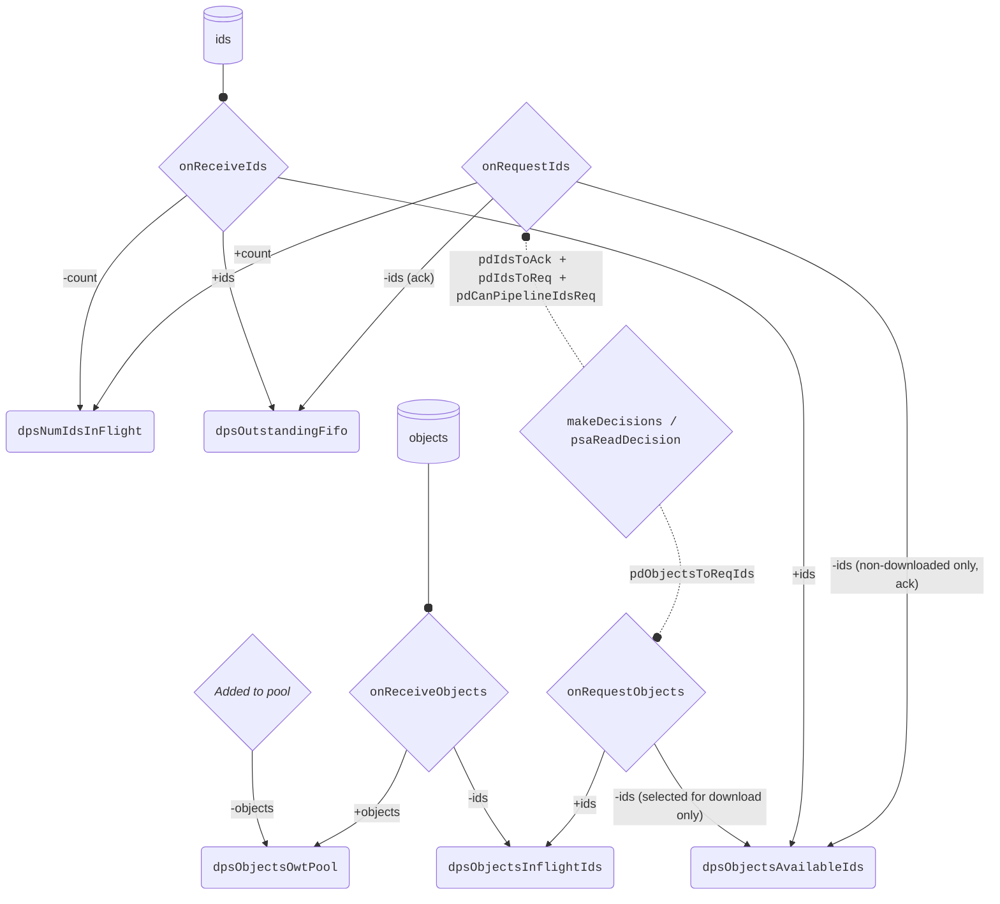

# Object Diffusion Inbound Mini-Protocol V2

This document describes the inner workings of the inbound side of the `ObjectDiffusion` mini-protocol. A broad description of this protocol can be found in section 2.5 of [this document](https://tweag.github.io/cardano-peras/peras-design.pdf).

## TODOs

- what happens when a peer gets disconnected: ensure correctness
- describe the strategy for individual peer decisions
- describe lifetime of id + related object
- list differences with TxSubmissionV

## General architecture

In `ObjectDiffusion` V2 (only the inbound side changes compared to V1), each connection to an outbound peer is no longer considered in isolation. Instead, there is a global state `DecisionGlobalState` (defined in `Types.hs`) that tracks the state of all connections together using `dgsPeerStates :: Map peerAddr (DecisionPeerState objectId object)`. Currently, this field is the only one of `DecisionGlobalState`, meaning that we use no global data other than the sum of the peer's. Further on, we denote _an instance of the inbound protocol connected to a specific outbound peer_ simply as _an inbound peer_.

A `DecisionPeerState` holds the state of the interaction with the distant outbound peer, which is described in more details in [this section](#fields-of-decisionpeerstate-and-their-lifecycle).

The global state is read periodically from a dedicated _decision_ thread (defined in `Registry.hs` and `Decision.hs`), and for each inbound peer computes a `PeerDecision` (defined in `Types.hs`) that indicates what the inbound peer should do next. More specifically, in the decision, the inbound peer can find:

- `pdIdsToReq`: number of new IDs to request from the outbound peer
- `pdIdsToAck`: a set of IDs that the peer should ack in its next request for IDs. Note that if `pdIdsToReq` is zero, then no request for IDs will be sent, and thus no acking will happen despite `pdIdsToAck` being non-zero.
- `pdCanPipelineIdsReq`: a flag indicating whether the peer can pipeline its requests for IDs (instead of making a blocking call).
- `pdObjectsToReqIds`: the IDs of the objects that the inbound peer should request from the outbound peer.

An inbound peer (defined in `V2.hs`) has no direct access to the state, neither in write nor read fashion. It only has access to a monadic API `PeerStateAPI` defined in `Registry.hs`. This API has 2 decisions-related callbacks, and 4 state-mutating callbacks. It should follow the decision and call the state-mutating callbacks accordingly to keep the global state consistent with the actions taken.

**Decision-related callbacks:**

- `psaReadDecision` that allows the inbound peer to read the current `PeerDecision` made for itself by the last round of the decision logic. This will block if a new decision is not yet available for this peer.
- `psaOnDecisionCompleted` that allows the inbound peer to signal that it has executed the last decision it read, and that the decision logic should now compute a new decision for this peer

The decision additionally has a flag `pdStatus` (not intended to be read by the peer) that is set to `DecisionBeingActedUpon` when `psaReadDecision`, and stays at that value until the peer calls `psaOnDecisionCompleted`, indicating that it has executed the decision (the status is set to `DecisionCompleted`). This is the main way the peer interacts with the decision thread. While the flag is set to `DecisionBeingActedUpon`, the global-state decision logic will not update the decision for this peer (it is locked, or "frozen").

**State-mutating callbacks:**

These are the callbacks that the inbound peer must call when it takes the corresponding actions that has been dictated by the decision it read. These callbacks will update the corresponding peer state. For reference, the fields of this state are documented in [this section](#fields-of-decisionpeerstate-and-their-lifecycle)

- `psaOnRequestIds` (corresponding to `onRequestIds` from `State.hs`) that must be called when emitting a request for new IDs (that also acks previously received IDs that we no longer care about). Under the hood, `onRequestIds` will increase the `dpsNumIdsInFlight` count by the requested number of IDs, and remove the acked IDs from `dpsOutstandingFifo` and `dpsObjectsAvailableIds`.
- `psaOnReceiveIds` (corresponding to `onReceiveIds` from `State.hs`) that must be called after receiving new IDs from the outbound peer. Under the hood, `onReceiveIds` will decrease the `dpsNumIdsInFlight` count by **the number of IDs that were requested in the request corresponding to this reply** (it might be more than the number of received IDs), and add the received IDs to `dpsOutstandingFifo` and `dpsObjectsAvailableIds`.
- `psaOnRequestObjects` (corresponding to `onRequestObjects` from `State.hs`) that must be called when emitting a request for new objects. Under the hood, `onRequestObjects` will remove the requested IDs from `dpsObjectsAvailableIds` and add them to `dpsObjectsInflightIds`.
- `psaOnReceiveObjects` (corresponding to `onReceiveObjects` from `State.hs`) that must be called when receiving objects from the outbound peer. Under the hood, `onReceiveObjects` will remove the received IDs from `dpsObjectsInflightIds`, and add the received objects to `dpsOwtPool`, and call the `submitObjectsToPool` subroutine that will actually insert the objects into the object pool when the lock can be acquired (at which point the objects are removed from `dpsOwtPool`)

NOTE: Protocol error-handling (e.g. making sure the outbound peer has sent the correct information) is done by the callback themselves, so the inbound peer doesn't have to check anything before calling these state-mutating callbacks. Preconditions that should hold, but don't due to implementation errors, are tested with `assert` throughout the code. This ensures a modicum of correctness as long as the code is sufficiently tested.

## Inbound peer loop

The inbound peer performs a loop where each iteration starts with (blocking on) reading a new decision, and ends with signaling that the decision has been executed. It should not return to the start of the loop too early, i.e., before it has taken all the actions dictated by the decision (except for acks, that cannot be made when `pdIdsToReq == 0`), as the decision logic considers that once a decision has been read, it is effectively "frozen in" and will be performed. So in each iteration, the inbound peer should do the following steps in order:

1. Read the current decision via `psaReadDecision`
2. Then try to read any available reply from the outbound peer if there have been pipelined requests in previous rounds. It should process the reply accordingly, i.e. check that the reply conforms to the mini-protocol rules, and call either `psaOnReceiveIds` or `psaOnReceiveObjects` as needed
3. Then request objects (if any) as per `pdObjectsToReqIds`, and call `psaOnRequestObjects` accordingly
4. Then request IDs (if any) as per `pdIdsToReq` (acking `pdIdsToAck` as a side-effect), and call `psaOnRequestIds` accordingly
5. Call `psaOnDecisionExecuted` to signal that a new decision should be made for this peer

In the implementation, steps 2-4 are performed by the `goCollect`, `goReqIds` and `goReqObjects` functions respectively of `V2.hs`.

NOTE: The decision logic doesn't assume that we will first request objects, then only (request and) acknowledge IDs. Consequently, the decision logic won't ever ask to request objects whose IDs would be acknowledged in that same round.

## Peer state description and lifecycle

This diagram shows when a value (count, ID or object) is added or removed from a specific field of the `DecisionPeerState` during the execution of an inbound peer.

Fields of `DecisionPeerState` are represented as rounded rectangles, while callbacks/functions are represented as diamond shapes. The entry point of the diagram is the `makeDecisions / psaReadDecision` node, that dictates the actions to be taken by the inbound peer, that are then reflected through the `onRequestIds` and `onRequestObjects` callbacks.

```mermaid
%%{init: {"flowchart": {"htmlLabels": true}} }%%
flowchart TD
    A(<code>dpsNumIdsInFlight</code>)
    B(<code>dpsOutstandingFifo</code>)
    C(<code>dpsObjectsAvailableIds</code>)
    D(<code>dpsObjectsInflightIds</code>)
    F(<code>dpsObjectsOwtPool</code>)

    EA{<code>onRequestIds</code>}
    EA-->|+count| A
    EA -->|"`-ids (ack)`"| B
    EA -->|"`-ids (non-downloaded only, ack)`"| C

    EB{<code>onReceiveIds</code>}
    EB -->|-count| A
    EB -->|+ids| B
    IN1@{ shape: lin-cyl, label: "ids" } --o EB
    EB -->|+ids| C

    EC{<code>onRequestObjects</code>}
    EC -->|"`-ids (selected for download only)`"| C
    EC -->|+ids| D

    ED{<code>onReceiveObjects</code>}
    ED -->|-ids| D
    IN2@{ shape: lin-cyl, label: "objects" } --o ED
    ED -->|+objects| F

    EE{<code>makeDecisions / psaReadDecision</code>}
    EA ~~~ EE
    EC ~~~ EE
    EE -.-o|<code>pdIdsToAck + pdIdsToReq + pdCanPipelineIdsReq</code>| EA
    EE -.-o|<code>pdObjectsToReqIds</code>| EC

    EG{<i>Added to pool</i>}
    EG -->|-objects| F
```

### Fields of `DecisionPeerState` and their lifecycle

- `dpsNumIdsInFlight`: The cumulative number of object IDs we have asked in requests that have not yet been replied to. We need to track this to ensure we don't ask the outbound peer to keep available more objects at a given time than the protocol defined limit (see `dpMaxNumObjectsOutstanding` in `Policy.hs`). This count is incremented in `onRequestIds` by the number of requested IDs, and decremented in `onReceiveIds` by **the same number of requested IDs** when the reply is received. E.g., if we request 10 IDs, then we increment the count by 10; and if later the outbound peer replies with only 7 IDs (because it had only 7 available), we still decrement the count by 10.
- `dpsOutstandingFifo`: IDs of the objects that the outbound peer has available for us, and which we have not yet acknowledged. This is kept in the order in which the outbound peer gave them to us. It is also the order in which we acknowledge them (because acknowledgment, as in TX-submission, is made by sending the length of the prefix of the FIFO that we no longer care about, instead of providing the IDs as a set). IDs are added to this FIFO in `onReceiveIds`, and removed from this FIFO in `onRequestIds` when we acknowledge (i.e. drop) a prefix of the FIFO.
- `dpsObjectsAvailableIds`: Set of IDs of the objects that can be requested to the outbound peer, and have not yet been requested or downloaded. This is a subset of `dpsOutstandingFifo`. IDs are added to this set in `onReceiveIds`. They can be removed from this set in two ways:
  - when some objects are requested by their IDs in `onRequestObjects`, the corresponding IDs are removed from `dpsObjectsAvailableIds`
  - for the IDs that are voluntarily not requested (e.g. because we already have obtained them through other peers), they are removed from `dpsObjectsAvailableIds` when we acknowledge a prefix of the FIFO that contains them
- `dpsObjectsInflightIds`: The IDs of objects that have been requested to the outbound peer, but have not yet been received. IDs are added to this set in `onRequestObjects` (at the moment they are removed from `dpsObjectsAvailableIds`), and removed from this set in `onReceiveObjects` (at the moment the corresponding objects are added to `dpsObjectsOwtPool`). In ObjectDiffusion, we must receive exactly the objects that we requested, so there is no way for some items in this set to stay here indefinitely
- `dpsObjectsOwtPool`: A map of IDs to objects that have been received, and are on their way to the `ObjectPool`. As we have many inbound peers in parallel, we cannot directly insert objects into the pool when we receive them; instead, we should wait to obtain the pool lock. So we store the received objects here in the meantime, and the subroutine `submitObjectsToPool` (launched by `onReceiveObjects`) will acquire the lock and insert them into the pool when possible, and thus remove them from `dpsObjectsOwtPool` at that moment.

## Acknowledgement behavior note

The ID of an object is eligible for acknowledgement from a given inbound peer when:

- The corresponding object has been downloaded from its direct outbound peer, and is currently in `dpsObjectsOwtPool` of **this** inbound peer
- The corresponding object is already in the pool (either obtained through other inbound peers, or previously downloaded and inserted by this inbound peer)

So even if the validation of a received object is done at the moment it is added to pool, this won't cause any trouble. Take the example of an object that is rejected by the pool (because it has invalid cryptographic signature, for example). In this case:

- the inbound peer that submitted the object to pool might have acked it already at the moment the object is rejected by the pool, but this means the outbound peer which sent us the object is adversarial, and we should disconnect from it anyway. So there is no harm done by having acked the object to the adversarial outbound peer, as we won't want to re-download this object from it again (or any other object whatsoever).
- any other inbound peer that has this ID available from its outbound peer won't be able to ack it because this ID isn't in their `dpsObjectsOwtPool`, and is not in the pool, so we will be able to download it from these other peers until we find a valid one.

As in TxSubmission, acknowledgement is done by indicating to the outbound peer the length of the (longest) prefix of the oustanding FIFO that we no longer care about (i.e. for which all IDs are eligible to acknowledgment by the definition above). The field `dpsOutstandingFifo` on the inbound peer is supposed to mirror exactly the state of the FIFO of the outbound peer, bar eventual discrepancies due to in-flight information.

## Download attribution process in `makeDecisions`

When making decisions, we first divide the peers in two groups:
- Those who are currently executing a decision, i.e., those for which the (previous) decision in the decision channel verifies `pdStatus == DecisionBeingActedUpon`. These are further called _frozen peers_.
- Those who are not currently executing a decision, i.e., those for which the (previous) decision in the decision channel verifies `pdStatus == DecisionUnread || pdStatus == DecisionCompleted`. The former are the ones who didn't have time to read the previous decision yet, so it makes sense to recompute a more up-to-date decision for them. The latter are the ones who have completed executing the previous decision, so it also makes sense to compute a new decision for them. These two categories of peers are further called _active peers_.

The rest of the decision logic will only aim to compute decisions for the active peers, while frozen peers will keep their previous decision until they complete executing it. But we need a few information from frozen peers to drive the decision for active peers.

The first step is to pre-compute which acknowledgment each active peer will make on its next request for IDs, and how many IDs they should request. This is done by the `computeAck` function in `Decision.hs`, that produces partial `PeerDecision`s (i.e. their `pdObjectsToReqIds` field is not yet specified).

Then we decide which objects should be downloaded from which active peer in the `pickObjectsToReq` function.

More concretely, we list from each peer which are the interesting available objects, i.e. the objects that match this two criteria:
- They are not already in the pool
- They are available from the peer, and won't be acked by the peer on its next request for IDs according to the partial decision computed by `computeAck` at the previous step (NOTE: theoretically, this second condition is redundant with other constraints and invariants of the protocol).

Then we "reverse" this mapping to obtain a map of object IDs to the set of active peers that have the corresponding interesting objects available (according to the criteria above), further called _potential providers_.

Now, we consider how many copies of each object are already in the process of being acquired. We count as "in the process of being acquired" any object that is either:
- in `dpsObjectsInFlightIds` of any active peer
- in `dpsObjectsInFlightIds` **or** in `pdObjectsToReqIds` of any frozen peer (because we consider that a frozen peer will execute its decision to completion, even if `onRequestObjects`, that adds items to `dpsObjectsInFlightIds`, hasn't been called yet by it)
- in `dpsObjectsOwtPool` of any peer

For each object, sequentially, we then try to select as many providers as the difference between the redundancy target (`dpTargetObjectRedundancy` in `Policy.hs`) and the number of copies of this object already in the process of being acquired. But we also make sure, when selecting providers, that we don't go beyond the limit of objects in flight for each potential provider, and that we don't go beyond the limit of total objects in flight for our node too (defined by `dpMaxNumObjectsInflightPerPeer` and `dpMaxNumObjectsInflightTotal` in `Policy.hs`).

The result is a map from active peers to the set of object IDs that should be requested from them. This map is then merged with the partial decisions computed by `computeAck` to produce the final decisions for each active peer, that are then propagated to the peers through their decision channels (in `Registry.hs`).

At the moment, the algorithm is eager towards securing the target number of copies for each object, at the detriment of object coverage and peer load balancing. Future improvements could be made to address this if needed.

NOTE: the decision logic doesn't make any changes to the global state; it only reads it. All changes to the global state are made by the inbound peers through the `PeerStateAPI` callbacks.
