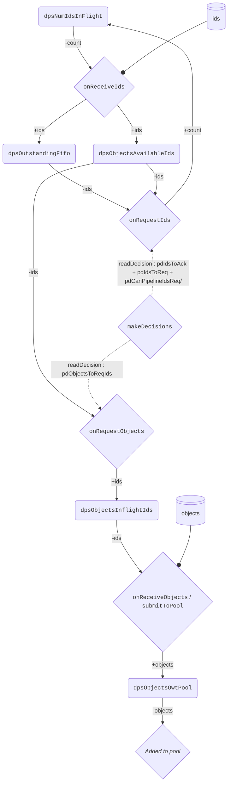

# Object Diffusion Inbound Mini-Protocol V2

```mermaid
%%{init: {"flowchart": {"htmlLabels": true}} }%%
flowchart TD
    A(<code>dpsNumIdsInFlight</code>)
    B(<code>dpsOutstandingFifo</code>)
    C(<code>dpsObjectsAvailableIds</code>)
    D(<code>dpsObjectsInflightIds</code>)
    F(<code>dpsObjectsOwtPool</code>)

    EA{<code>onRequestIds</code>}
    EA-->|+count| A
    B -->|-ids| EA
    C -->|-ids| EA

    EB{<code>onReceiveIds</code>}
    A -->|-count| EB
    EB -->|+ids| B
    IN1@{ shape: lin-cyl, label: "ids" } --o EB
    EB -->|+ids| C

    EC{<code>onRequestObjects</code>}
    C -->|-ids| EC
    EC -->|+ids| D

    ED{<code>onReceiveObjects</code> / <code>submitToPool</code>}
    D -->|-ids| ED
    IN2@{ shape: lin-cyl, label: "objects" } --o ED
    ED -->|+objects| F

    EE{<code>makeDecisions</code>}
    EA ~~~ EE
    EC ~~~ EE
    EE -.->|readDecision : pdIdsToAck + pdIdsToReq + pdCanPipelineIdsReq/| EA
    EE -.->|readDecision : pdObjectsToReqIds| EC

    EG{<i>Added to pool</i>}
    F -->|-objects| EG
```
