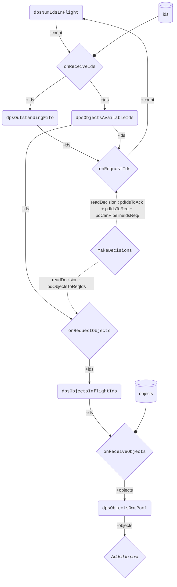

# Object Diffusion Inbound Mini-Protocol V2

### TODOs

- talk about pipelined vs. not pipelined
- what happens when a peer gets disconnected: ensure correctness
- describe the strategy for individual peer decisions
- talk about contraints / partial functions
- how is acknowledgement implemented, and where
- describe lifetime of id + related object
- describe main loop, starting with makeDecisions?
- list differences with TxSubmissionV2

```mermaid
%%{init: {"flowchart": {"htmlLabels": true}} }%%
flowchart TD
    A(<code>dpsNumIdsInFlight</code>)
    B(<code>dpsOutstandingFifo</code>)
    C(<code>dpsObjectsAvailableIds</code>)
    D(<code>dpsObjectsInflightIds</code>)
    F(<code>dpsObjectsOwtPool</code>)

    EA{<code>onRequestIds</code>}
    EA-->|+count| A
    B -->|-ids| EA
    C -->|-ids| EA

    EB{<code>onReceiveIds</code>}
    A -->|-count| EB
    EB -->|+ids| B
    IN1@{ shape: lin-cyl, label: "ids" } --o EB
    EB -->|+ids| C

    EC{<code>onRequestObjects</code>}
    C -->|-ids| EC
    EC -->|+ids| D

    ED{<code>onReceiveObjects</code>}
    D -->|-ids| ED
    IN2@{ shape: lin-cyl, label: "objects" } --o ED
    ED -->|+objects| F

    EE{<code>makeDecisions</code>}
    EA ~~~ EE
    EC ~~~ EE
    EE -.->|readDecision : pdIdsToAck + pdIdsToReq + pdCanPipelineIdsReq/| EA
    EE -.->|readDecision : pdObjectsToReqIds| EC

    EG{<i>Added to pool</i>}
    F -->|-objects| EG
```

The inbound peer (defined in `V2.hs`) has no direct access to the state. It only has access to a monadic API `PeerStateAPI` defined in `Registry.hs`.

This API has 4 callbacks, that trigger global state changes:

- `psaOnRequestIds` (corresponding to `onRequestIds` from `State.hs`) that must be called when emitting a request for new IDs (that also acks previously received IDs that we no longer care about). Under the hood, `onRequestIds` will increase the `dpsNumIdsInFlight` count by the requested number of IDs, and remove the acked IDs from `dpsOutstandingFifo` and `dpsObjectsAvailableIds`.
- `psaOnReceiveIds` (corresponding to `onReceiveIds` from `State.hs`) that must be called after receiving new IDs from the outbound peer, after validating that we received the correct number (not more than requested). Under the hood, `onReceiveIds` will decrease the `dpsNumIdsInFlight` count by **the number of IDs that were requested in the request corresponding to this reply** (it might be more than the number of received IDs), and add the received IDs to `dpsOutstandingFifo` and `dpsObjectsAvailableIds`.
- `psaOnRequestObjects` (corresponding to `onRequestObjects` from `State.hs`) that must be called when emitting a request for new objects. Under the hood, `onRequestObjects` will remove the requested IDs from `dpsObjectsAvailableIds` and add them to `dpsObjectsInflightIds`.
- `psaOnReceiveObjects` (corresponding to `onReceiveObjects` from `State.hs`) that must be called when receiving objects from the outbound peer, after validating that the received objects match exactly the requested IDs, and that all received objects have valid cryptographic proofs. Under the hood, `onReceiveObjects` will remove the received IDs from `dpsObjectsInflightIds`, and add the received objects to `dpsOwtPool`, and call the `submitObjectsToPool` subroutine that will actually insert the objects into the object pool when the lock can be acquired (at which point the objects are removed from `dpsOwtPool`)

To know when to call request IDs or objects, the inbound peer (`V2.hs`) relies on a global-state decision procedure, running in another thread, mainly implemented in `Decision.hs` and called from `Registry.hs`.

This decision procedure refreshes `PeerDecision`s periodically for each peer. The peer can read this decision via the `psaReadDecision` callback in the `PeerStateAPI`. The decision has a flag `pdStatus` that is set to `DecisionBeingActedUpon` when a decision has been read by the peer, and stays at that state until the peer calls `psaOnDecisionCompleted`, indicating that it has executed the decision (the status is set to `DecisionCompleted`) and that the global decision logic can generate a new one for this peer (a decision can also be updated when it is in state `DecisionUnread`). While the flag is set to `DecisionBeingActedUpon`, the global-state decision logic will not update the decision for this peer (it is locked, or "frozen").

In the decision, the peer can find:
- `pdIdsToReq`: number of new IDs to request from the outbound peer
- `pdIdsToAck`: a set of IDs that the peer should ack in its next request for IDs. Note that if `pdIdsToReq` is zero, then no request for IDs will be sent, and thus no acking will happen despite `pdIdsToAck` being non-zero.
- `pdCanPipelineIdsReq`: a flag indicating whether the peer can pipeline its requests for IDs (instead of making a blocking call). In ObjectDiffusion protocol specification, a peer can only pipeline requests for IDs when there are some unacknowledged IDs, i.e. when the `dpsOutstandingFifo` is not empty.
- `pdObjectsToReqIds`: the IDs of the objects that the inbound peer should request from the outbound peer.
- `pdExecutingDecision` flag is not meant to be read by the peer itself; it will always be set to `True` when the inbound peer is able to read a decision.

In a round of its main loop, the inbound peer will:
1. Read the current decision via `psaReadDecision`
2. Try to read any available reply from the outbound peer if there have been pipelined requests in previous rounds
3. Try to request objects (if any) as per `pdObjectsToReqIds`
4. Try to request IDs (if any) as per `pdIdsToReq`; acking `pdIdsToAck` as a side-effect
5. Call `psaOnDecisionExecuted` to signal that a new decision should be made for this peer
