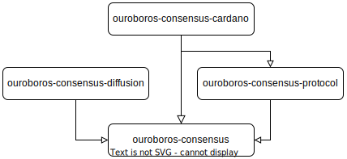
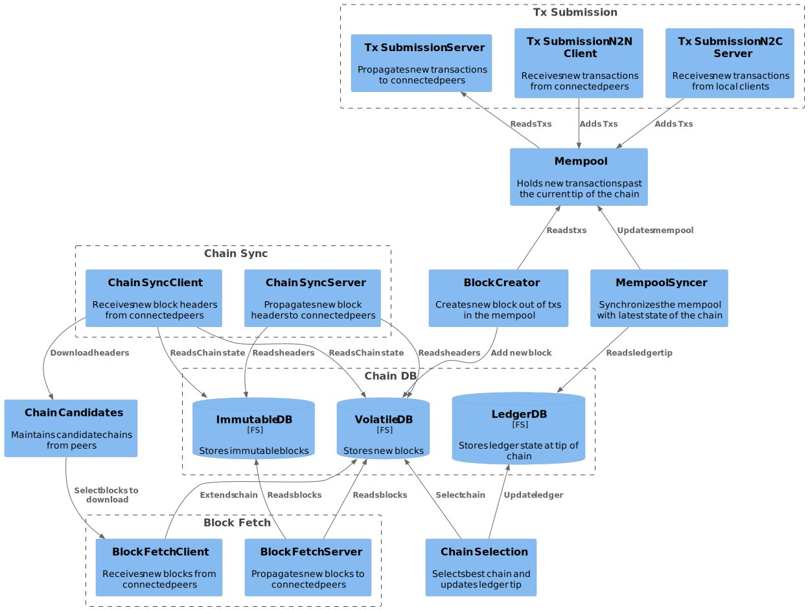

= Ouroboros-Consensus Repository Hackage Documentation

[Skip to module list](#module-list)

This graph depicts the relationship between the various Consensus packages:

* __ouroboros-consensus__: Main package for Cardano consensus implementation,
  aka. Ouroboros.

    * The [Ouroboros Consensus Modules Map](./modules-consensus.svg) represents
      the dependencies between various /Consensus/ modules and is a map to
      navigate the (large) codebase. Clicking on a module should bring you to
      the corresponding haddock page from which you can later navigate to the
      source code. __Note__: The image needs to be enlarged to be useful hence
      why it's an external link.

=== Notable haddock comments

The comments in modules listed below provide important information on the
implementation of consensus.

* "Ouroboros.Consensus.Util.ResourceRegistry"
* "Ouroboros.Consensus.HeaderValidation"
* "Ouroboros.Consensus.Mempool.API"
* "Ouroboros.Consensus.Forecast"
* "Ouroboros.Consensus.HardFork.History.EraParams"
* "Ouroboros.Consensus.HardFork.History.Qry"
* "Ouroboros.Consensus.HardFork.History.Summary"
* "Ouroboros.Consensus.Protocol.Abstract"
* "Ouroboros.Consensus.Storage.ChainDB.API"
* "Ouroboros.Consensus.Storage.ChainDB.Impl.ChainSel"
* "Ouroboros.Consensus.Storage.ChainDB.Impl.Iterator"
* "Ouroboros.Network.AnchoredFragment"
* "Ouroboros.Consensus.MiniProtocol.ChainSync.Client"
* "Ouroboros.Network.BlockFetch.Decision"

=== Consensus Components

The following [C4 Component Diagram](https://c4model.com/) provides a high-level
overview of the main components involved in /Consensus/. Note that clicking on a
box should link to the corresponding documentation:

==== Consensus tests (_ThreadNet_ tests)

The main consensus tests are the consensus layer's sophisticated tests. They are
"system level" tests, in which we set up a mock network of nodes, where we can
simulate things like nodes joining late, network message delay, etc. We then
have these nodes run the full protocol, exchanging blocks, doing chain
selection, etc. Finally we verify that the nodes can reach consensus. We have
some generic infrastructure for doing all of this, and then have specific tests
for each of the protocols/ledgers we support.

In a way, these are the most important tests we have, as they are testing
properties of the system as a whole. Of course, that also means that if
something goes wrong, debugging these tests can be difficult, and it would be
better to have such problems caught by the other, more fine-grained, tests.

We run these tests for

* A mock ledger (containing bare bones UTxO style transactions) using a variety
  of consensus protocols: BFT, PBFT, Praos, and a version of Praos where we
  override the leader schedule. See [this
  directory](https://github.com/input-output-hk/ouroboros-consensus/tree/master/ouroboros-consensus-diffusion/diffusion-testlib/Test/ThreadNet).
  * Byron/PBFT. See
  __[Test.ThreadNet.Byron](ouroboros-consensus-byron-test-test/Test-ThreadNet-Byron.html)__.
  * DualByron. See
  __[Test.ThreadNet.DualByron](ouroboros-consensus-byron-test-test/Test-ThreadNet-DualByron.html)__.
  * Shelley/TPraos. See
  __[Test.ThreadNet.Shelley](ouroboros-consensus-shelley-test-test/Test-ThreadNet-Shelley.html)__.
  * Cardano. See
  __[Test.ThreadNet.Cardano](ouroboros-consensus-cardano-test-test/Test-ThreadNet-Cardano.html)__.  
  * The hard fork combinator transitioning from a mock ledger @A@ to a mock
  ledger @B@; these mock ledgers are absolutely minimal ledgers: the only
  transaction supported on the @A@ ledger is "initiate transition to @B@", and
  the @B@ ledger can only contain blocks with a header only, no body at all. *
  @HardForkBlock '[Byron, Shelley]@: the hard fork combinator instantiated with
  the Byron and Shelley ledgers, running @PBFT@ before the transition and
  @TPraos@ after.
